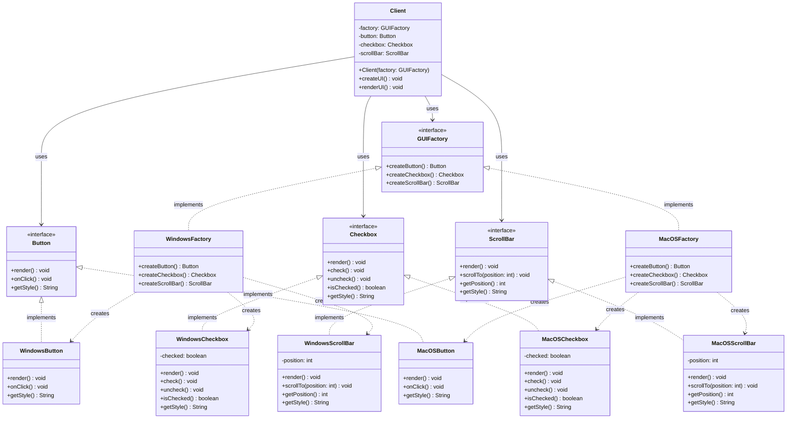
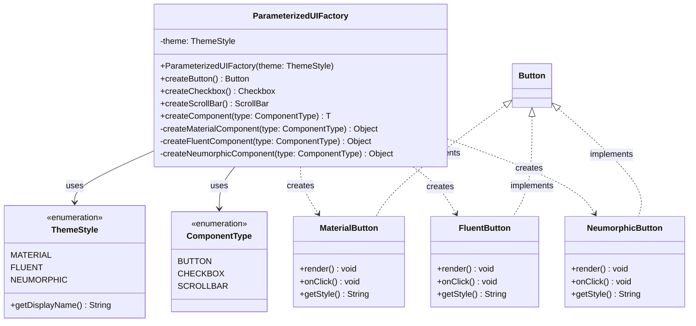
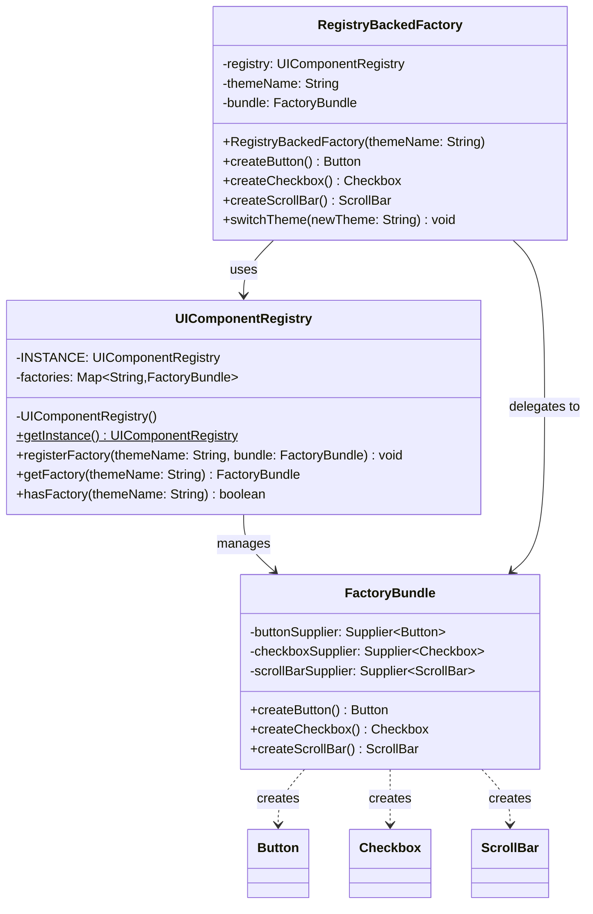

# Abstract Factory Pattern - Class Diagram

## Classic Implementation Class Diagram



## Parameterized Factory Variant



## Registry-backed Factory Variant



## Functional Factory Variant

```mermaid
classDiagram
    class FunctionalFactory {
        -buttonSupplier: Supplier~Button~
        -checkboxSupplier: Supplier~Checkbox~
        -scrollBarSupplier: Supplier~ScrollBar~
        -themeName: String
        +FunctionalFactory(themeName, suppliers...)
        +createButton() Button
        +createCheckbox() Checkbox
        +createScrollBar() ScrollBar
    }
    
    class Builder {
        -themeName: String
        -buttonSupplier: Supplier~Button~
        -checkboxSupplier: Supplier~Checkbox~
        -scrollBarSupplier: Supplier~ScrollBar~
        +withTheme(themeName: String) Builder
        +withButton(supplier: Supplier~Button~) Builder
        +withCheckbox(supplier: Supplier~Checkbox~) Builder
        +withScrollBar(supplier: Supplier~ScrollBar~) Builder
        +build() FunctionalFactory
    }
    
    class Themes {
        +createFlatDesign() FunctionalFactory$
        +createSkeuomorphic() FunctionalFactory$
        +createAccessible() FunctionalFactory$
    }
    
    FunctionalFactory +-- Builder : nested
    FunctionalFactory +-- Themes : nested
    
    Builder --> FunctionalFactory : builds
    Themes --> FunctionalFactory : creates
    
    FunctionalFactory ..> Button : creates via supplier
    FunctionalFactory ..> Checkbox : creates via supplier
    FunctionalFactory ..> ScrollBar : creates via supplier
```

## Config-driven Factory Variant

```mermaid
classDiagram
    class ConfigDrivenFactory {
        -config: ThemeConfig
        +ConfigDrivenFactory(config: ThemeConfig)
        +createButton() Button
        +createCheckbox() Checkbox
        +createScrollBar() ScrollBar
        -createComponent(type: String, expectedType: Class) T
        +reloadConfig(newConfig: ThemeConfig) void
    }
    
    class ThemeConfig {
        -themeName: String
        -factoryType: String
        -components: Map~String,ComponentConfig~
        +getThemeName() String
        +getComponentConfig(type: String) ComponentConfig
    }
    
    class ComponentConfig {
        -className: String
        -properties: Map~String,String~
        +getClassName() String
        +getProperties() Map~String,String~
    }
    
    class ConfigLoader {
        +loadFromEnvironment() ThemeConfig$
        +loadFromFile(filename: String) ThemeConfig$
        +loadFromProperties(props: Map) ThemeConfig$
    }
    
    class Configurable {
        <<interface>>
        +configure(properties: Map~String,String~) void
    }
    
    ConfigDrivenFactory --> ThemeConfig : uses
    ThemeConfig --> ComponentConfig : contains
    ThemeConfig +-- ConfigLoader : nested
    
    ConfigDrivenFactory ..> Button : creates
    ConfigDrivenFactory ..> Checkbox : creates
    ConfigDrivenFactory ..> ScrollBar : creates
    
    Button <|-- Configurable : may implement
    Checkbox <|-- Configurable : may implement
    ScrollBar <|-- Configurable : may implement
```