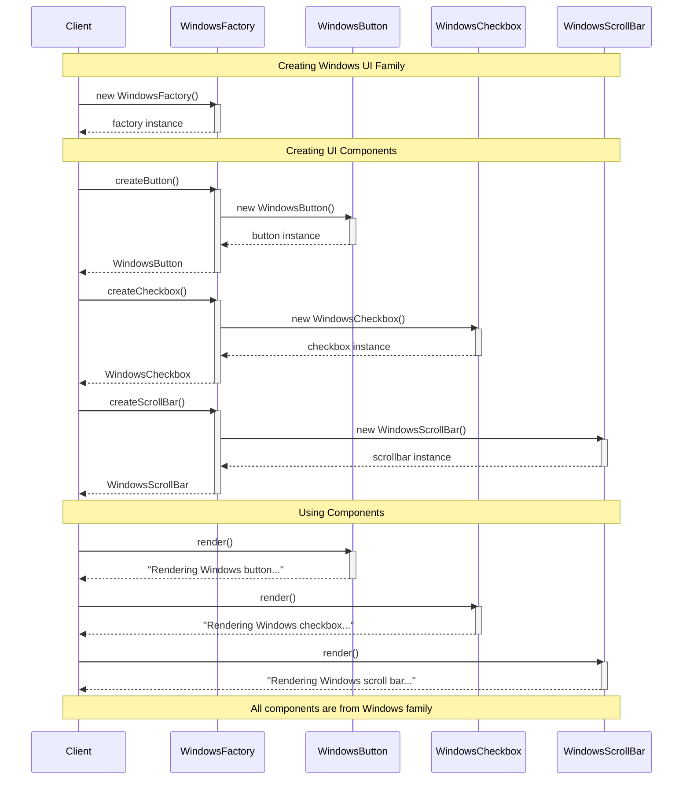
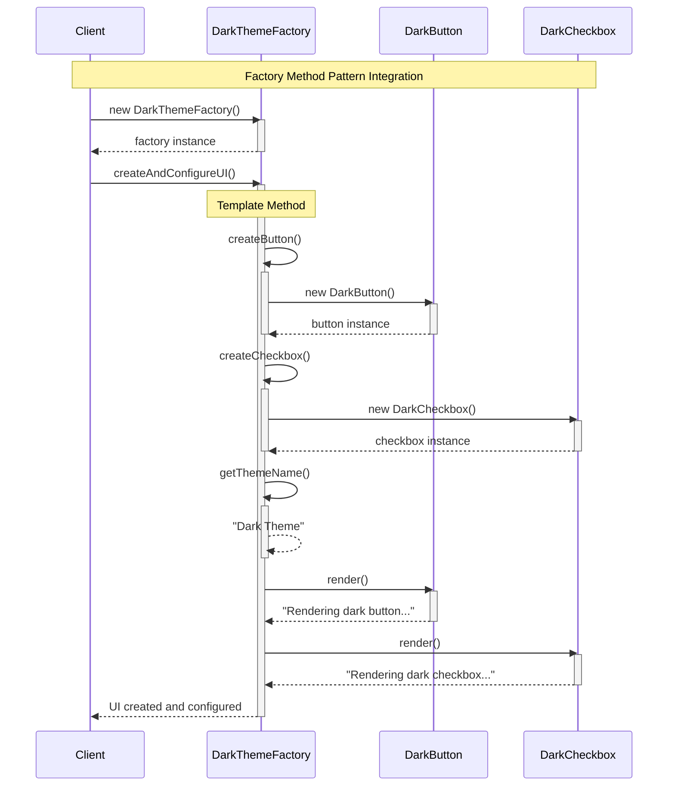
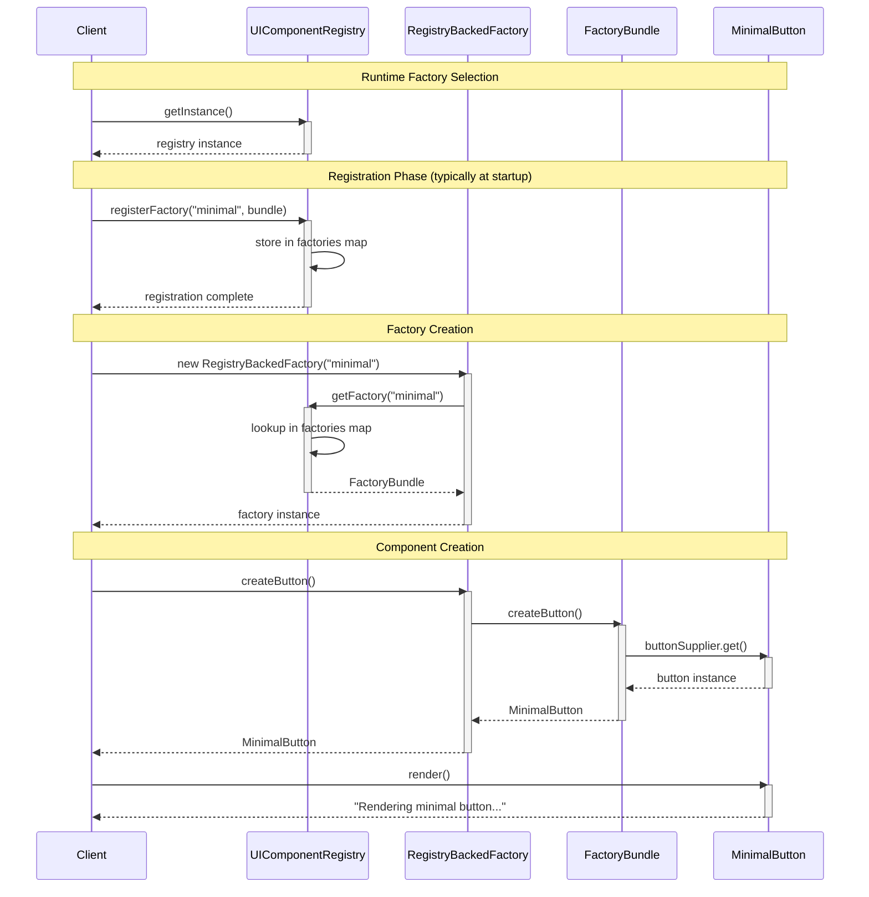
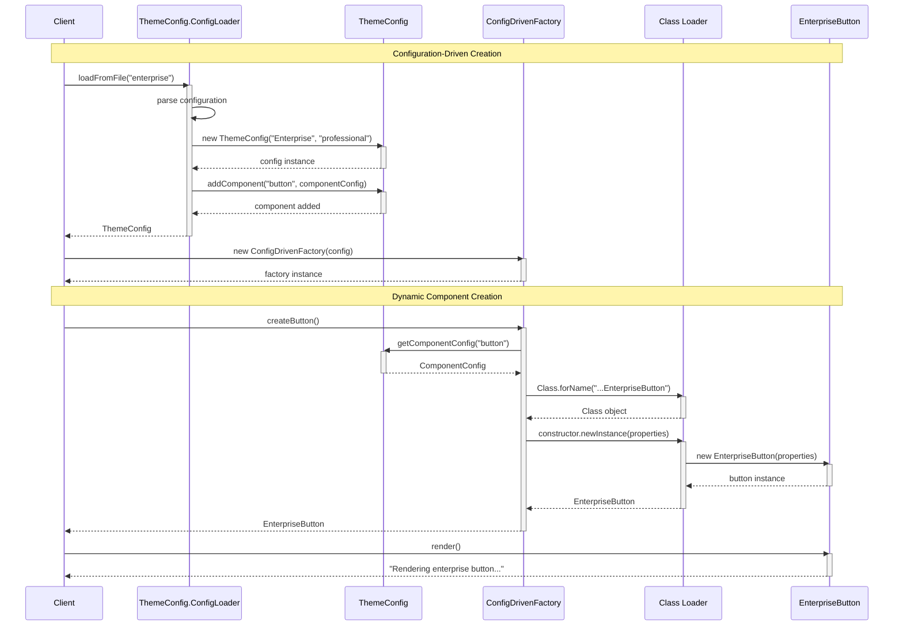
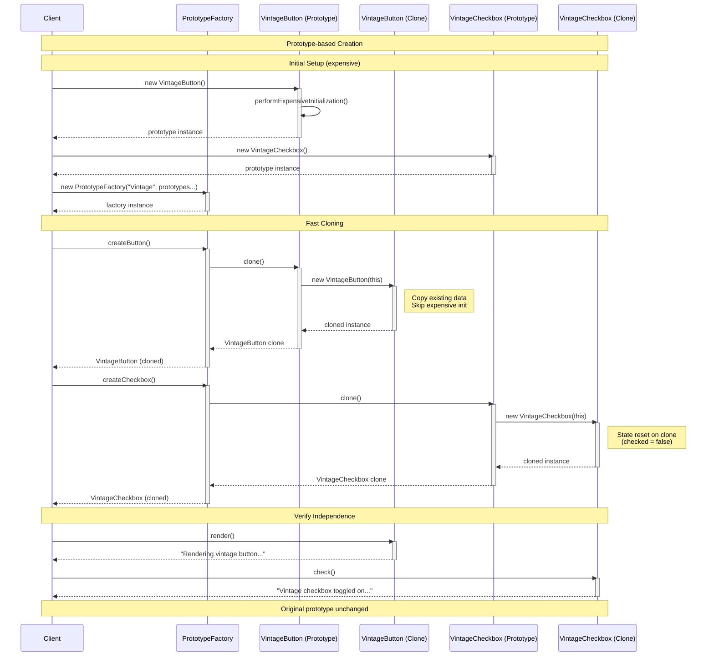
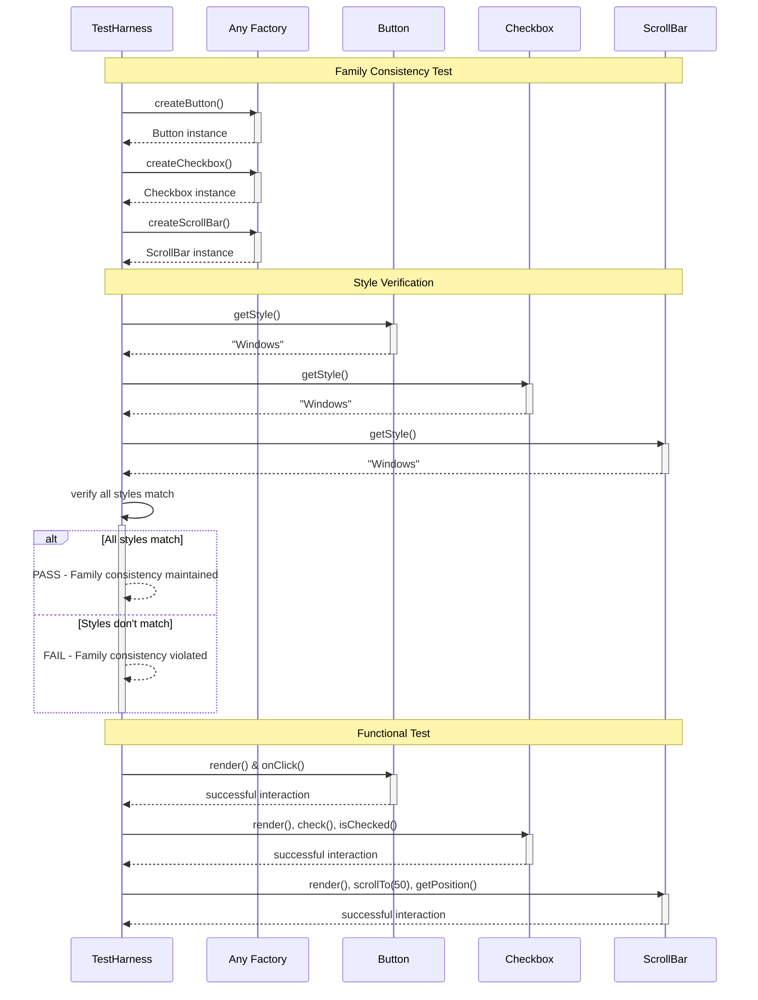

# Abstract Factory Pattern - Sequence Diagrams

## Classic Abstract Factory Sequence

## Factory Method-backed Sequence

## Registry-backed Factory Sequence

## Config-driven Factory Sequence

## Prototype-backed Factory Sequence

## Family Consistency Verification Sequence

