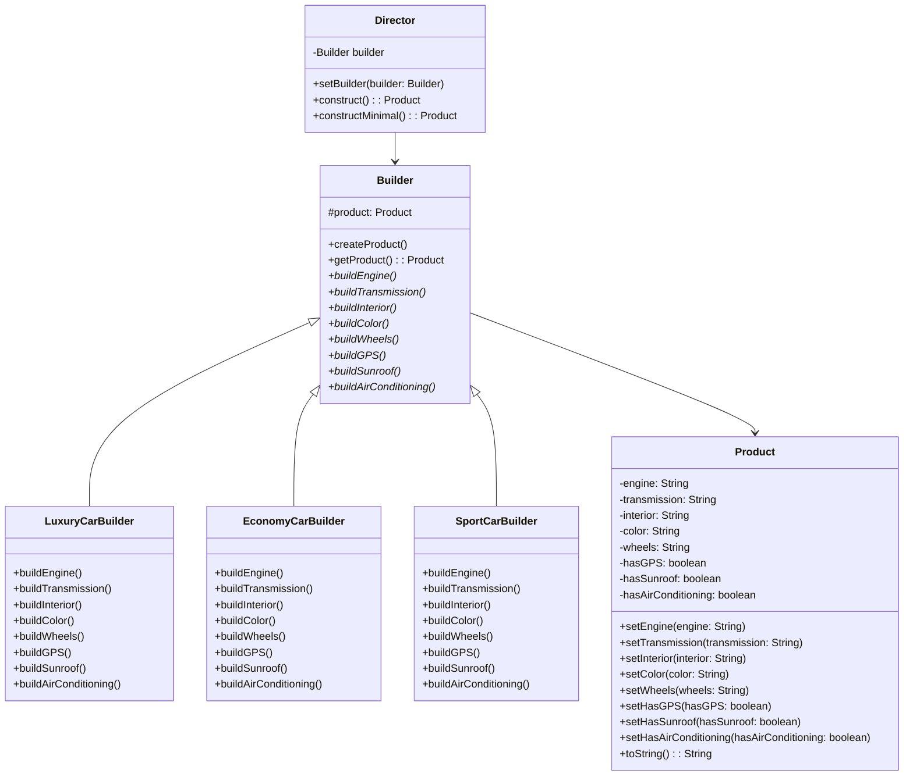
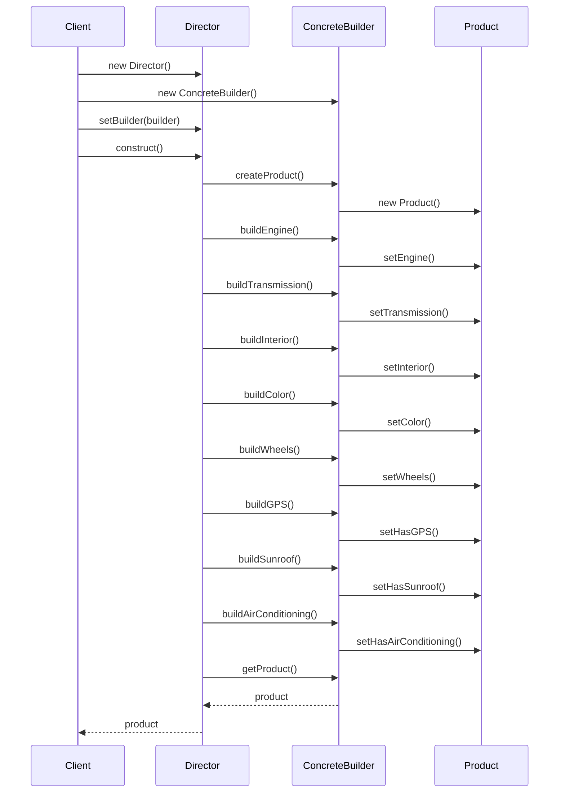
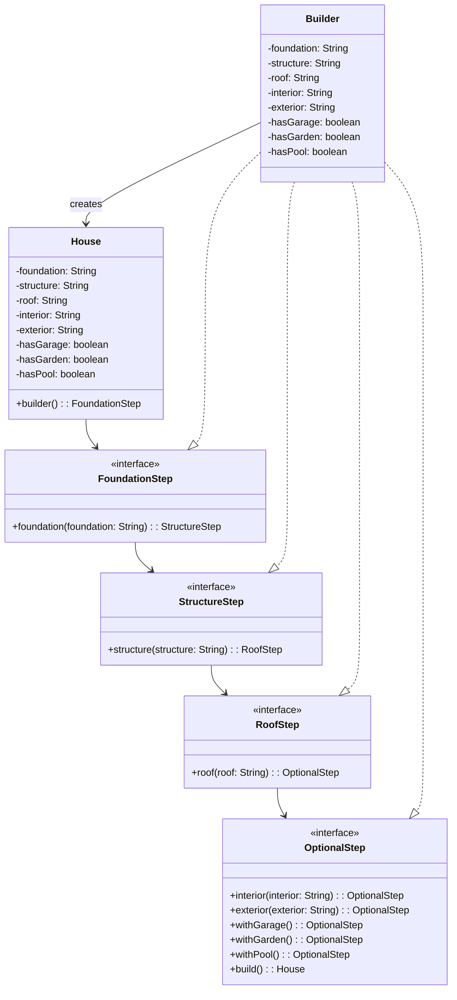

# 🏗️ Builder Pattern

A comprehensive implementation demonstrating **11 variations** of the Builder Pattern in Java, from classic GoF to modern functional approaches.

## 📋 Table of Contents

- [Overview](#-overview)
- [Pattern Intent](#-pattern-intent)
- [When to Use Builder Pattern](#-when-to-use-builder-pattern)
- [Implementation Variants](#-implementation-variants)
- [UML Diagrams](#-uml-diagrams)
- [Decision Matrix](#-decision-matrix)
- [Trade-offs Analysis](#-trade-offs-analysis)
- [Running the Examples](#-running-the-examples)
- [Key Takeaways](#-key-takeaways)
- [Related Patterns](#-related-patterns)
- [Exercises](#-exercises)

## 🎯 Overview

The Builder Pattern separates the construction of complex objects from their representation, allowing the same construction process to create different representations. This pattern is particularly useful when dealing with objects that have many optional parameters or complex initialization logic.

**Core Problem Solved**: Avoid telescoping constructor anti-pattern and provide a clean, readable way to construct complex objects.

## 🎪 Pattern Intent

> **Separate the construction of a complex object from its representation so that the same construction process can create different representations.**

### Key Benefits
- ✅ **Readability**: Self-documenting method names
- ✅ **Flexibility**: Optional parameters handled naturally  
- ✅ **Immutability**: Objects can be made immutable after construction
- ✅ **Validation**: Centralized validation logic
- ✅ **Telescoping Constructor Solution**: Eliminates parameter confusion

## 🎯 When to Use Builder Pattern

### ✅ Use Builder When:
- Object has **4+ constructor parameters**
- Many parameters are **optional**
- **Parameter validation** is complex
- Need **different representations** of the same object
- Want **immutable objects** with complex construction
- **Telescoping constructors** become unwieldy

### ❌ Avoid Builder When:
- Simple objects with **few parameters**
- All parameters are **required**
- Object construction is **trivial**
- **Performance** is extremely critical
- Adding unnecessary **complexity**

## 🔧 Implementation Variants

| # | Variant | Use Case | Complexity | Key Benefit |
|---|---------|----------|------------|-------------|
| 1 | [**Classic GoF**](src/main/java/com/example/builder/classic) | Multiple representations, Director orchestration | Medium | True to original pattern |
| 2 | [**Fluent Builder**](src/main/java/com/example/builder/fluent) | Readable method chaining | Low | High readability |
| 3 | [**Telescoping Alternative**](src/main/java/com/example/builder/telescoping) | Replace constructor overloads | Low | Solves specific problem |
| 4 | [**Immutable Object**](src/main/java/com/example/builder/immutable) | Thread-safe, defensive copying | Medium | Thread safety |
| 5 | [**Nested/Inner Builder**](src/main/java/com/example/builder/nested) | Tight coupling, clean API | Medium | Idiomatic usage |
| 6 | [**Step Builder**](src/main/java/com/example/builder/stepbuilder) | Compile-time field enforcement | High | Type safety |
| 7 | [**Hierarchical Builder**](src/main/java/com/example/builder/hierarchical) | Inheritance hierarchies | High | Polymorphic construction |
| 8 | [**Director-less**](src/main/java/com/example/builder/directorless) | Simple construction | Low | Minimal overhead |
| 9 | [**DSL Builder**](src/main/java/com/example/builder/dsl) | Domain-specific language | Medium | Domain clarity |
| 10 | [**Functional Builder**](src/main/java/com/example/builder/functional) | Lambda configuration | Medium | Functional paradigm |
| 11 | [**Prototype + Builder**](src/main/java/com/example/builder/prototype) | Template-based construction | Medium | Efficiency |

## 📊 UML Diagrams

### Classic GoF Builder Pattern - Class Diagram



### Sequence Diagram - Construction Process



### Step Builder Pattern - Interface Chain



## 📊 Decision Matrix

| Criteria | Classic GoF | Fluent | Step | Hierarchical | Nested | DSL | Functional |
|----------|-------------|---------|------|--------------|--------|-----|------------|
| **Readability** | ⭐⭐⭐ | ⭐⭐⭐⭐⭐ | ⭐⭐⭐⭐ | ⭐⭐⭐ | ⭐⭐⭐⭐ | ⭐⭐⭐⭐⭐ | ⭐⭐⭐⭐ |
| **Compile Safety** | ⭐⭐ | ⭐⭐⭐ | ⭐⭐⭐⭐⭐ | ⭐⭐⭐⭐ | ⭐⭐⭐ | ⭐⭐⭐⭐ | ⭐⭐⭐ |
| **Flexibility** | ⭐⭐⭐⭐⭐ | ⭐⭐⭐⭐ | ⭐⭐⭐ | ⭐⭐⭐⭐⭐ | ⭐⭐⭐⭐ | ⭐⭐⭐ | ⭐⭐⭐⭐⭐ |
| **Performance** | ⭐⭐⭐ | ⭐⭐⭐⭐ | ⭐⭐⭐⭐ | ⭐⭐⭐ | ⭐⭐⭐⭐ | ⭐⭐⭐ | ⭐⭐⭐ |
| **Complexity** | ⭐⭐⭐⭐ | ⭐⭐ | ⭐⭐⭐⭐⭐ | ⭐⭐⭐⭐⭐ | ⭐⭐⭐ | ⭐⭐⭐⭐ | ⭐⭐⭐ |
| **Boilerplate** | ⭐⭐ | ⭐⭐⭐⭐ | ⭐ | ⭐⭐ | ⭐⭐⭐ | ⭐⭐ | ⭐⭐⭐⭐ |

**Legend**: ⭐ = Poor, ⭐⭐⭐⭐⭐ = Excellent

## ⚖️ Trade-offs Analysis

### Readability vs Complexity
- **High Readability**: Fluent, DSL → More intuitive but may sacrifice flexibility
- **High Complexity**: Step, Hierarchical → More robust but steeper learning curve

### Compile-time Safety vs Runtime Flexibility  
- **Compile Safety**: Step Builder enforces required fields at compile time
- **Runtime Flexibility**: Classic GoF allows dynamic construction steps

### Performance vs Features
- **High Performance**: Director-less, simple fluent → Minimal overhead
- **Rich Features**: Hierarchical, prototype → More functionality, slight performance cost

### Boilerplate vs Type Safety
- **Less Boilerplate**: Functional, nested → Concise code
- **More Type Safety**: Step, hierarchical → Better error prevention

## 🚀 Running the Examples

### Compile All Examples
```bash
cd builder-pattern
javac -d build -sourcepath src/main/java src/main/java/com/example/**/*.java
```

### Run Individual Demos
```bash
# Classic GoF Builder
java -cp build com.example.builder.classic.ClassicBuilderDemo

# Fluent Builder
java -cp build com.example.builder.fluent.FluentBuilderDemo

# Telescoping Constructor Alternative
java -cp build com.example.builder.telescoping.TelescopingBuilderDemo

# Immutable Object Builder
java -cp build com.example.builder.immutable.ImmutableBuilderDemo

# Nested/Inner Builder
java -cp build com.example.builder.nested.NestedBuilderDemo

# Step Builder
java -cp build com.example.builder.stepbuilder.StepBuilderDemo

# Hierarchical Builder
java -cp build com.example.builder.hierarchical.HierarchicalBuilderDemo

# Director-less Builder
java -cp build com.example.builder.directorless.DirectorlessBuilderDemo

# DSL Builder
java -cp build com.example.builder.dsl.DSLBuilderDemo

# Functional Builder
java -cp build com.example.builder.functional.FunctionalBuilderDemo

# Prototype + Builder
java -cp build com.example.builder.prototype.PrototypeBuilderDemo
```

## 💡 Key Takeaways

### 🎯 Choose Your Variant Based On:

1. **Simple Cases**: Use **Fluent Builder** or **Nested Builder**
2. **Required Fields**: Use **Step Builder** for compile-time enforcement  
3. **Inheritance**: Use **Hierarchical Builder** for object hierarchies
4. **Multiple Representations**: Use **Classic GoF** with Director
5. **Domain-Specific**: Use **DSL Builder** for specialized domains
6. **Functional Style**: Use **Functional Builder** with Java 8+
7. **Templates**: Use **Prototype + Builder** for template-based construction

### 🔄 Common Patterns Across Variants:
- **Method Chaining**: Most builders support fluent interfaces
- **Validation**: Build-time validation ensures object consistency
- **Immutability**: Final products are typically immutable
- **Default Values**: Sensible defaults reduce required parameters

## 🔗 Related Patterns

### 🏭 **Factory Method vs Builder**
- **Factory Method**: Creates objects with few, well-known configurations
- **Builder**: Creates objects with many optional parameters

### 🏭 **Abstract Factory vs Builder**  
- **Abstract Factory**: Creates families of related objects
- **Builder**: Creates complex individual objects step by step

### 🎭 **Prototype vs Builder**
- **Prototype**: Clones existing objects efficiently  
- **Builder**: Constructs objects from scratch with configuration

### 🎪 **Strategy vs Builder**
- **Strategy**: Changes object behavior at runtime
- **Builder**: Defines object structure at construction time

## 📚 Exercises

### 🔰 Beginner
1. **Convert Telescoping Constructor**: Take a class with 6+ constructor parameters and convert it to use a Fluent Builder
2. **Add Validation**: Implement build-time validation in a builder (e.g., email format, positive numbers)
3. **Default Values**: Create a builder that provides sensible defaults for optional parameters

### 🔥 Intermediate  
4. **Step Builder Implementation**: Convert a fluent builder to a step builder that enforces required fields at compile time
5. **Hierarchical Builder**: Create a vehicle hierarchy (Car, Motorcycle, Truck) with appropriate builders using the self-type pattern
6. **Functional Configuration**: Implement a functional builder that accepts lambda configuration functions

### 🚀 Advanced
7. **DSL Builder**: Create a domain-specific language builder for a specific domain (e.g., REST API client, configuration files)
8. **Builder Performance**: Compare performance between different builder variants and optimize for your use case
9. **Thread-Safe Builder**: Implement a builder that can be safely used across multiple threads
10. **Builder Registry**: Create a registry of different builders that can be selected at runtime based on configuration

### 🎓 Expert
11. **Meta-Builder**: Create a builder that can construct other builders dynamically
12. **Builder Composition**: Implement a system where multiple builders can be composed to create complex object graphs
13. **Annotation-Driven Builder**: Use annotations and reflection to automatically generate builders for POJOs

---

**💡 Pro Tips:**
- Start with **Fluent Builder** for most use cases
- Use **Step Builder** when field ordering matters
- Consider **Nested Builder** for better encapsulation
- Apply **Hierarchical Builder** only when inheritance is involved
- **Validate early** and provide **clear error messages**
- **Document your builders** with examples and use cases

Happy Building! 🏗️✨