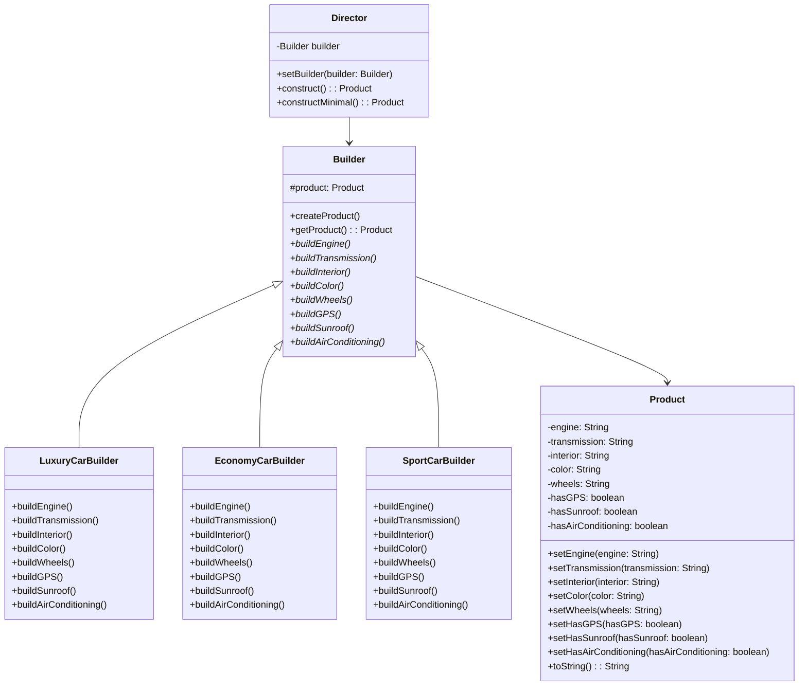
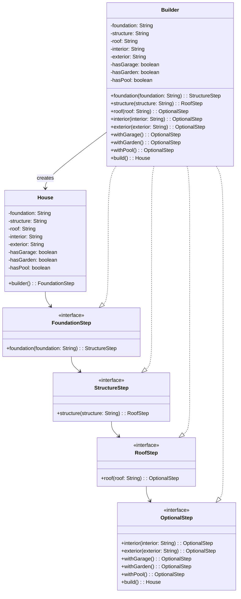
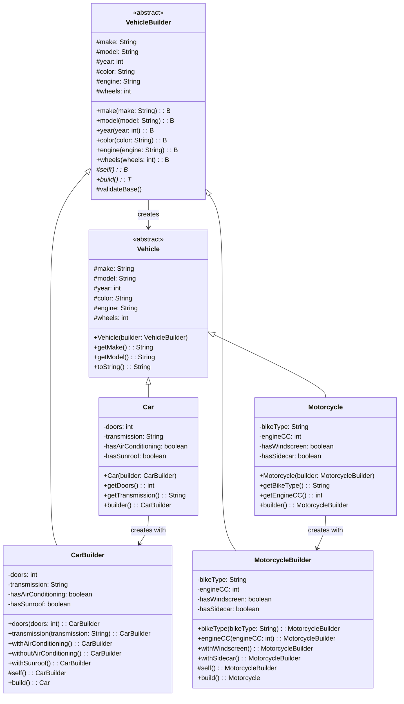

# Builder Pattern - Class Diagrams

## Classic GoF Builder Pattern



## Fluent Builder Pattern

```mermaid
classDiagram
    class Computer {
        -cpu: String
        -memory: String
        -storage: String
        -graphics: String
        -motherboard: String
        -hasWifi: boolean
        -hasBluetooth: boolean
        -hasWebcam: boolean
        -ports: int
        -operatingSystem: String
        +Computer(builder: ComputerBuilder)
        +getCpu(): String
        +getMemory(): String
        +getStorage(): String
        +toString(): String
    }
    
    class ComputerBuilder {
        -cpu: String
        -memory: String
        -storage: String
        -graphics: String
        -motherboard: String
        -hasWifi: boolean
        -hasBluetooth: boolean
        -hasWebcam: boolean
        -ports: int
        -operatingSystem: String
        +cpu(cpu: String): ComputerBuilder
        +memory(memory: String): ComputerBuilder
        +storage(storage: String): ComputerBuilder
        +graphics(graphics: String): ComputerBuilder
        +motherboard(motherboard: String): ComputerBuilder
        +withWifi(): ComputerBuilder
        +withBluetooth(): ComputerBuilder
        +withWebcam(): ComputerBuilder
        +ports(ports: int): ComputerBuilder
        +operatingSystem(os: String): ComputerBuilder
        +build(): Computer
    }
    
    Computer +-- ComputerBuilder
    ComputerBuilder --> Computer : creates
```

## Step Builder Pattern



## Hierarchical Builder Pattern



## Nested Builder Pattern

```mermaid
classDiagram
    class DatabaseConnection {
        -host: String
        -port: int
        -database: String
        -username: String
        -password: String
        -driver: String
        -connectionTimeout: int
        -readTimeout: int
        -maxPoolSize: int
        -autoCommit: boolean
        -isolationLevel: String
        -additionalProperties: Properties
        +DatabaseConnection(builder: Builder)
        +getHost(): String
        +getPort(): int
        +getConnectionString(): String
        +builder(): Builder
    }
    
    class Builder {
        -host: String
        -port: int
        -database: String
        -username: String
        -password: String
        -driver: String
        -connectionTimeout: int
        -readTimeout: int
        -maxPoolSize: int
        -autoCommit: boolean
        -isolationLevel: String
        -additionalProperties: Map
        +host(host: String): Builder
        +port(port: int): Builder
        +database(database: String): Builder
        +username(username: String): Builder
        +password(password: String): Builder
        +driver(driver: String): Builder
        +connectionTimeout(timeoutMs: int): Builder
        +readTimeout(timeoutMs: int): Builder
        +maxPoolSize(maxPoolSize: int): Builder
        +autoCommit(autoCommit: boolean): Builder
        +isolationLevel(isolationLevel: String): Builder
        +property(key: String, value: String): Builder
        +properties(properties: Map): Builder
        +build(): DatabaseConnection
    }
    
    DatabaseConnection +-- Builder
    Builder --> DatabaseConnection : creates
```