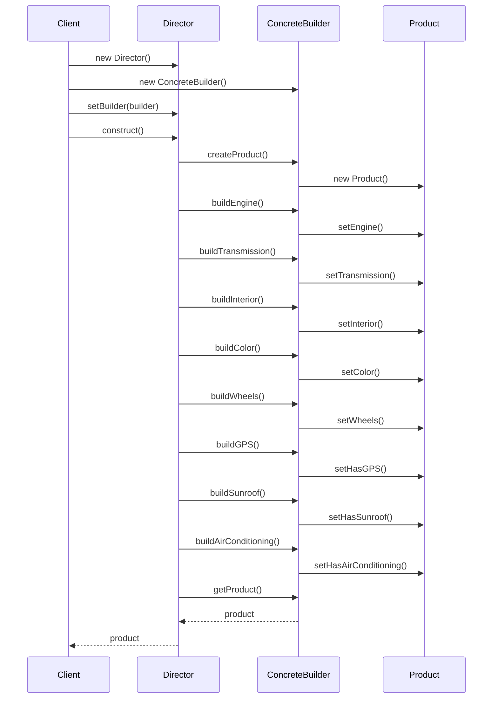
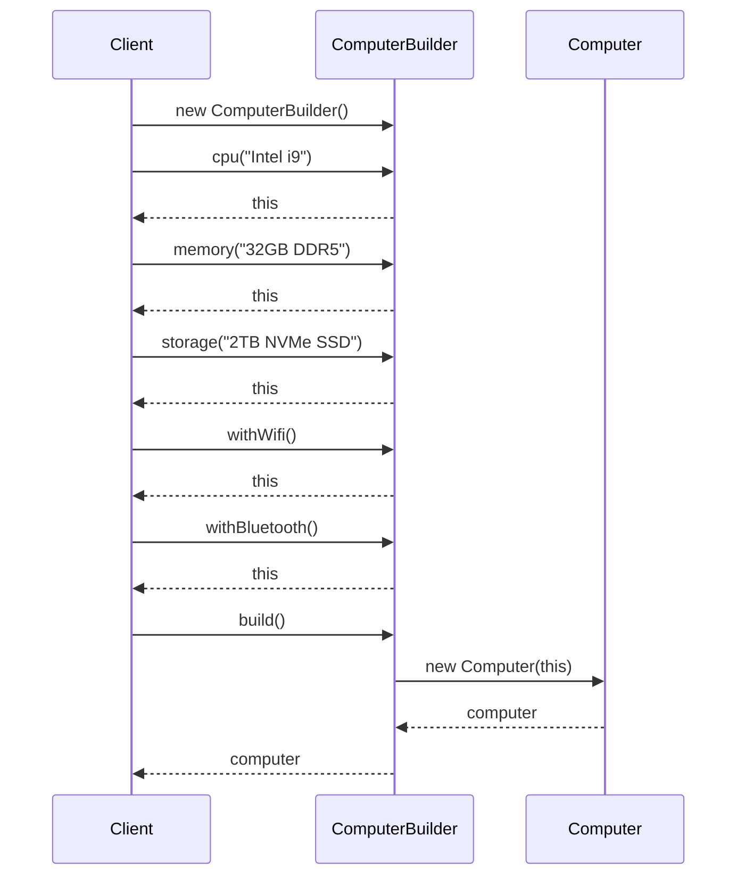
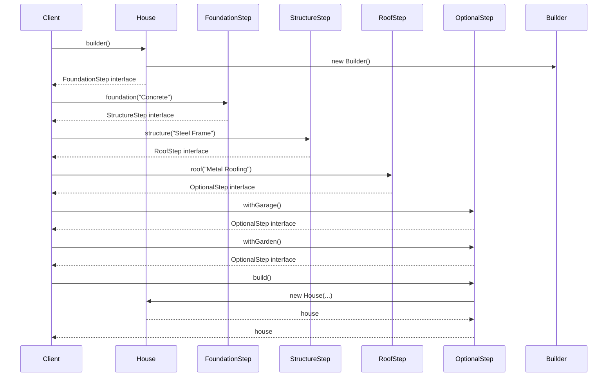
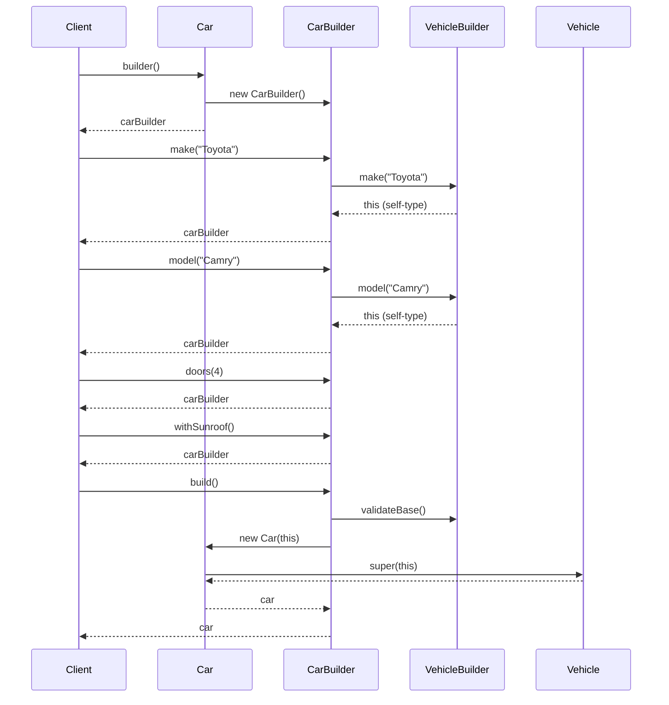
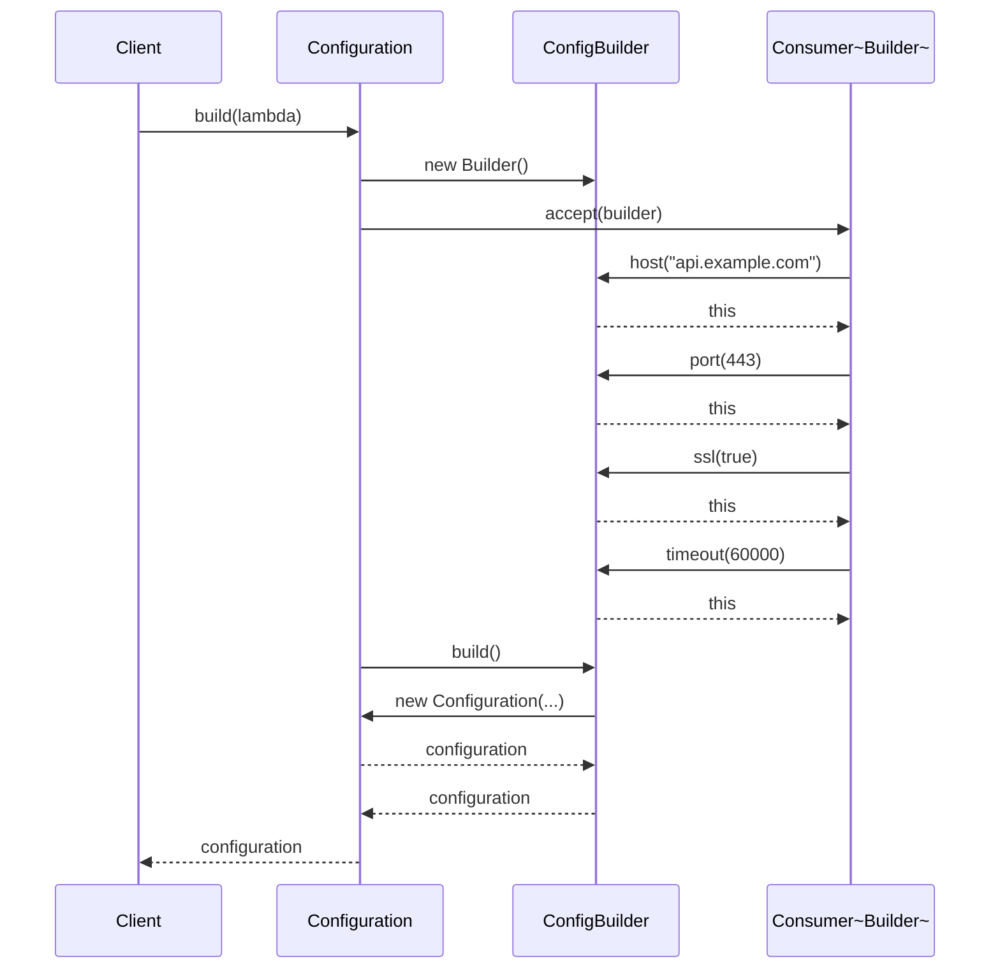
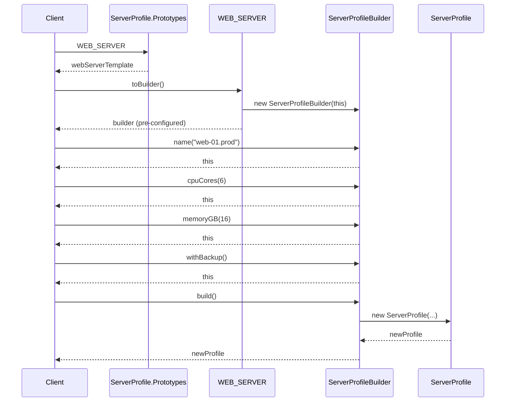

# Builder Pattern - Sequence Diagrams

## Classic GoF Builder - Construction Process

## Fluent Builder - Method Chaining

## Step Builder - Enforced Sequence

## Hierarchical Builder - Inheritance Chain

## Functional Builder - Lambda Configuration

## Prototype + Builder - Template-based Construction

