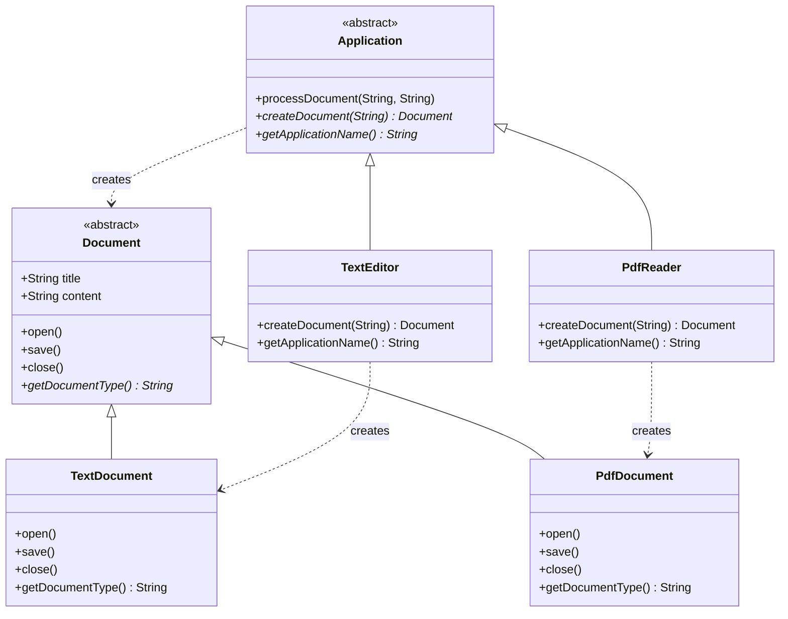
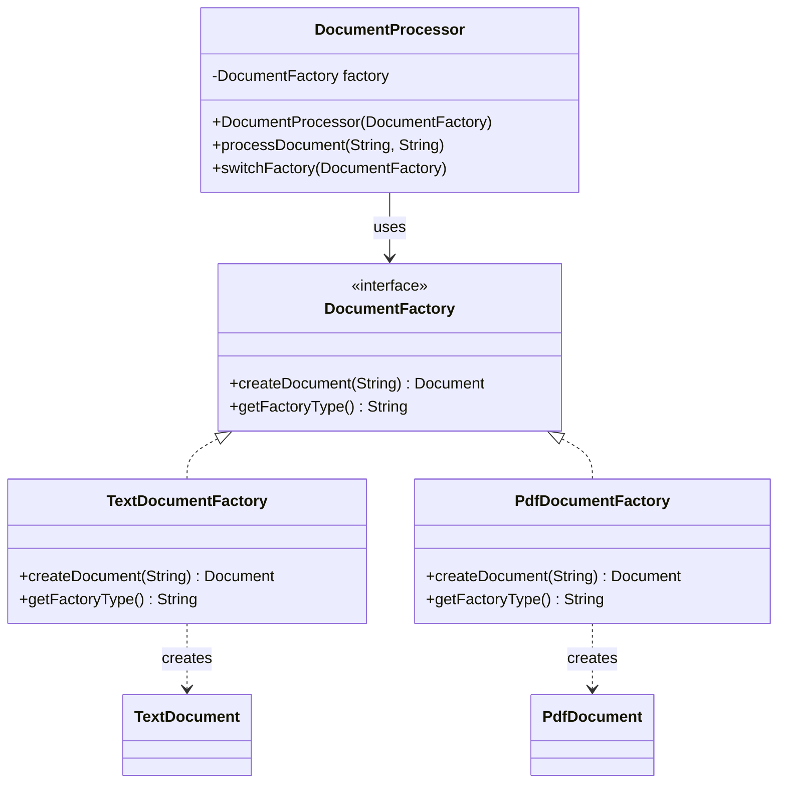
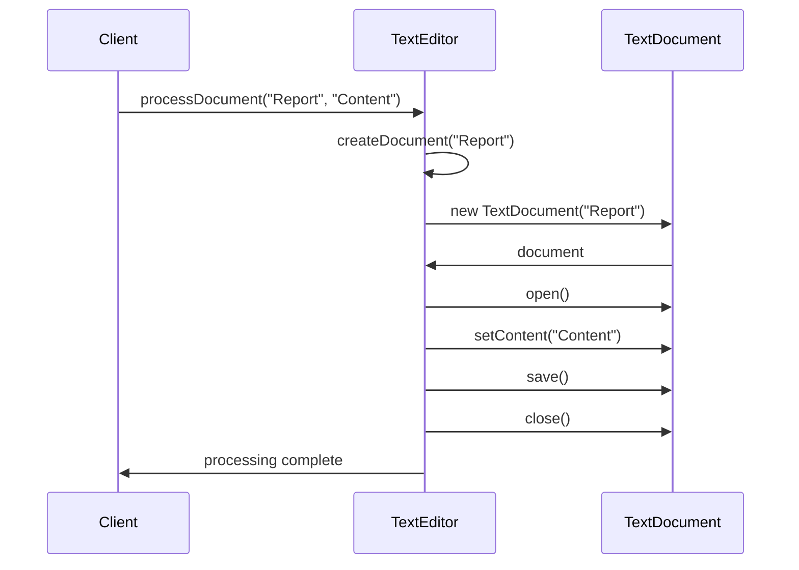
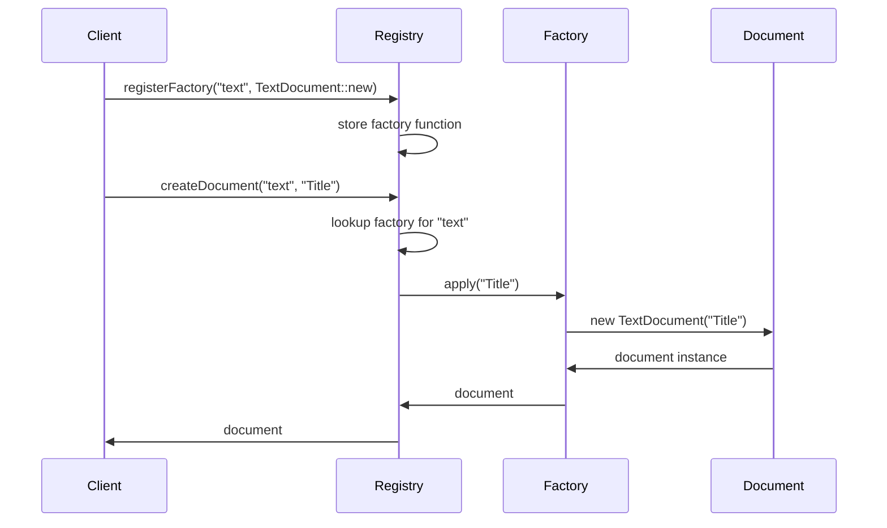

# Factory Method Design Pattern in Java

The Factory Method pattern provides an interface for creating objects in a superclass, but allows subclasses to alter the type of objects that will be created. It's one of the most widely used creational patterns, offering a way to delegate object instantiation to subclasses while maintaining loose coupling between creator and product classes.

## 📋 Table of Contents

- [Overview](#overview)
- [Pattern Variants](#pattern-variants)
- [Project Structure](#project-structure)
- [Running the Examples](#running-the-examples)
- [UML Diagrams](#uml-diagrams)
- [Pattern Comparison](#pattern-comparison)
- [When to Use](#when-to-use)
- [Pros and Cons](#pros-and-cons)
- [Related Patterns](#related-patterns)

## 🎯 Overview

The Factory Method pattern solves the problem of creating objects without specifying their exact classes. Instead of calling constructors directly, the pattern uses a special factory method to create objects. This method can be overridden in subclasses to change the type of objects that will be created.

**Key Components:**
1. **Product**: Defines the interface for objects the factory method creates
2. **ConcreteProduct**: Implements the Product interface
3. **Creator**: Declares the factory method that returns Product objects
4. **ConcreteCreator**: Overrides the factory method to return ConcreteProduct instances

## 🔧 Pattern Variants

This project demonstrates **nine comprehensive implementations** of the Factory Method pattern:

### 1. Classic Inheritance-Based Factory Method
- **Location**: [`src/main/java/com/example/factorymethod/classic/`](src/main/java/com/example/factorymethod/classic/)
- **Approach**: Traditional GoF implementation with abstract creator classes
- **Key Feature**: Subclass inheritance to override factory method

```java
// Abstract creator
public abstract class Application {
    protected abstract Document createDocument(String title); // Factory method
    
    public void processDocument(String title, String content) {
        Document doc = createDocument(title); // Uses factory method
        // Process document...
    }
}

// Concrete creator
public class TextEditor extends Application {
    @Override
    protected Document createDocument(String title) {
        return new TextDocument(title); // Creates specific product
    }
}
```

**Characteristics:**
- ✅ True Factory Method pattern implementation
- ✅ Follows Open/Closed Principle
- ✅ Clear separation of concerns
- ❌ Requires inheritance hierarchy

### 2. Interface-Based Creators
- **Location**: [`src/main/java/com/example/factorymethod/interfacebased/`](src/main/java/com/example/factorymethod/interfacebased/)
- **Approach**: Composition over inheritance using factory interfaces
- **Key Feature**: Runtime factory switching capabilities

```java
public interface DocumentFactory {
    Document createDocument(String title);
}

public class DocumentProcessor {
    private final DocumentFactory factory;
    
    public DocumentProcessor(DocumentFactory factory) {
        this.factory = factory; // Inject factory
    }
    
    public void processDocument(String title, String content) {
        Document doc = factory.createDocument(title);
        // Process document...
    }
}
```

**Characteristics:**
- ✅ Composition over inheritance
- ✅ Runtime factory switching
- ✅ Easier to test with mocks
- ✅ Multiple factory implementations possible

### 3. Static Factory Methods
- **Location**: [`src/main/java/com/example/factorymethod/staticmethod/`](src/main/java/com/example/factorymethod/staticmethod/)
- **Approach**: Static methods with descriptive names and optional caching
- **Key Feature**: Named constructors with performance optimizations

```java
public class DocumentFactory {
    private static final Map<String, Document> cache = new ConcurrentHashMap<>();
    
    public static Document createTextDocument(String title) {
        return new TextDocument(title); // Named constructor
    }
    
    public static Document createCachedTextDocument(String title) {
        return cache.computeIfAbsent("text_" + title, 
            k -> new TextDocument(title)); // Cached creation
    }
}
```

**Characteristics:**
- ✅ Descriptive method names
- ✅ Can return cached instances
- ✅ No inheritance required
- ❌ No polymorphism (static methods)

### 4. Parameterized Factory Method
- **Location**: [`src/main/java/com/example/factorymethod/parameterized/`](src/main/java/com/example/factorymethod/parameterized/)
- **Approach**: Single factory method with parameters to determine product type
- **Key Feature**: Type-safe enums and parameter validation

```java
public enum DocumentType {
    TEXT, PDF, WORD, HTML, XML
}

public class ParameterizedDocumentFactory {
    public static Document createDocument(DocumentType type, String title) {
        Function<String, Document> factory = factories.get(type);
        return factory.apply(title); // Parameter-driven selection
    }
    
    public static Document createDocumentWithFormat(DocumentType type, 
                                                   String title, 
                                                   String format) {
        Document doc = createDocument(type, title);
        applyFormat(doc, format); // Enhanced creation
        return doc;
    }
}
```

**Characteristics:**
- ✅ Centralized creation logic
- ✅ Type-safe with enums
- ✅ Parameter validation
- ❌ Violates Open/Closed Principle for new types

### 5. Registry-Backed Factory Method
- **Location**: [`src/main/java/com/example/factorymethod/registrybacked/`](src/main/java/com/example/factorymethod/registrybacked/)
- **Approach**: Dynamic factory registration for plugin architectures
- **Key Feature**: Runtime extensibility and plugin management

```java
public class DocumentFactoryRegistry {
    private static final Map<String, Function<String, Document>> factoryRegistry = 
        new ConcurrentHashMap<>();
    
    public static void registerFactory(String type, Function<String, Document> factory) {
        factoryRegistry.put(type.toLowerCase(), factory); // Dynamic registration
    }
    
    public static Document createDocument(String type, String title) {
        Function<String, Document> factory = factoryRegistry.get(type.toLowerCase());
        return factory.apply(title); // Registry lookup
    }
}
```

**Characteristics:**
- ✅ Runtime extensibility
- ✅ Plugin architecture support
- ✅ Type aliases support
- ❌ Requires initialization

### 6. Reflection-Based Instantiation
- **Location**: [`src/main/java/com/example/factorymethod/reflection/`](src/main/java/com/example/factorymethod/reflection/)
- **Approach**: Dynamic class loading and instantiation using reflection
- **Key Feature**: Ultimate flexibility with runtime class discovery

```java
public class ReflectionDocumentFactory {
    public static void registerType(String type, String className) throws ClassNotFoundException {
        Class<?> clazz = Class.forName(className); // Dynamic class loading
        typeRegistry.put(type.toLowerCase(), (Class<? extends Document>) clazz);
    }
    
    public static Document createDocument(String type, String title) throws ReflectionFactoryException {
        Class<? extends Document> documentClass = typeRegistry.get(type.toLowerCase());
        Constructor<? extends Document> constructor = documentClass.getConstructor(String.class);
        return constructor.newInstance(title); // Reflection instantiation
    }
}
```

**Characteristics:**
- ✅ Maximum flexibility
- ✅ Configuration-driven creation
- ✅ Plugin architecture with unknown types
- ❌ Performance overhead
- ❌ Runtime errors vs compile-time safety

### 7. Functional/Lambda Factories
- **Location**: [`src/main/java/com/example/factorymethod/functional/`](src/main/java/com/example/factorymethod/functional/)
- **Approach**: Java 8+ functional programming with lambda expressions
- **Key Feature**: Function composition and higher-order factory functions

```java
public class FunctionalDocumentFactory {
    private static final Map<String, Function<String, Document>> factories = new HashMap<>();
    
    static {
        factories.put("text", TextDocument::new); // Method reference
        factories.put("pdf", PdfDocument::new);
    }
    
    public static Document createDocumentWithProcessor(String type, String title, 
                                                      Function<Document, Document> processor) {
        Document document = createDocument(type, title);
        return processor.apply(document); // Function composition
    }
    
    public static void registerFactory(String type, Function<String, Document> factory) {
        factories.put(type.toLowerCase(), factory); // Lambda registration
    }
}
```

**Characteristics:**
- ✅ Concise lambda syntax
- ✅ Functional composition
- ✅ Higher-order functions
- ❌ Requires Java 8+

### 8. Abstract Creator with Default Factory Method
- **Location**: [`src/main/java/com/example/factorymethod/abstractdefault/`](src/main/java/com/example/factorymethod/abstractdefault/)
- **Approach**: Abstract base class with default implementation, optional override
- **Key Feature**: Sensible defaults with selective customization

```java
public abstract class AbstractDocumentCreator {
    // Default implementation - can be overridden
    protected Document createDocument(String title) {
        return new TextDocument(title); // Default factory method
    }
    
    public void processDocument(String title, String content) {
        Document document = createDocument(title); // Uses factory method
        // Process document...
    }
}

public class DefaultTextCreator extends AbstractDocumentCreator {
    // Uses inherited default factory method
}

public class SpecializedPdfCreator extends AbstractDocumentCreator {
    @Override
    protected Document createDocument(String title) {
        return new PdfDocument(title); // Override when needed
    }
}
```

**Characteristics:**
- ✅ Reduces code duplication
- ✅ Sensible defaults
- ✅ Optional override
- ❌ Default might not suit all subclasses

### 9. Test-Double-Oriented Factory Usage
- **Location**: [`src/main/java/com/example/factorymethod/testdouble/`](src/main/java/com/example/factorymethod/testdouble/)
- **Approach**: Factory pattern designed specifically for testing scenarios
- **Key Feature**: Easy swapping between production and mock implementations

```java
public class DocumentProcessor {
    private final DocumentFactory factory;
    
    public DocumentProcessor(DocumentFactory factory) {
        this.factory = factory; // Dependency injection
    }
    
    public void processDocument(String title, String content) {
        Document document = factory.createDocument(title); // Uses injected factory
        // Process document...
    }
}

// Production usage
DocumentProcessor processor = new DocumentProcessor(new ProductionDocumentFactory());

// Testing usage
MockDocumentFactory mockFactory = new MockDocumentFactory();
DocumentProcessor testProcessor = new DocumentProcessor(mockFactory);
// Verify mockFactory.getCreateCallCount() etc.
```

**Characteristics:**
- ✅ Easy testing with mocks
- ✅ Isolation of units under test
- ✅ Verification of factory interactions
- ✅ Fast tests without external dependencies

## 📁 Project Structure

```
factory-method-pattern/
├── src/main/java/com/example/factorymethod/
│   ├── shared/                           # Common product classes
│   │   ├── Document.java                 # Abstract product base class
│   │   ├── TextDocument.java            # Concrete text document
│   │   ├── PdfDocument.java             # Concrete PDF document
│   │   ├── WordDocument.java            # Concrete Word document
│   │   ├── HtmlDocument.java            # Concrete HTML document
│   │   └── XmlDocument.java             # Concrete XML document
│   ├── classic/                          # 1. Classic inheritance-based
│   │   ├── Application.java             # Abstract creator
│   │   ├── TextEditor.java              # Concrete creator for text
│   │   ├── PdfReader.java               # Concrete creator for PDF
│   │   ├── WordProcessor.java           # Concrete creator for Word
│   │   └── ClassicFactoryMethodDemo.java
│   ├── interfacebased/                   # 2. Interface-based creators
│   │   ├── DocumentFactory.java         # Factory interface
│   │   ├── TextDocumentFactory.java     # Text factory implementation
│   │   ├── PdfDocumentFactory.java      # PDF factory implementation
│   │   ├── WordDocumentFactory.java     # Word factory implementation
│   │   ├── DocumentProcessor.java       # Client using factory interface
│   │   └── InterfaceBasedFactoryDemo.java
│   ├── staticmethod/                     # 3. Static factory methods
│   │   ├── DocumentFactory.java         # Static factory methods with caching
│   │   └── StaticFactoryMethodDemo.java
│   ├── parameterized/                    # 4. Parameterized factory method
│   │   ├── DocumentType.java            # Type enumeration
│   │   ├── ParameterizedDocumentFactory.java # Single parameterized factory
│   │   └── ParameterizedFactoryDemo.java
│   ├── registrybacked/                   # 5. Registry-backed factory method
│   │   ├── DocumentFactoryRegistry.java # Dynamic factory registry
│   │   ├── PluginManager.java           # Plugin management system
│   │   └── RegistryBackedFactoryDemo.java
│   ├── reflection/                       # 6. Reflection-based instantiation
│   │   ├── ReflectionDocumentFactory.java # Reflection-based factory
│   │   └── ReflectionFactoryDemo.java
│   ├── functional/                       # 7. Functional/lambda factories
│   │   ├── FunctionalDocumentFactory.java # Lambda-based factory
│   │   └── FunctionalFactoryDemo.java
│   ├── abstractdefault/                  # 8. Abstract creator with default
│   │   ├── AbstractDocumentCreator.java # Abstract base with default method
│   │   ├── DefaultTextCreator.java      # Uses default factory method
│   │   ├── SpecializedPdfCreator.java   # Overrides factory method
│   │   └── AbstractDefaultFactoryDemo.java
│   └── testdouble/                       # 9. Test-double-oriented usage
│       ├── DocumentFactory.java         # Factory interface for testing
│       ├── ProductionDocumentFactory.java # Production implementation
│       ├── MockDocumentFactory.java     # Mock implementation with verification
│       ├── DocumentProcessor.java       # Client class to be tested
│       └── TestDoubleFactoryDemo.java
├── docs/uml/                             # UML Diagrams
│   ├── README.md                         # UML documentation overview
│   ├── classic-factory-method-class-diagram.md
│   ├── classic-factory-method-sequence-diagram.md
│   ├── interface-based-factory-class-diagram.md
│   ├── parameterized-factory-class-diagram.md
│   └── factory-method-comparison-diagram.md
└── README.md
```

## 🚀 Running the Examples

### Prerequisites
- Java 8 or higher
- Command line terminal or any Java IDE

### Quick Start

1. **Navigate to the project directory:**
   ```bash
   cd factory-method-pattern
   ```

2. **Compile all Java files:**
   ```bash
   javac -d build -sourcepath src/main/java src/main/java/com/example/factorymethod/**/*.java
   ```

3. **Run any demonstration:**

   **Classic Factory Method:**
   ```bash
   java -cp build com.example.factorymethod.classic.ClassicFactoryMethodDemo
   ```

   **Interface-Based Factory:**
   ```bash
   java -cp build com.example.factorymethod.interfacebased.InterfaceBasedFactoryDemo
   ```

   **Static Factory Methods:**
   ```bash
   java -cp build com.example.factorymethod.staticmethod.StaticFactoryMethodDemo
   ```

   **Parameterized Factory:**
   ```bash
   java -cp build com.example.factorymethod.parameterized.ParameterizedFactoryDemo
   ```

   **Registry-Backed Factory:**
   ```bash
   java -cp build com.example.factorymethod.registrybacked.RegistryBackedFactoryDemo
   ```

   **Reflection-Based Factory:**
   ```bash
   java -cp build com.example.factorymethod.reflection.ReflectionFactoryDemo
   ```

   **Functional/Lambda Factory:**
   ```bash
   java -cp build com.example.factorymethod.functional.FunctionalFactoryDemo
   ```

   **Abstract Default Factory:**
   ```bash
   java -cp build com.example.factorymethod.abstractdefault.AbstractDefaultFactoryDemo
   ```

   **Test-Double Factory:**
   ```bash
   java -cp build com.example.factorymethod.testdouble.TestDoubleFactoryDemo
   ```

### One-Command Execution Examples

```bash
# Classic Factory Method
javac -d build -sourcepath src/main/java src/main/java/com/example/factorymethod/**/*.java && java -cp build com.example.factorymethod.classic.ClassicFactoryMethodDemo

# Interface-Based Factory
javac -d build -sourcepath src/main/java src/main/java/com/example/factorymethod/**/*.java && java -cp build com.example.factorymethod.interfacebased.InterfaceBasedFactoryDemo

# Run all demos sequentially
javac -d build -sourcepath src/main/java src/main/java/com/example/factorymethod/**/*.java && \
java -cp build com.example.factorymethod.classic.ClassicFactoryMethodDemo && \
java -cp build com.example.factorymethod.interfacebased.InterfaceBasedFactoryDemo && \
java -cp build com.example.factorymethod.staticmethod.StaticFactoryMethodDemo && \
java -cp build com.example.factorymethod.parameterized.ParameterizedFactoryDemo && \
java -cp build com.example.factorymethod.registrybacked.RegistryBackedFactoryDemo && \
java -cp build com.example.factorymethod.reflection.ReflectionFactoryDemo && \
java -cp build com.example.factorymethod.functional.FunctionalFactoryDemo && \
java -cp build com.example.factorymethod.abstractdefault.AbstractDefaultFactoryDemo && \
java -cp build com.example.factorymethod.testdouble.TestDoubleFactoryDemo
```

## 📊 UML Diagrams

This project includes comprehensive UML diagrams to help visualize the structure and behavior of each factory method implementation.

### 🏗️ Class Diagrams

**Classic Factory Method Pattern:**



**Interface-Based Factory Pattern:**



### 🔄 Sequence Diagrams

**Classic Factory Method Sequence:**



**Registry-Backed Factory Sequence:**



### 📈 Pattern Comparison Overview

```mermaid
graph TB
    subgraph "Factory Method Variants"
        A[Classic Inheritance] --> D[Document Creation]
        B[Interface-Based] --> D
        C[Static Methods] --> D
        E[Parameterized] --> D
        F[Registry-Backed] --> D
        G[Reflection-Based] --> D
        H[Functional/Lambda] --> D
        I[Abstract Default] --> D
        J[Test-Double] --> D
    end
    
    subgraph "Key Characteristics"
        A --> A1[True GoF Pattern<br/>Inheritance Required<br/>Compile-Time Binding]
        B --> B1[Composition Over Inheritance<br/>Runtime Factory Switching<br/>Easy Testing]
        C --> C1[Named Constructors<br/>Optional Caching<br/>No Polymorphism]
        E --> E1[Parameter-Driven Selection<br/>Centralized Logic<br/>Type-Safe Enums]
        F --> F1[Runtime Extensibility<br/>Plugin Architecture<br/>Dynamic Registration]
        G --> G1[Maximum Flexibility<br/>Configuration-Driven<br/>Performance Overhead]
        H --> H1[Functional Programming<br/>Lambda Expressions<br/>Function Composition]
        I --> I1[Sensible Defaults<br/>Optional Override<br/>Reduced Duplication]
        J --> J1[Testing-Focused<br/>Mock Integration<br/>Verification Support]
    end
    
    style A fill:#ffcccc
    style B fill:#ccffcc
    style C fill:#ccccff
    style E fill:#ffffcc
    style F fill:#ffccff
    style G fill:#ccffff
    style H fill:#ffddcc
    style I fill:#ddffcc
    style J fill:#ddccff
```



## ⚖️ Pattern Comparison

| Variant | Inheritance | Polymorphism | Runtime Flexibility | Testing | Complexity | Performance | Use Case |
|---------|------------|--------------|-------------------|---------|------------|------------|----------|
| **Classic** | Required | ✅ | ❌ | Medium | Low | High | Traditional OO design |
| **Interface-Based** | Optional | ✅ | ✅ | Easy | Medium | High | Modern flexible design |
| **Static Methods** | None | ❌ | ❌ | Hard | Low | High | Simple utilities |
| **Parameterized** | None | ❌ | ❌ | Medium | Medium | High | Centralized creation |
| **Registry-Backed** | None | ✅ | ✅ | Medium | High | Medium | Plugin systems |
| **Reflection** | None | ✅ | ✅ | Hard | High | Low | Dynamic/config-driven |
| **Functional** | None | ✅ | ✅ | Easy | Medium | High | Java 8+ modern style |
| **Abstract Default** | Required | ✅ | ❌ | Medium | Low | High | Default implementations |
| **Test-Double** | Optional | ✅ | ✅ | Very Easy | Medium | High | Test-driven development |

### 🎯 Selection Guide

**Choose Classic Inheritance-Based when:**
- Implementing traditional GoF patterns
- Working in established OO codebases  
- Need compile-time type safety
- Inheritance hierarchy makes sense

**Choose Interface-Based when:**
- Prefer composition over inheritance
- Need runtime factory switching
- Want easy unit testing
- Working with dependency injection

**Choose Static Methods when:**
- Creating utility classes
- Need descriptive method names
- Want simple, stateless creation
- Performance is critical

**Choose Parameterized when:**
- Have centralized creation logic
- Want type-safe parameter handling
- Need parameter validation
- Limited set of well-known types

**Choose Registry-Backed when:**
- Building plugin architectures
- Need runtime extensibility
- Supporting dynamic module loading
- Want type aliases/multiple names

**Choose Reflection-Based when:**
- Maximum runtime flexibility needed
- Configuration-driven creation
- Plugin system with unknown types
- Performance is not critical

**Choose Functional/Lambda when:**
- Using Java 8+ features
- Want function composition
- Prefer functional programming style
- Need higher-order factory functions

**Choose Abstract Default when:**
- Want sensible defaults
- Most subclasses use same factory
- Need to reduce code duplication
- Override only when necessary

**Choose Test-Double when:**
- Test-driven development
- Need extensive mocking
- Want interaction verification
- Isolating units under test

## 🎯 When to Use Factory Method Pattern

### Use Factory Method When:
- A class can't anticipate the class of objects it needs to create
- A class wants its subclasses to specify the objects it creates
- Classes delegate responsibility to one of several helper subclasses
- You need to localize the knowledge of which helper subclass is the delegate

### **Real-World Examples:**

**1. GUI Framework:**
```java
abstract class DialogFactory {
    abstract Button createButton();
    abstract TextField createTextField();
    
    public void renderDialog() {
        Button btn = createButton();
        TextField field = createTextField();
        // Layout components...
    }
}

class WindowsDialogFactory extends DialogFactory {
    Button createButton() { return new WindowsButton(); }
    TextField createTextField() { return new WindowsTextField(); }
}
```

**2. Database Connection:**
```java
abstract class DatabaseConnector {
    abstract Connection createConnection();
    
    public void executeQuery(String sql) {
        Connection conn = createConnection();
        // Execute query...
    }
}

class MySQLConnector extends DatabaseConnector {
    Connection createConnection() { return new MySQLConnection(); }
}
```

**3. Document Processing:**
```java
interface DocumentProcessor {
    Document createDocument(String type);
    
    default void processFile(String filename) {
        String type = getFileExtension(filename);
        Document doc = createDocument(type);
        // Process document...
    }
}
```

## ✅ Pros and Cons

### Advantages
- **Eliminates tight coupling** between creator and concrete products
- **Single Responsibility Principle** - creation code moved to one place
- **Open/Closed Principle** - introduce new products without changing existing code
- **Provides flexibility** in object creation process
- **Encapsulates object creation** logic in subclasses
- **Makes code more maintainable** and extensible

### Disadvantages  
- **Increases complexity** by introducing many subclasses
- **Can lead to class explosion** with many product variants
- **Inheritance-based variants** create rigid hierarchies
- **Client needs to know** which creator to use
- **May introduce unnecessary abstraction** for simple creation needs

### When NOT to Use
- **Simple object creation** that doesn't vary
- **Single product type** that never changes
- **Performance-critical code** where factory overhead matters
- **When direct instantiation** is clearer and simpler

## 🔗 Related Patterns

### Factory Method vs. Abstract Factory
```java
// Factory Method - creates one product
abstract class Creator {
    abstract Product createProduct(); // Single factory method
}

// Abstract Factory - creates families of related products  
interface AbstractFactory {
    ProductA createProductA(); // Multiple factory methods
    ProductB createProductB();
    ProductC createProductC();
}
```

**Key Differences:**
- **Factory Method**: Creates one product type, uses inheritance
- **Abstract Factory**: Creates product families, uses composition

### Factory Method vs. Builder
```java
// Factory Method - creates complete objects
Document doc = factory.createDocument("report");

// Builder - constructs complex objects step by step
Document doc = new DocumentBuilder()
    .setTitle("Report")
    .addSection("Introduction") 
    .addSection("Analysis")
    .build();
```

**Key Differences:**
- **Factory Method**: Creates objects in one step
- **Builder**: Constructs objects step-by-step

### Factory Method vs. Prototype
```java
// Factory Method - creates new instances
Document doc = factory.createDocument("template");

// Prototype - clones existing instances
Document doc = templateDoc.clone();
```

**Key Differences:**
- **Factory Method**: Creates from scratch
- **Prototype**: Creates by cloning

### Integration with Other Patterns

**Factory Method + Strategy:**
```java
class PaymentProcessorFactory {
    PaymentStrategy createPaymentStrategy(PaymentType type) {
        switch (type) {
            case CREDIT_CARD: return new CreditCardStrategy();
            case PAYPAL: return new PayPalStrategy();
            default: throw new IllegalArgumentException("Unknown payment type");
        }
    }
}
```

**Factory Method + Template Method:**
```java
abstract class DataProcessor {
    public final void processData() {
        DataSource source = createDataSource(); // Factory method
        source.connect();
        source.readData();
        source.processData(); // Template method steps
        source.disconnect();
    }
    
    protected abstract DataSource createDataSource(); // Factory method
}
```

## 📚 Best Practices

### 1. **Use Meaningful Names**
```java
// Good
public static Document createEmptyTextDocument(String title) { }
public static Document createTemplateReport(String title) { }

// Avoid
public static Document create(String title, int type) { }
```

### 2. **Handle Edge Cases**
```java
public Document createDocument(String type) {
    if (type == null || type.isEmpty()) {
        throw new IllegalArgumentException("Document type cannot be null or empty");
    }
    
    DocumentCreator creator = creators.get(type.toLowerCase());
    if (creator == null) {
        throw new UnsupportedOperationException("Unsupported document type: " + type);
    }
    
    return creator.create();
}
```

### 3. **Consider Thread Safety**
```java
public class ThreadSafeDocumentFactory {
    private static final Map<String, Supplier<Document>> creators = 
        new ConcurrentHashMap<>(); // Thread-safe collection
    
    public static synchronized void registerCreator(String type, Supplier<Document> creator) {
        creators.put(type, creator); // Synchronized access
    }
}
```

### 4. **Provide Clear Documentation**
```java
/**
 * Creates a document of the specified type.
 * 
 * @param type the document type (case-insensitive). Supported types:
 *             "text", "pdf", "word", "html", "xml"
 * @param title the document title (must not be null)
 * @return a new document instance
 * @throws IllegalArgumentException if type is null/empty or unsupported
 * @throws NullPointerException if title is null
 * @since 1.0
 */
public static Document createDocument(String type, String title) {
    // Implementation...
}
```

## 📖 Further Reading

### Books
- **"Design Patterns: Elements of Reusable Object-Oriented Software"** by Gang of Four
- **"Effective Java"** by Joshua Bloch (Item 1: Consider static factory methods)
- **"Head First Design Patterns"** by Freeman & Robson
- **"Clean Code"** by Robert C. Martin

### Online Resources
- [Refactoring Guru - Factory Method](https://refactoring.guru/design-patterns/factory-method)
- [Oracle Java Documentation - Static Factory Methods](https://docs.oracle.com/javase/tutorial/)
- [Martin Fowler - Patterns of Enterprise Application Architecture](https://martinfowler.com/eaaCatalog/)

### Related Patterns Documentation
- [Abstract Factory Pattern](../abstract-factory-pattern/)
- [Builder Pattern](../builder-pattern/)
- [Prototype Pattern](../prototype-pattern/)
- [Strategy Pattern](../strategy-pattern/)

---

**Note**: The Factory Method pattern is fundamental to object-oriented design and provides the foundation for understanding more complex creational patterns. Each variant shown here addresses different needs and constraints, allowing you to choose the most appropriate approach for your specific use case.

Choose the variant that best fits your requirements in terms of flexibility, testability, performance, and maintainability. When in doubt, start with the Classic or Interface-Based approaches as they provide good balance of benefits while remaining true to the pattern's intent.