# Factory Method Pattern UML Diagrams

This directory contains comprehensive UML diagrams for all nine Factory Method pattern implementations using Mermaid syntax. These diagrams illustrate the structural relationships and behavioral interactions of each pattern variant.

## 📊 Available Diagrams

### Class Diagrams
Class diagrams show the static structure, relationships, and key methods of each implementation.

| Pattern | Class Diagram | Key Features |
|---------|---------------|--------------|
| **Classic Inheritance** | [classic-factory-method-class-diagram.md](classic-factory-method-class-diagram.md) | Abstract creator, concrete creators, inheritance hierarchy |
| **Interface-Based** | [interface-based-factory-class-diagram.md](interface-based-factory-class-diagram.md) | Factory interface, composition over inheritance |
| **Static Methods** | [static-factory-methods-class-diagram.md](static-factory-methods-class-diagram.md) | Static factory methods, optional caching |
| **Parameterized** | [parameterized-factory-class-diagram.md](parameterized-factory-class-diagram.md) | Single factory method, parameter-driven creation |
| **Registry-Backed** | [registry-backed-factory-class-diagram.md](registry-backed-factory-class-diagram.md) | Dynamic factory registration, plugin architecture |
| **Reflection-Based** | [reflection-based-factory-class-diagram.md](reflection-based-factory-class-diagram.md) | Dynamic class loading, runtime flexibility |

### Sequence Diagrams
Sequence diagrams demonstrate the runtime interactions and method call flows for each pattern.

| Pattern | Sequence Diagram | Key Interactions |
|---------|------------------|------------------|
| **Classic Inheritance** | [classic-factory-method-sequence-diagram.md](classic-factory-method-sequence-diagram.md) | Client → Creator → Factory Method → Product Creation |
| **Interface-Based** | [interface-based-factory-sequence-diagram.md](interface-based-factory-sequence-diagram.md) | Client → Factory Interface → Implementation → Product |
| **Registry-Backed** | [registry-backed-factory-sequence-diagram.md](registry-backed-factory-sequence-diagram.md) | Registration → Registry Lookup → Dynamic Creation |
| **Reflection-Based** | [reflection-based-factory-sequence-diagram.md](reflection-based-factory-sequence-diagram.md) | Class Registration → Reflection API → Dynamic Instantiation |

## 🔍 Factory Method Pattern Comparison Overview

```mermaid
graph TB
    subgraph "Factory Method Variants"
        A[Classic Inheritance] --> D[Document Creation]
        B[Interface-Based] --> D
        C[Static Methods] --> D
        E[Parameterized] --> D
        F[Registry-Backed] --> D
        G[Reflection-Based] --> D
        H[Functional/Lambda] --> D
        I[Abstract Default] --> D
        J[Test-Double] --> D
    end
    
    subgraph "Key Characteristics"
        A --> A1[True GoF Pattern<br/>Inheritance Required<br/>Compile-Time Binding]
        B --> B1[Composition Over Inheritance<br/>Runtime Factory Switching<br/>Easy Testing]
        C --> C1[Named Constructors<br/>Optional Caching<br/>No Polymorphism]
        E --> E1[Parameter-Driven Selection<br/>Centralized Logic<br/>Type-Safe Enums]
        F --> F1[Runtime Extensibility<br/>Plugin Architecture<br/>Dynamic Registration]
        G --> G1[Maximum Flexibility<br/>Configuration-Driven<br/>Performance Overhead]
        H --> H1[Functional Programming<br/>Lambda Expressions<br/>Function Composition]
        I --> I1[Sensible Defaults<br/>Optional Override<br/>Reduced Duplication]
        J --> J1[Testing-Focused<br/>Mock Integration<br/>Verification Support]
    end
    
    subgraph "Common Elements"
        D --> K[Document Interface]
        D --> L[Concrete Documents]
        D --> M[Factory Logic]
    end
    
    style A fill:#ffcccc
    style B fill:#ccffcc
    style C fill:#ccccff
    style E fill:#ffffcc
    style F fill:#ffccff
    style G fill:#ccffff
    style H fill:#ffddcc
    style I fill:#ddffcc
    style J fill:#ddccff
```

## 🏗️ Architecture Patterns by Complexity

### Simple Implementations
- **Static Methods**: Direct utility methods
- **Abstract Default**: Inheritance with sensible defaults

### Intermediate Implementations
- **Classic Inheritance**: Traditional GoF pattern
- **Interface-Based**: Modern composition approach
- **Parameterized**: Centralized parameter-driven creation

### Advanced Implementations
- **Registry-Backed**: Plugin and modular architectures
- **Functional/Lambda**: Modern Java 8+ functional approach
- **Test-Double**: Testing-optimized implementations

### Expert Implementations
- **Reflection-Based**: Maximum runtime flexibility

## 📝 How to View These Diagrams

All diagrams are created using [Mermaid](https://mermaid-js.github.io/) syntax and will render automatically when viewed on:

- **GitHub** - Direct viewing in repository
- **GitLab** - Native Mermaid support
- **IDE Plugins** - VS Code, IntelliJ with Mermaid plugins
- **Online Viewers** - [Mermaid Live Editor](https://mermaid.live/)

### Local Viewing Options

1. **VS Code**: Install the "Markdown Preview Mermaid Support" extension
2. **IntelliJ IDEA**: Install the "Mermaid" plugin
3. **Browser**: Copy diagram code to [Mermaid Live Editor](https://mermaid.live/)

## 🎯 Usage Guidelines

### For Learning
Start with the **Classic Inheritance** diagrams to understand the core Factory Method pattern, then explore variants based on your specific needs.

### For Implementation
- **Web Applications**: Interface-Based or Functional variants
- **Enterprise Systems**: Registry-Backed or Reflection-Based variants  
- **Testing**: Test-Double variant
- **Performance-Critical**: Static Methods or Classic Inheritance

### For Architecture Design
Use the comparison diagram to select the most appropriate variant based on:
- **Flexibility Requirements**: Runtime vs Compile-time
- **Testing Strategy**: Mock-friendly vs Simple
- **Performance Needs**: Speed vs Features
- **Maintainability**: Simple vs Extensible