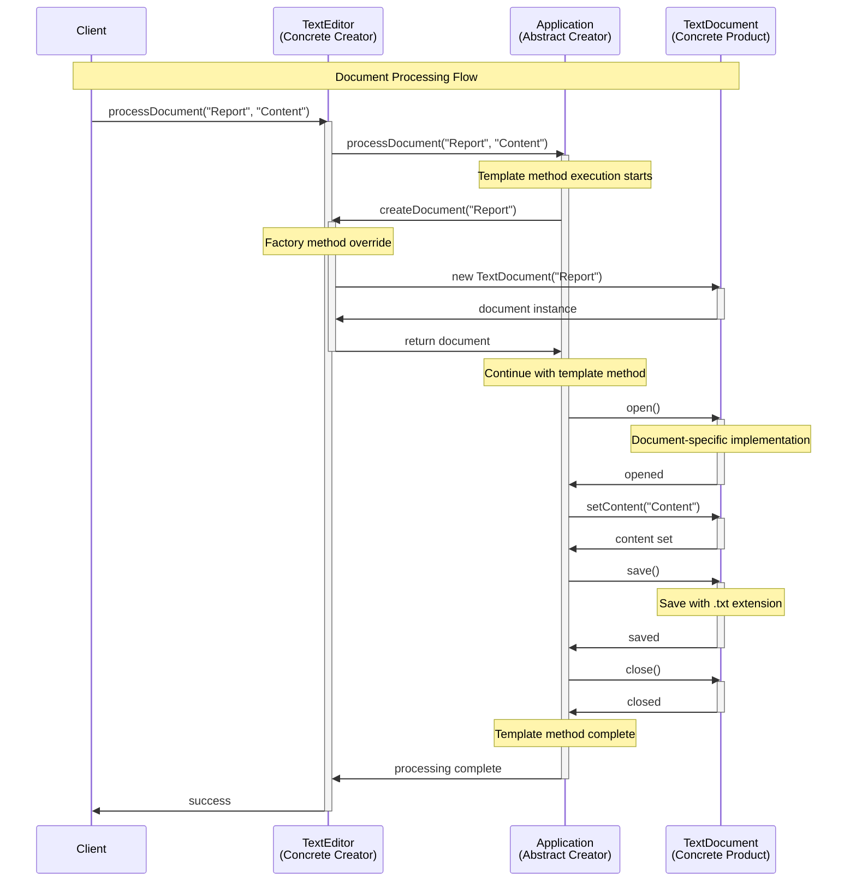
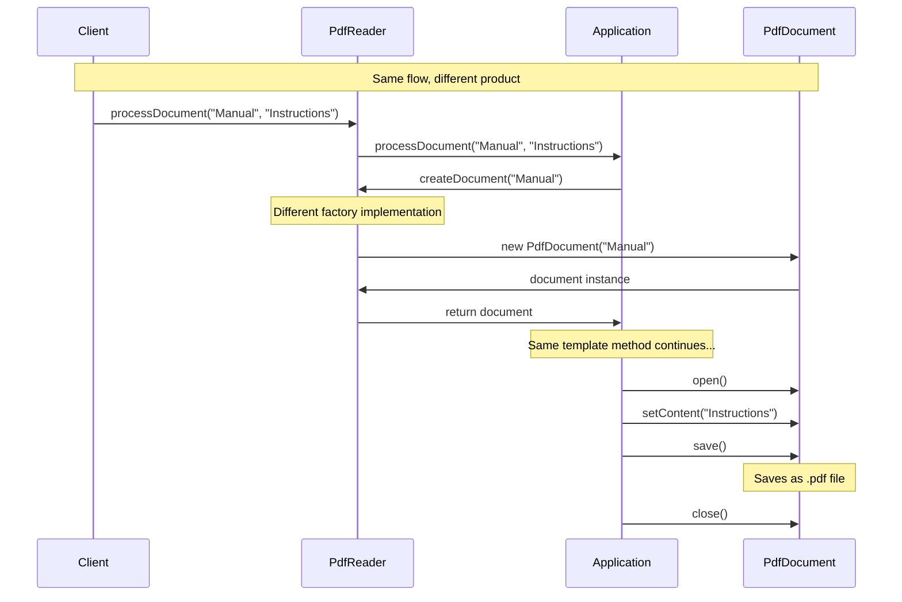
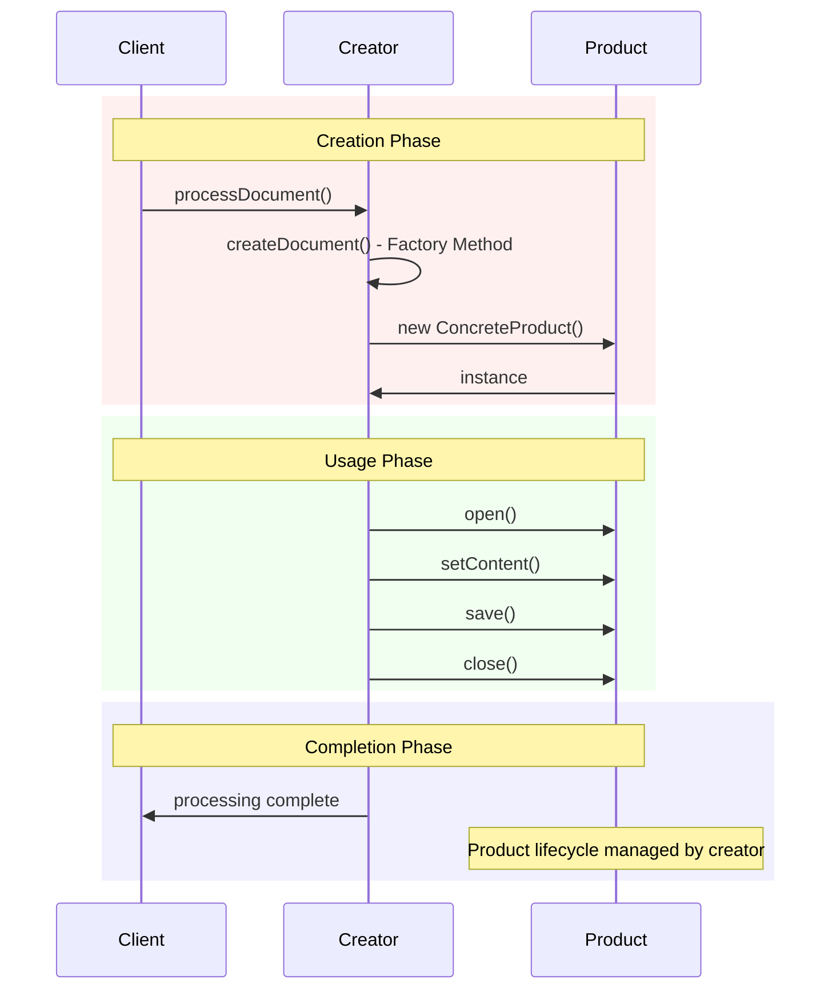
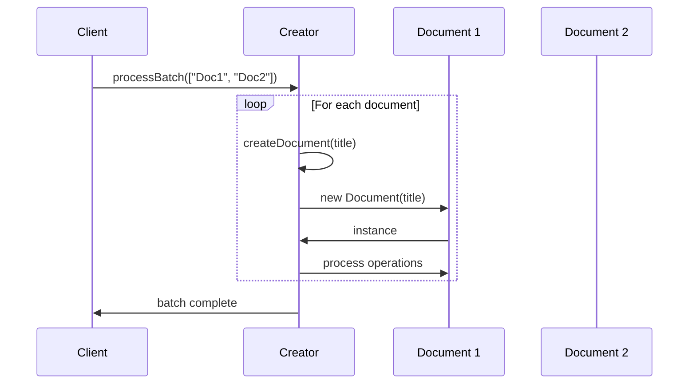
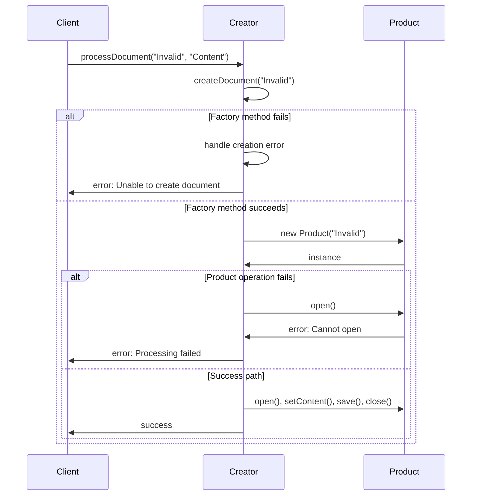
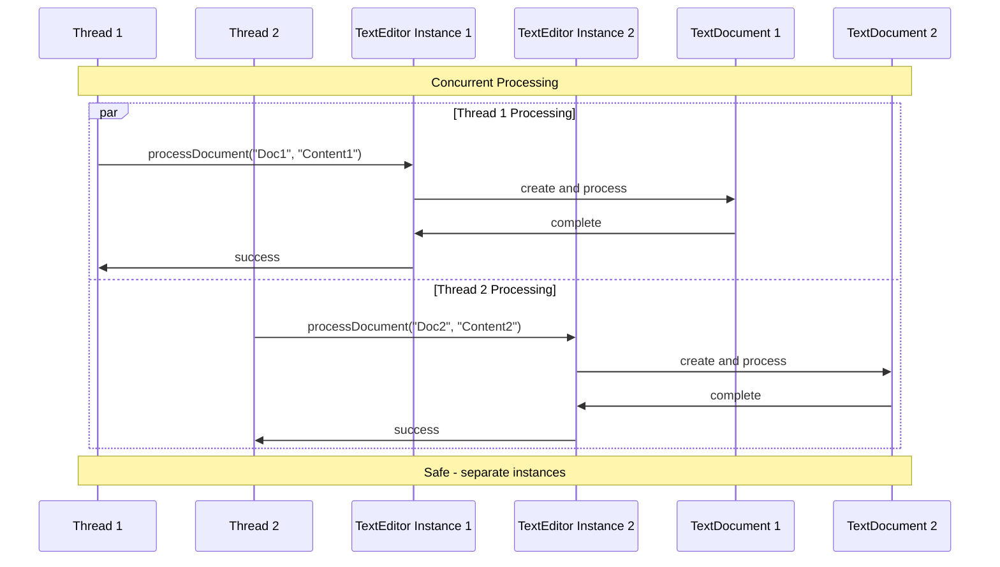

# Classic Factory Method Pattern - Sequence Diagram

This diagram illustrates the runtime interactions and method call flow for the classic inheritance-based Factory Method pattern.

## 🔄 Sequence Flow

## 🎯 Key Interaction Points

### 1. Template Method Pattern Integration
The Factory Method works seamlessly with the Template Method pattern:
- **Template Method**: `processDocument()` defines the algorithm skeleton
- **Factory Method**: `createDocument()` allows subclasses to customize object creation
- **Business Logic**: Remains constant across all creators

### 2. Factory Method Override

### 3. Polymorphism in Action
Each concrete creator produces a different product type, but the client and template method treat all products uniformly through the Document interface.

## 📊 Timing and Lifecycle

## 🔍 Pattern Variations

### Multiple Products in Single Operation

### Error Handling Flow

## 🎯 Key Benefits Illustrated

### 1. **Encapsulation of Creation Logic**
- Factory method encapsulates the decision of which concrete product to create
- Template method doesn't need to know about specific product types

### 2. **Extensibility**
- New creator/product pairs can be added without modifying existing code
- Each creator can have specialized creation logic

### 3. **Consistent Interface Usage**
- All products used through the same Document interface
- Template method works with any product type

## 💼 Real-World Timing Considerations

### Performance Characteristics
- **Creation Time**: Single object creation per operation
- **Memory Usage**: One product instance at a time in template method
- **Scalability**: Linear with number of documents processed

### Thread Safety

## 🔗 Related Pattern Interactions

The sequence diagram shows how Factory Method integrates with:
- **Template Method**: Providing customization points in algorithms
- **Strategy Pattern**: Different creators can be seen as different strategies
- **Prototype Pattern**: Could be combined for cloning-based creation