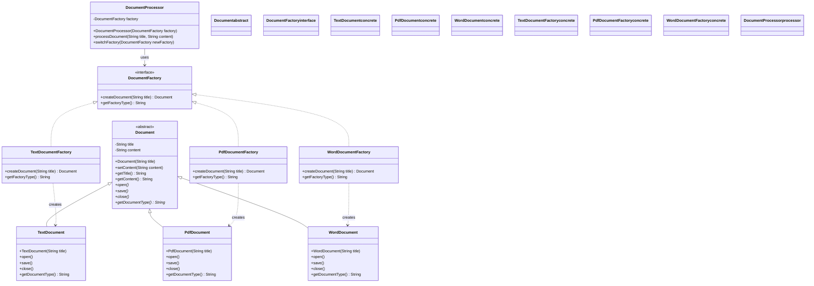
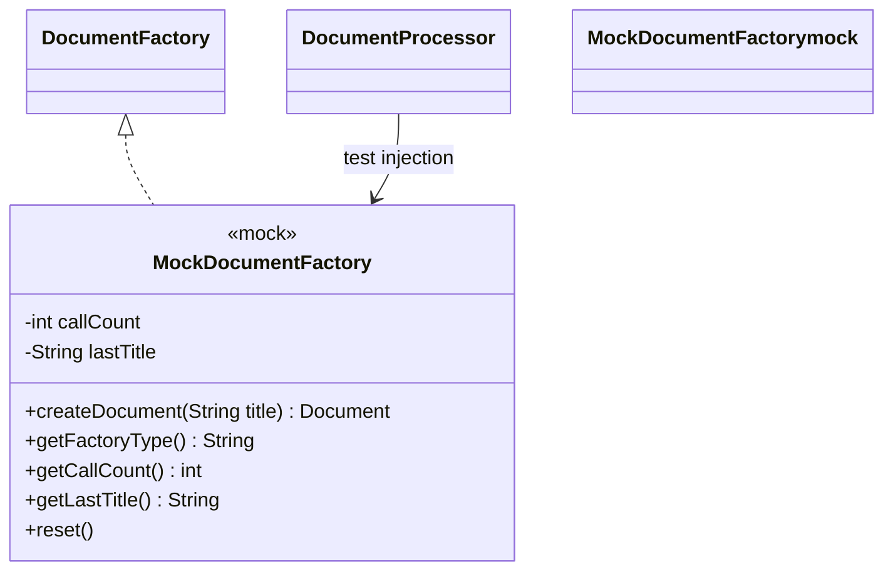

# Interface-Based Factory Pattern - Class Diagram

This diagram illustrates the interface-based Factory Method implementation using composition over inheritance.

## 🏗️ Class Structure

## 🔍 Key Components

### Factory Interface (DocumentFactory)
- **Purpose**: Defines the contract for all factory implementations
- **Key Features**:
  - `createDocument()` - Factory method signature
  - `getFactoryType()` - Identification method
  - No implementation details - pure interface

### Concrete Factory Implementations
- **TextDocumentFactory**: Creates TextDocument instances
- **PdfDocumentFactory**: Creates PdfDocument instances  
- **WordDocumentFactory**: Creates WordDocument instances
- **Key Features**:
  - Each implements the DocumentFactory interface
  - Encapsulates creation logic for specific document type
  - Can have factory-specific initialization or configuration

### Document Processor (Client)
- **Purpose**: Uses factories to create and process documents
- **Key Features**:
  - **Composition**: Contains a DocumentFactory reference
  - **Flexibility**: Can switch factories at runtime
  - **Dependency Injection**: Factory injected via constructor
  - Business logic decoupled from specific creation logic

## 🎯 Pattern Benefits

### ✅ Advantages
- **Composition over Inheritance**: Avoids rigid inheritance hierarchies
- **Runtime Flexibility**: Can switch factories dynamically
- **Easy Testing**: Simple to inject mock factories
- **Multiple Implementations**: Factory interface can have various implementations
- **Dependency Injection**: Works well with DI containers

### ⚠️ Considerations
- **Setup Complexity**: Requires more initial setup than inheritance approach
- **Factory Selection**: Client needs to choose appropriate factory
- **Interface Management**: Must maintain factory interface stability

## 🔄 Method Flow

1. **Client** creates DocumentProcessor with specific factory (e.g., TextDocumentFactory)
2. **DocumentProcessor** calls `factory.createDocument()` when needed
3. **Factory Implementation** creates and returns specific document type
4. **DocumentProcessor** uses created document for business operations
5. **Optional**: Client can call `switchFactory()` to change factory at runtime

## 💼 Real-World Usage

This pattern is ideal when:
- You need runtime factory switching capability
- You're using dependency injection frameworks
- You want to easily unit test with mock factories
- You prefer composition over inheritance
- Multiple factory implementations might be needed

## 🧪 Testing Benefits

The interface-based approach makes testing straightforward:
- **Mock Injection**: Easy to inject mock factories for testing
- **Behavior Verification**: Can verify factory method calls
- **Isolated Testing**: Test business logic without real document creation

## 🔗 Relationships

- **Interface Implementation**: `DocumentFactory ← ConcreteFactories`
- **Composition**: `DocumentProcessor → DocumentFactory`
- **Creation**: `ConcreteFactory → ConcreteDocument`
- **Product Inheritance**: `Document ← ConcreteDocuments`