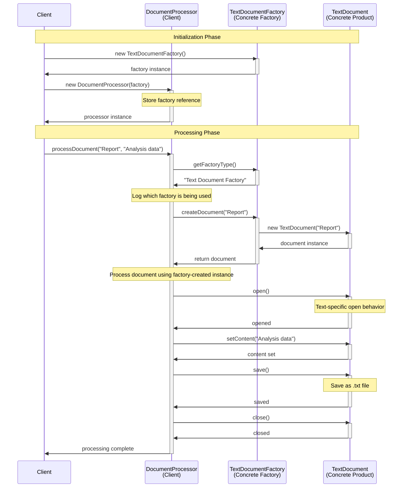
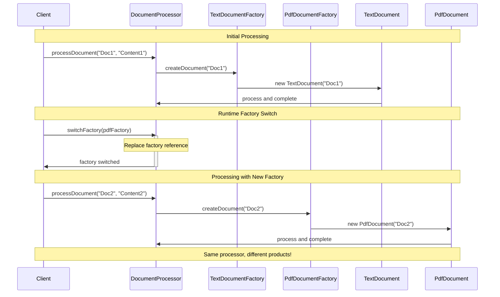
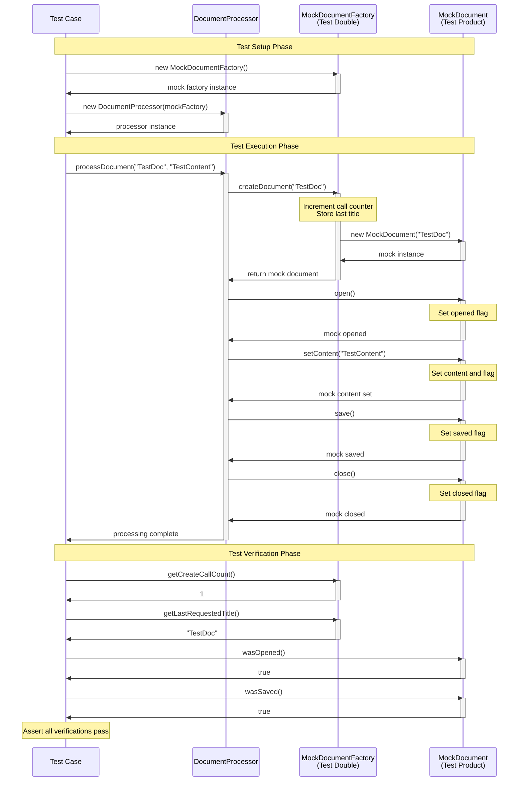
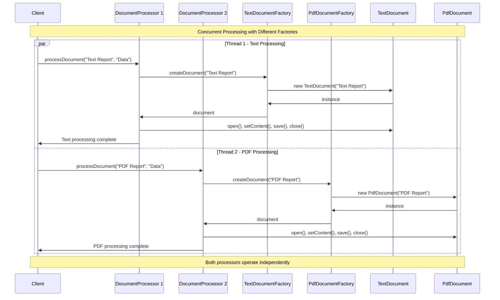
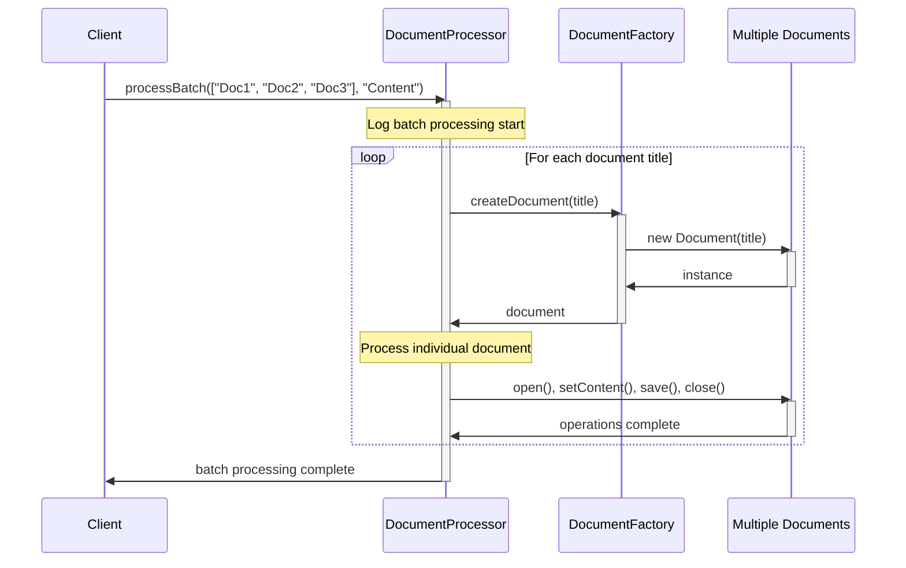

# Interface-Based Factory Pattern - Sequence Diagram

This diagram illustrates the runtime interactions and method call flow for the interface-based Factory Method implementation with composition.

## 🔄 Basic Sequence Flow



## 🔄 Runtime Factory Switching



## 🧪 Testing Sequence with Mock Factory



## 📊 Parallel Processing Capabilities



## 🔄 Batch Processing Sequence



## 🎯 Key Advantages Illustrated

### 1. **Flexible Composition**
- DocumentProcessor can work with any factory implementation
- Runtime switching enables different processing strategies
- No inheritance coupling between processor and factories

### 2. **Easy Testing**
- Mock factories can be injected for isolated testing
- Verification of factory interactions possible
- Test doubles can simulate various scenarios (errors, delays)

### 3. **Scalability**
- Multiple processors can use different factories concurrently
- Factory instances can be shared or dedicated per processor
- Easy to add new factory types without changing existing code

## 💼 Error Handling Flows

```mermaid
sequenceDiagram
    participant Client
    participant Processor as DocumentProcessor
    participant Factory as DocumentFactory
    
    Client->>Processor: processDocument("Invalid", "Content")
    activate Processor
    
    Processor->>Factory: createDocument("Invalid")
    activate Factory
    
    alt Factory throws exception
        Factory->>Processor: CreationException
        deactivate Factory
        Processor->>Client: ProcessingException: "Cannot create document"
        deactivate Processor
    else Factory returns null
        Factory->>Processor: null
        deactivate Factory
        Processor->>Client: ProcessingException: "Factory returned null"
        deactivate Processor
    else Success path
        Factory->>Processor: valid document
        deactivate Factory
        Note over Processor: Continue with normal processing
        Processor->>Client: success
        deactivate Processor
    end
```

## 🔗 Integration Patterns

The interface-based approach integrates well with:
- **Dependency Injection**: Factories injected via containers
- **Observer Pattern**: Factories can notify observers of creation events
- **Decorator Pattern**: Factory results can be decorated with additional behavior
- **Command Pattern**: Factory creation can be encapsulated in commands