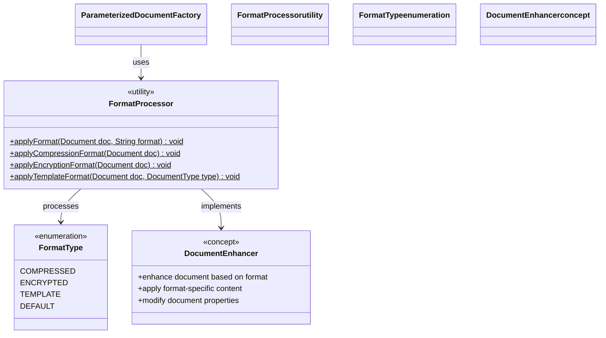

# Parameterized Factory Method Pattern - Class Diagram

This diagram illustrates the parameterized Factory Method implementation where a single factory method uses parameters to determine the product type.

## 🏗️ Class Structure

```mermaid
classDiagram
    class Document {
        <<abstract>>
        -String title
        -String content
        +Document(String title)
        +setContent(String content)
        +getTitle() String
        +getContent() String
        +open()*
        +save()*
        +close()*
        +getDocumentType()* String
    }
    
    class TextDocument {
        +TextDocument(String title)
        +open()
        +save() 
        +close()
        +getDocumentType() String
    }
    
    class PdfDocument {
        +PdfDocument(String title)
        +open()
        +save()
        +close()
        +getDocumentType() String
    }
    
    class WordDocument {
        +WordDocument(String title)
        +open()
        +save()
        +close()
        +getDocumentType() String
    }
    
    class HtmlDocument {
        +HtmlDocument(String title)
        +open()
        +save()
        +close()
        +getDocumentType() String
    }
    
    class XmlDocument {
        +XmlDocument(String title)
        +open()
        +save()
        +close()
        +getDocumentType() String
    }
    
    class DocumentType {
        <<enumeration>>
        TEXT("txt", "Text Document")
        PDF("pdf", "PDF Document")
        WORD("docx", "Word Document")
        HTML("html", "HTML Document")
        XML("xml", "XML Document")
        -String extension
        -String displayName
        +DocumentType(String ext, String name)
        +getExtension() String
        +getDisplayName() String
    }
    
    class ParameterizedDocumentFactory {
        <<utility>>
        -Map~DocumentType, Function~String, Document~~ factories$
        +createDocument(DocumentType type, String title)$ Document
        +createDocument(String typeString, String title)$ Document
        +createDocumentWithFormat(DocumentType type, String title, String format)$ Document
        +getSupportedTypes()$ DocumentType[]
        -setTemplateContent(Document doc, DocumentType type)$ void
        -ParameterizedDocumentFactory()
    }
    
    class Function~String_Document~ {
        <<functional interface>>
        +apply(String title) Document
    }
    
    %% Inheritance relationships
    Document <|-- TextDocument
    Document <|-- PdfDocument
    Document <|-- WordDocument
    Document <|-- HtmlDocument
    Document <|-- XmlDocument
    
    %% Factory relationships
    ParameterizedDocumentFactory --> DocumentType : uses
    ParameterizedDocumentFactory --> Function~String_Document~ : stores
    ParameterizedDocumentFactory ..> TextDocument : creates via λ
    ParameterizedDocumentFactory ..> PdfDocument : creates via λ
    ParameterizedDocumentFactory ..> WordDocument : creates via λ
    ParameterizedDocumentFactory ..> HtmlDocument : creates via λ
    ParameterizedDocumentFactory ..> XmlDocument : creates via λ
    
    %% Function mappings
    Function~String_Document~ ..> TextDocument : TextDocument::new
    Function~String_Document~ ..> PdfDocument : PdfDocument::new
    Function~String_Document~ ..> WordDocument : WordDocument::new
    Function~String_Document~ ..> HtmlDocument : HtmlDocument::new
    Function~String_Document~ ..> XmlDocument : XmlDocument::new
    
    %% Styling
    classDef abstract fill:#ffe6e6,stroke:#ff0000,stroke-width:2px
    classDef concrete fill:#e6ffe6,stroke:#00aa00,stroke-width:2px
    classDef enumeration fill:#fff0e6,stroke:#ff6600,stroke-width:2px
    classDef utility fill:#e6e6ff,stroke:#0000ff,stroke-width:2px
    classDef functional fill:#f0e6ff,stroke:#9900cc,stroke-width:2px
    
    class Document abstract
    class TextDocument,PdfDocument,WordDocument,HtmlDocument,XmlDocument concrete
    class DocumentType enumeration
    class ParameterizedDocumentFactory utility
    class Function~String_Document~ functional
```

## 🔍 Key Components

### DocumentType Enumeration
- **Purpose**: Type-safe parameter for document type selection
- **Key Features**:
  - **File Extensions**: Each type has associated file extension
  - **Display Names**: Human-readable names for UI display
  - **Validation**: Compile-time validation of document types
  - **Extensibility**: Easy to add new document types

### ParameterizedDocumentFactory
- **Purpose**: Single factory with parameter-driven product creation
- **Key Features**:
  - **Enum-Based Creation**: `createDocument(DocumentType, String)`
  - **String-Based Creation**: `createDocument(String, String)` with validation
  - **Format Enhancement**: `createDocumentWithFormat()` for specialized creation
  - **Function Registry**: Uses `Map<DocumentType, Function<String, Document>>`

### Function Registry Pattern
- **Storage**: Maps document types to factory functions
- **Initialization**: Static block populates factory mappings
- **Execution**: Parameter lookup followed by function application

## 🎯 Method Variations

### Type-Safe Creation
```java
// Compile-time type safety
Document doc = ParameterizedDocumentFactory.createDocument(
    DocumentType.PDF, "Project Report"
);
```

### String-Based Creation with Validation
```java
// Runtime validation with fallback
Document doc = ParameterizedDocumentFactory.createDocument(
    "pdf", "Project Report"  // Validates and converts to enum
);
```

### Enhanced Format Creation
```java
// Additional format parameter
Document doc = ParameterizedDocumentFactory.createDocumentWithFormat(
    DocumentType.TEXT, "Template", "compressed"
);
```

## 📊 Factory Function Mapping

```mermaid
classDiagram
    class FactoryRegistry {
        <<concept>>
        TEXT → TextDocument::new
        PDF → PdfDocument::new  
        WORD → WordDocument::new
        HTML → HtmlDocument::new
        XML → XmlDocument::new
    }
    
    class StaticInitialization {
        <<process>>
        +populate factory mappings
        +validate function signatures
        +ensure type coverage
    }
    
    class ParameterLookup {
        <<process>>
        +validate parameter
        +lookup factory function
        +apply function with title
        +return product instance
    }
    
    FactoryRegistry --> StaticInitialization : initialized by
    ParameterLookup --> FactoryRegistry : queries
    
    classDef concept fill:#fff0e6,stroke:#ff6600,stroke-width:2px
    classDef process fill:#f0e6ff,stroke:#9900cc,stroke-width:2px
    
    class FactoryRegistry concept
    class StaticInitialization,ParameterLookup process
```

## 🔄 Parameter Processing Flow

### Enum Parameter Path
1. **Direct Lookup**: `DocumentType` parameter used directly as map key
2. **Function Retrieval**: Get corresponding factory function
3. **Function Application**: Apply function with title parameter
4. **Product Return**: Return created document instance

### String Parameter Path
1. **String Validation**: Check for null/empty string
2. **Enum Conversion**: `DocumentType.valueOf(string.toUpperCase())`
3. **Fallback Handling**: Default to `TEXT` type if conversion fails
4. **Delegate**: Forward to enum-based creation method

## 🎯 Format Enhancement System



### Format Processing Examples
- **Compressed**: Adds "[COMPRESSED]" prefix to content
- **Encrypted**: Adds "[ENCRYPTED]" prefix to content  
- **Template**: Sets type-specific template content
- **Default**: No additional processing

## 🎯 Pattern Benefits

### ✅ Advantages
- **Centralized Logic**: Single point of creation for all document types
- **Type Safety**: Enum parameters provide compile-time validation
- **Parameter Validation**: String-based method includes validation and fallbacks
- **Format Flexibility**: Additional format parameters allow customization
- **Easy Extension**: Adding new types requires minimal code changes

### ⚠️ Considerations
- **Open/Closed Violation**: Adding new types requires modifying factory class
- **Parameter Explosion**: Multiple parameters can make methods complex
- **Runtime Errors**: String-based creation can fail at runtime
- **Limited Polymorphism**: Single factory method limits customization per type

## 💼 Real-World Usage Scenarios

### Configuration-Driven Creation
```java
// Type from configuration file
String configType = config.getProperty("document.type");
Document doc = ParameterizedDocumentFactory.createDocument(configType, title);
```

### User Interface Integration
```java
// Dropdown selection in UI
DocumentType selectedType = (DocumentType) dropdown.getSelectedItem();
Document doc = ParameterizedDocumentFactory.createDocument(selectedType, title);
```

### Batch Processing
```java
// Process multiple types in loop
for (DocumentType type : DocumentType.values()) {
    Document doc = ParameterizedDocumentFactory.createDocument(type, 
        "Batch_" + type.name());
    processBatch(doc);
}
```

## 🔗 Related Patterns Integration

- **Simple Factory**: Very similar but parameterized factory uses single method
- **Abstract Factory**: Can be combined for families of related document types
- **Strategy Pattern**: Document types can be seen as creation strategies
- **Template Method**: Format processing follows template method pattern

## 🎯 When to Use

This pattern is ideal when:
- **Limited Product Types**: Small, stable set of product variants
- **Centralized Control**: Want single point of creation logic
- **Parameter Validation**: Need to validate and convert input parameters
- **UI Integration**: Working with dropdowns, configuration files, or user input
- **Batch Processing**: Creating multiple types based on iteration or configuration