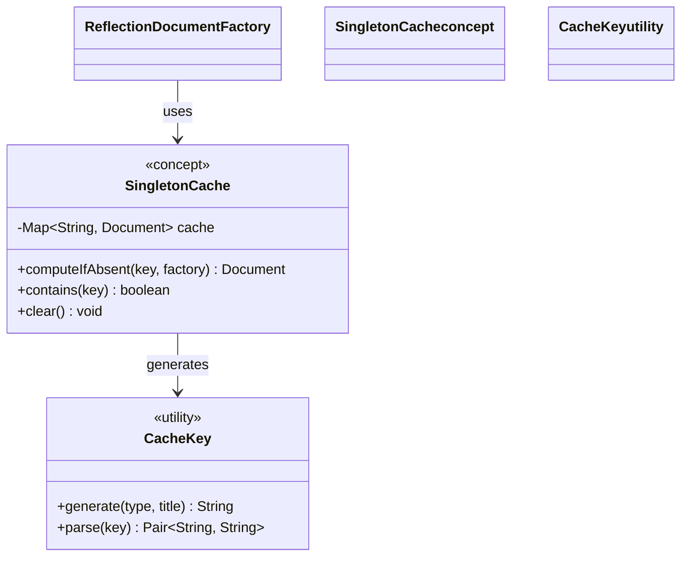

# Reflection-Based Factory Pattern - Class Diagram

This diagram illustrates the reflection-based Factory Method implementation with dynamic class loading and runtime instantiation capabilities.

## 🏗️ Class Structure

```mermaid
classDiagram
    class Document {
        <<abstract>>
        -String title
        -String content
        +Document(String title)
        +setContent(String content)
        +getTitle() String
        +getContent() String
        +open()*
        +save()*
        +close()*
        +getDocumentType()* String
    }
    
    class TextDocument {
        +TextDocument(String title)
        +open()
        +save() 
        +close()
        +getDocumentType() String
    }
    
    class PdfDocument {
        +PdfDocument(String title)
        +open()
        +save()
        +close()
        +getDocumentType() String
    }
    
    class WordDocument {
        +WordDocument(String title)
        +open()
        +save()
        +close()
        +getDocumentType() String
    }
    
    class ReflectionDocumentFactory {
        <<utility>>
        -Map~String, Class~? extends Document~~ typeRegistry$
        -Map~String, Document~ singletonCache$
        +registerType(String type, String className)$ void
        +registerType(String type, Class~Document~ docClass)$ void
        +createDocument(String type, String title)$ Document
        +createSingletonDocument(String type, String title)$ Document
        +createDocumentByClassName(String className, String title)$ Document
        +isTypeRegistered(String type)$ boolean
        +unregisterType(String type)$ void
        +clearCache()$ void
        +clearRegistry()$ void
        -registerDefaultTypes()$ void
    }
    
    class ReflectionFactoryException {
        <<exception>>
        +ReflectionFactoryException(String message)
        +ReflectionFactoryException(String message, Throwable cause)
    }
    
    class Class~T~ {
        <<java.lang.Class>>
        +forName(String className)$ Class~?~
        +getConstructor(Class~?~... parameterTypes) Constructor~T~
        +isAssignableFrom(Class~?~ cls) boolean
        +newInstance() T
    }
    
    class Constructor~T~ {
        <<java.lang.reflect.Constructor>>
        +newInstance(Object... initargs) T
    }
    
    class ClassLoader {
        <<java.lang.ClassLoader>>
        +loadClass(String name) Class~?~
        +getSystemClassLoader()$ ClassLoader
    }
    
    %% Inheritance relationships
    Document <|-- TextDocument
    Document <|-- PdfDocument
    Document <|-- WordDocument
    Exception <|-- ReflectionFactoryException
    
    %% Reflection relationships
    ReflectionDocumentFactory --> Class~T~ : uses
    ReflectionDocumentFactory --> Constructor~T~ : uses
    ReflectionDocumentFactory --> ClassLoader : uses
    ReflectionDocumentFactory --> ReflectionFactoryException : throws
    
    %% Registry relationships
    ReflectionDocumentFactory --> Document : caches singletons
    ReflectionDocumentFactory ..> TextDocument : creates via reflection
    ReflectionDocumentFactory ..> PdfDocument : creates via reflection
    ReflectionDocumentFactory ..> WordDocument : creates via reflection
    
    %% Dynamic relationships (dashed = runtime only)
    Class~T~ -.-> Constructor~T~ : getConstructor()
    Constructor~T~ -.-> Document : newInstance()
    ClassLoader -.-> Class~T~ : loadClass()
    
    %% Styling
    classDef abstract fill:#ffe6e6,stroke:#ff0000,stroke-width:2px
    classDef concrete fill:#e6ffe6,stroke:#00aa00,stroke-width:2px
    classDef utility fill:#e6e6ff,stroke:#0000ff,stroke-width:2px
    classDef exception fill:#ffcccc,stroke:#cc0000,stroke-width:2px
    classDef reflection fill:#fff0e6,stroke:#ff6600,stroke-width:2px
    
    class Document abstract
    class TextDocument,PdfDocument,WordDocument concrete
    class ReflectionDocumentFactory utility
    class ReflectionFactoryException exception
    class Class~T~,Constructor~T~,ClassLoader reflection
```

## 🔍 Key Components

### ReflectionDocumentFactory
- **Purpose**: Dynamic factory using Java reflection API for maximum flexibility
- **Key Features**:
  - **Type Registry**: Maps string types to Class objects
  - **Singleton Cache**: Caches instances for singleton pattern implementation
  - **Dynamic Registration**: Register types by class name or Class object
  - **Error Handling**: Custom exception for reflection-related failures

### Reflection API Integration
- **Class.forName()**: Dynamic class loading by name
- **getConstructor()**: Retrieves constructor with specific parameter types
- **newInstance()**: Creates new object instances dynamically
- **isAssignableFrom()**: Validates inheritance relationships

### Exception Handling
- **ReflectionFactoryException**: Wraps reflection-related exceptions
- **Comprehensive Error Messages**: Detailed error information for debugging
- **Cause Chain**: Preserves original exception causes

## 🎯 Registration Methods

### String-Based Registration
```java
// Register by fully qualified class name
ReflectionDocumentFactory.registerType("custom", 
    "com.example.CustomDocument");
```

### Class-Based Registration  
```java
// Register by Class object (compile-time safety)
ReflectionDocumentFactory.registerType("custom", 
    CustomDocument.class);
```

### Default Type Initialization
- Automatic registration of core document types
- Static initialization block populates registry
- Handles registration failures gracefully

## 📊 Reflection Process Flow

```mermaid
classDiagram
    class ReflectionProcess {
        <<process>>
        1. Type Lookup
        2. Class Retrieval
        3. Constructor Access
        4. Instance Creation
        5. Type Validation
        6. Return Product
    }
    
    class TypeValidation {
        <<process>>
        +validate class extends Document
        +check constructor availability
        +verify parameter types
        +handle inheritance
    }
    
    class ErrorHandling {
        <<process>>
        +ClassNotFoundException
        +NoSuchMethodException
        +InstantiationException
        +IllegalAccessException
        +InvocationTargetException
    }
    
    ReflectionProcess --> TypeValidation : includes
    ReflectionProcess --> ErrorHandling : manages
    
    classDef process fill:#f0e6ff,stroke:#9900cc,stroke-width:2px
    
    class ReflectionProcess,TypeValidation,ErrorHandling process
```

## 🔄 Creation Strategies

### Direct Creation
1. **Type Lookup**: Find Class object in registry
2. **Constructor Access**: Get constructor for `String` parameter
3. **Instance Creation**: Call `constructor.newInstance(title)`
4. **Return**: Product instance

### Singleton Creation  
1. **Cache Check**: Look for existing instance in singleton cache
2. **Cache Miss**: Create new instance using direct creation
3. **Cache Hit**: Return cached instance
4. **Cache Store**: Store new instances for future access

### Class Name Creation
1. **Dynamic Loading**: `Class.forName(className)`
2. **Type Validation**: Ensure class extends Document
3. **Constructor Access**: Get appropriate constructor
4. **Instance Creation**: Create and return instance

## 🎯 Advanced Features

### Singleton Pattern Integration


### Dynamic Type Management
- **Runtime Registration**: Add new types without code changes
- **Type Unregistration**: Remove types from registry
- **Registry Validation**: Ensure registered classes extend Document
- **Cleanup Operations**: Clear registry and cache for memory management

## 🎯 Pattern Benefits

### ✅ Advantages
- **Maximum Flexibility**: Create any class that extends Document
- **Configuration-Driven**: Types can be loaded from configuration files
- **Plugin Architecture**: Perfect for unknown types loaded at runtime
- **No Code Changes**: Add new document types without compilation
- **Singleton Support**: Built-in singleton pattern implementation

### ⚠️ Considerations
- **Performance Overhead**: Reflection is slower than direct instantiation
- **Runtime Errors**: Class loading and instantiation failures occur at runtime
- **Security Concerns**: Can bypass access controls (requires security manager consideration)
- **Debugging Difficulty**: Reflection-based errors are harder to debug
- **IDE Support**: Limited auto-completion and refactoring support

## 🔒 Security and Validation

```mermaid
classDiagram
    class SecurityValidation {
        <<security>>
        +validateClassAccess(Class clazz) boolean
        +checkInheritance(Class clazz) boolean
        +validateConstructor(Constructor ctor) boolean
        +preventMaliciousLoading() void
    }
    
    class AccessControl {
        <<security>>
        +checkClassPermission(String className) boolean
        +validatePackageAccess() boolean
        +enforceSecurityPolicy() void
    }
    
    ReflectionDocumentFactory --> SecurityValidation : implements
    SecurityValidation --> AccessControl : uses
    
    classDef security fill:#ffe6e6,stroke:#cc0000,stroke-width:2px
    
    class SecurityValidation,AccessControl security
```

### Validation Checks
- **Inheritance Validation**: Ensure classes extend Document
- **Constructor Availability**: Verify required constructor exists
- **Package Access**: Control which packages can be loaded
- **Class Permission**: Security manager integration

## 💼 Real-World Usage Scenarios

### Configuration-Driven Loading
```yaml
# application.yml
document_types:
  - type: "spreadsheet"
    class: "com.thirdparty.SpreadsheetDocument"
  - type: "presentation" 
    class: "com.plugins.PresentationDocument"
```

### Plugin System Integration
```java
// Plugin discovers and registers its document types
public class DocumentPlugin {
    public void initialize() {
        ReflectionDocumentFactory.registerType("custom", 
            "com.plugin.CustomDocument");
    }
}
```

### Database-Driven Registration
```sql
SELECT type_name, class_name FROM document_types WHERE enabled = true;
-- Results used to register types dynamically
```

## 🔗 Integration with Other Patterns

- **Strategy Pattern**: Different classes as different creation strategies
- **Plugin Pattern**: Dynamic loading of plugin-provided document types
- **Factory Method**: Can be combined with traditional factory methods
- **Singleton Pattern**: Built-in singleton support through caching
- **Registry Pattern**: Uses registry for type-to-class mappings

## 🎯 When to Use

This pattern excels when:
- **Maximum Flexibility**: Need to load unknown classes at runtime
- **Plugin Architecture**: Third-party plugins provide document types
- **Configuration-Driven**: Document types determined by external configuration
- **Dynamic Environments**: Types change based on runtime conditions
- **Legacy Integration**: Need to integrate with existing class hierarchies

## ⚠️ When NOT to Use

Avoid this pattern when:
- **Performance Critical**: Reflection overhead is unacceptable
- **Simple Requirements**: Direct instantiation is sufficient
- **Security Sensitive**: Reflection poses security risks
- **Compile-Time Safety**: Need compile-time validation of types