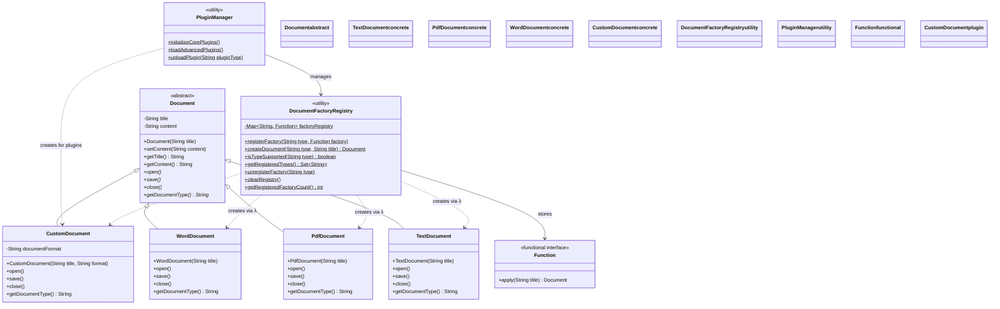
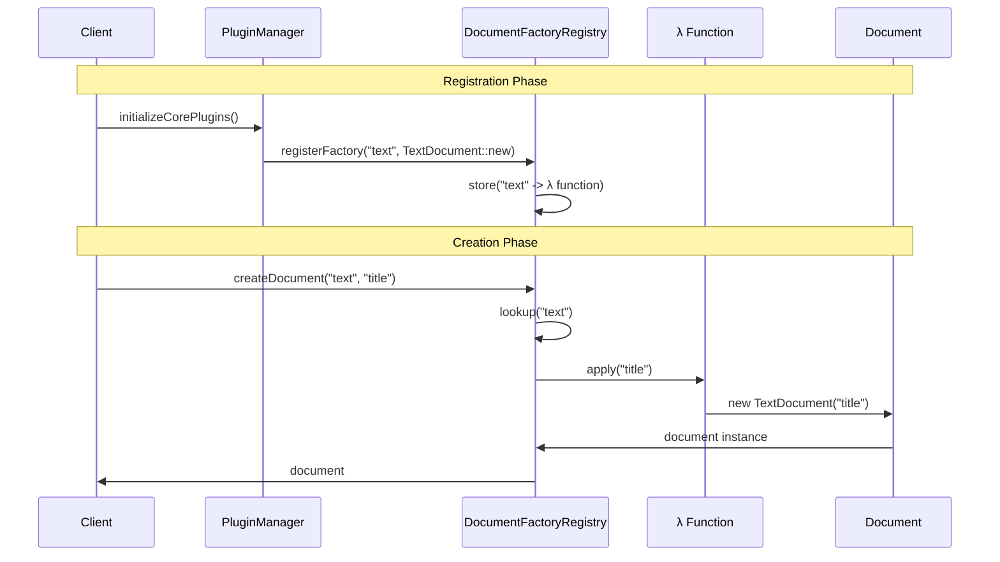

# Registry-Backed Factory Pattern - Class Diagram

This diagram illustrates the registry-backed Factory Method implementation with dynamic factory registration for plugin architectures.

## 🏗️ Class Structure



## 🔍 Key Components

### DocumentFactoryRegistry (Central Registry)
- **Purpose**: Central repository for factory functions with dynamic registration
- **Key Features**:
  - **Static Methods**: All operations are static for global access
  - **Function Storage**: Stores `Function<String, Document>` mappings
  - **Type Safety**: String-based type identification with validation
  - **Runtime Management**: Add/remove factories dynamically

### PluginManager (Plugin Orchestrator)
- **Purpose**: Manages plugin lifecycle and factory registration
- **Key Features**:
  - **Core Plugins**: Initializes standard document factories
  - **Advanced Plugins**: Loads additional/custom document types
  - **Plugin Lifecycle**: Load and unload plugins dynamically
  - **Factory Creation**: Creates lambda functions for plugin integration

### Function Interface (Factory Functions)
- **Purpose**: Functional interface for factory method implementations
- **Key Features**:
  - **Lambda Compatible**: Works with method references and lambdas
  - **Type Safe**: `Function<String, Document>` ensures correct signatures
  - **Composable**: Can be combined and transformed functionally

## 🎯 Pattern Benefits

### ✅ Advantages
- **Runtime Extensibility**: Add new document types without code changes
- **Plugin Architecture**: Perfect for modular applications
- **Type Aliases**: Support multiple names for same type (e.g., "txt", "text")
- **Dynamic Loading**: Load factories from configuration or at runtime
- **Memory Efficient**: Factories stored as lightweight function references

### ⚠️ Considerations
- **Initialization Required**: Registry must be populated before use
- **Runtime Errors**: Type mismatches discovered at runtime, not compile-time
- **Global State**: Static registry creates global state dependencies
- **Thread Safety**: Requires careful consideration for concurrent access

## 🔄 Registration and Creation Flow



## 💼 Plugin Architecture

The registry-backed pattern enables powerful plugin architectures:

### Core Plugin Loading
```java
// Core plugins with standard types
PluginManager.initializeCorePlugins();
// Registers: text, pdf, word, html, xml
```

### Advanced Plugin Loading
```java
// Advanced plugins with custom types
PluginManager.loadAdvancedPlugins();
// Registers: rtf, odt, csv, json
```

### Runtime Plugin Registration
```java
// Custom runtime registration
DocumentFactoryRegistry.registerFactory("custom", 
    title -> new CustomDocument(title, "CUSTOM"));
```

## 🧩 Extensibility Examples

### Configuration-Driven Registration
```yaml
# config.yml
document_factories:
  - type: "markdown"
    class: "com.example.MarkdownDocument"
  - type: "latex"
    class: "com.example.LatexDocument"
```

### Database-Driven Registration
```sql
-- Factory configurations in database
INSERT INTO factory_config (type, class_name, enabled) 
VALUES ('excel', 'com.example.ExcelDocument', true);
```

## 🔗 Key Relationships

- **Registration**: `PluginManager → DocumentFactoryRegistry`
- **Storage**: `DocumentFactoryRegistry → Function<String,Document>`
- **Creation**: `Function → ConcreteDocument`
- **Management**: `PluginManager → CustomDocument` (for plugins)

## 🎯 Use Cases

This pattern excels in:
- **Modular Applications**: Components can register their own document types
- **Plugin Systems**: Third-party plugins can add document support
- **Configuration-Driven**: Document types determined by configuration
- **Microservices**: Each service can register its document factories
- **Dynamic Environments**: Document types change based on runtime conditions