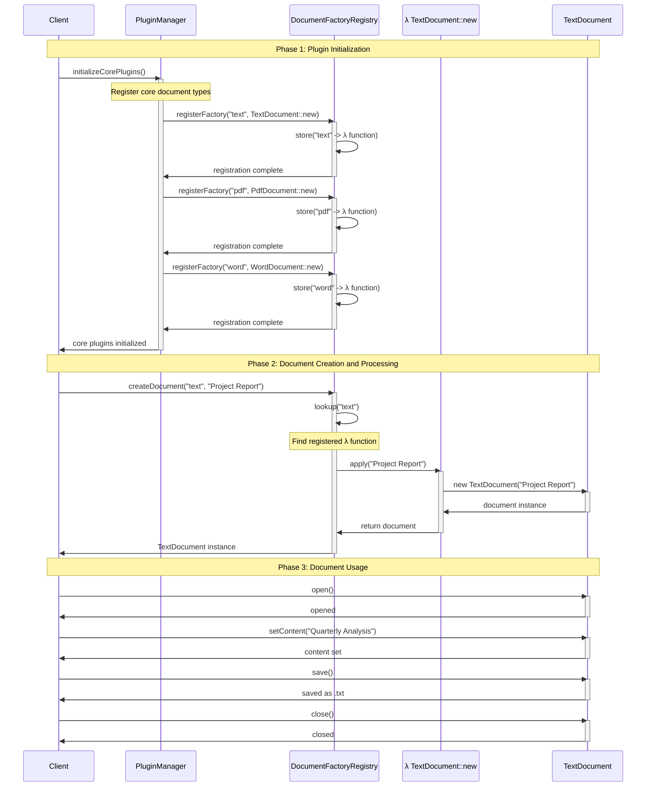
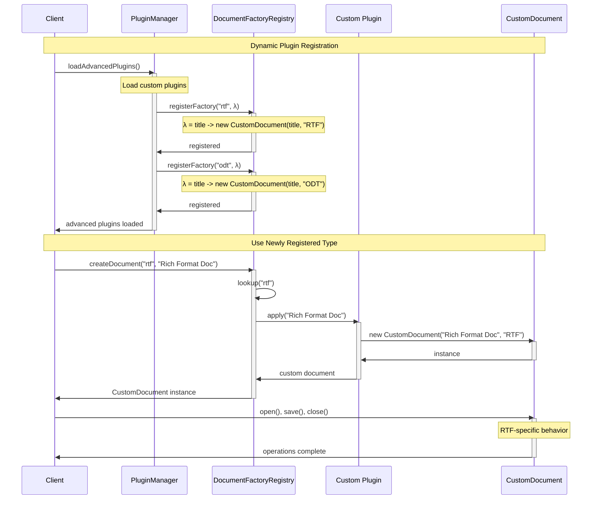
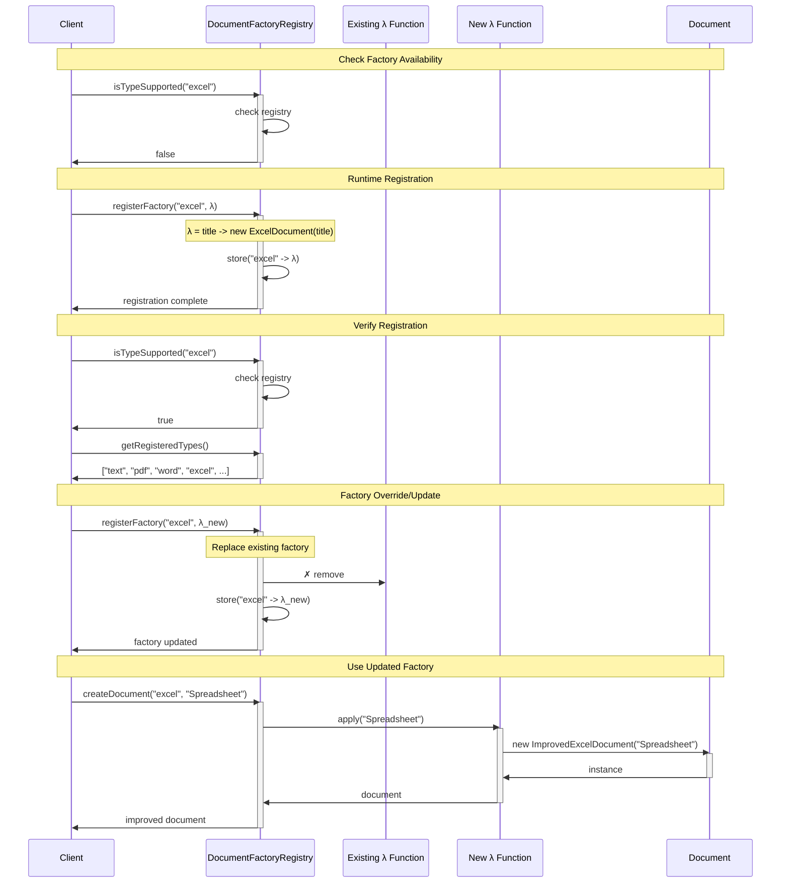
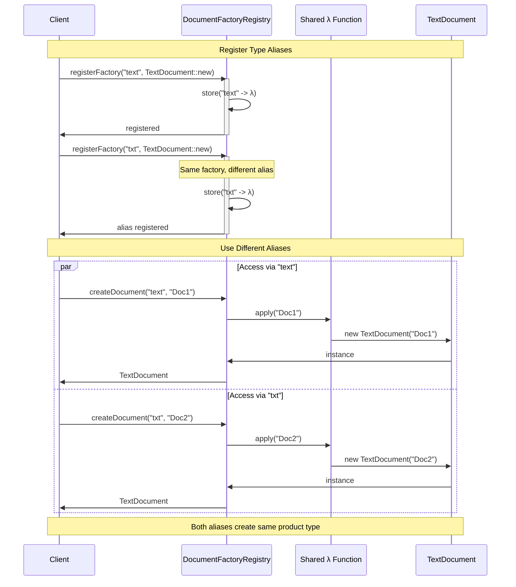
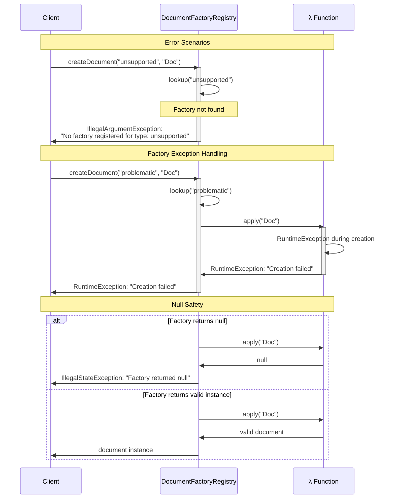
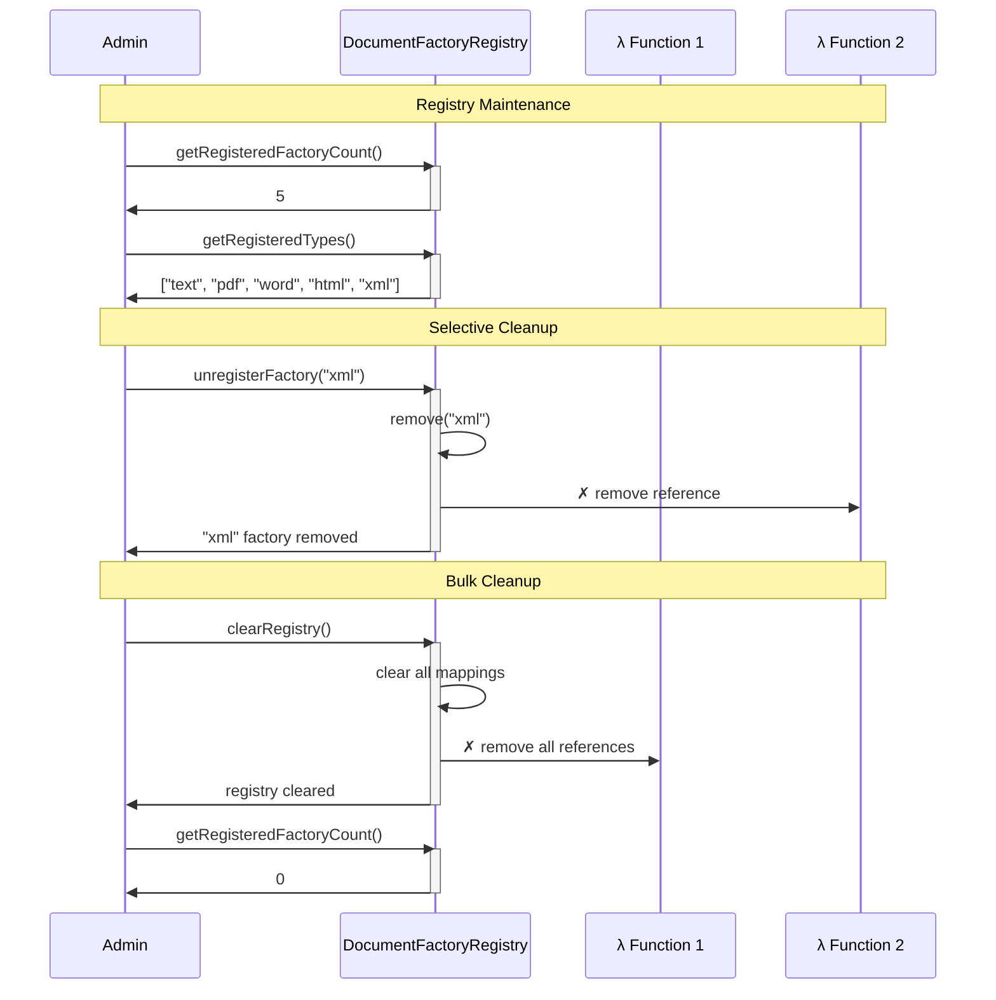
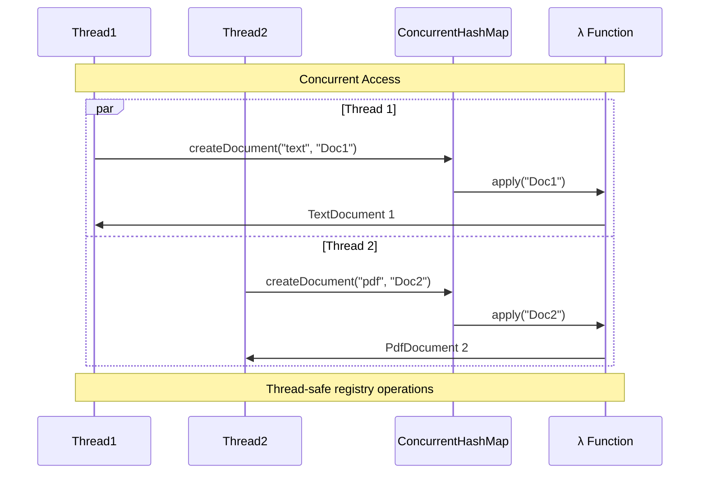

# Registry-Backed Factory Pattern - Sequence Diagram

This diagram illustrates the runtime interactions and method call flow for the registry-backed Factory Method implementation with dynamic factory registration.

## 🔄 Complete Lifecycle: Registration → Creation → Usage

## 🚀 Advanced Plugin Loading

## 🔧 Runtime Factory Management

## 🔍 Type Alias Support

## 🚫 Error Handling and Validation

## 🧹 Registry Management Operations

## 📈 Performance Characteristics

### Memory Usage
- **Registry Storage**: O(n) where n = number of registered types
- **Function References**: Minimal memory overhead per factory
- **Product Creation**: One instance per creation call

### Lookup Performance
- **Type Lookup**: O(1) HashMap access
- **Factory Execution**: O(1) function call
- **Registration**: O(1) HashMap insertion

### Concurrency Considerations

## 🎯 Key Benefits Demonstrated

1. **Runtime Extensibility**: New factories can be registered without code changes
2. **Type Flexibility**: Multiple aliases for same factory function
3. **Plugin Architecture**: Perfect for modular, extensible applications
4. **Performance**: Fast O(1) lookups with minimal memory overhead
5. **Error Handling**: Comprehensive validation and error reporting
6. **Management**: Full lifecycle management of factory registrations