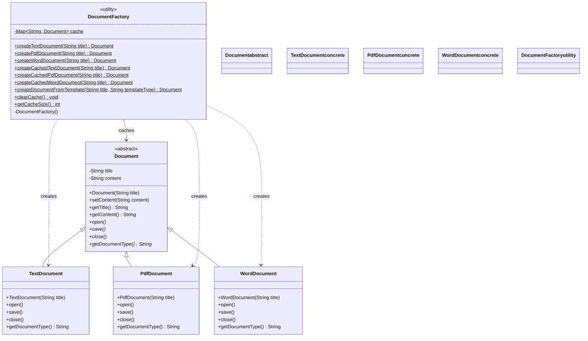

# Static Factory Methods Pattern - Class Diagram

This diagram illustrates the static factory methods implementation with named constructors and optional caching mechanisms.

## 🏗️ Class Structure



## 🔍 Key Components

### DocumentFactory (Static Utility Class)
- **Purpose**: Provides static factory methods with descriptive names
- **Key Features**:
  - **Named Constructors**: `createTextDocument()`, `createPdfDocument()`, etc.
  - **Caching Support**: `createCachedXXXDocument()` methods with memoization
  - **Template Creation**: `createDocumentFromTemplate()` with pre-defined content
  - **Cache Management**: `clearCache()`, `getCacheSize()` for maintenance
  - **Private Constructor**: Prevents instantiation (utility class pattern)

### Static Factory Method Benefits

#### 1. **Descriptive Method Names**
```java
// Clear intent vs generic constructor
Document textDoc = DocumentFactory.createTextDocument("Report");
Document templateDoc = DocumentFactory.createDocumentFromTemplate("Report", "executive");

// vs ambiguous constructor
Document doc = new SomeDocument("Report", DocumentType.TEXT);
```

#### 2. **Caching/Memoization**
```java
// Same instance returned for same parameters
Document cached1 = DocumentFactory.createCachedTextDocument("Template");
Document cached2 = DocumentFactory.createCachedTextDocument("Template");
// cached1 == cached2 (same instance)
```

#### 3. **Complex Creation Logic**
```java
// Factory method can contain complex logic
public static Document createDocumentFromTemplate(String title, String templateType) {
    switch (templateType) {
        case "report": return createReportTemplate(title);
        case "letter": return createLetterTemplate(title);
        case "manual": return createManualTemplate(title);
    }
}
```

## 🎯 Method Categories

### Basic Factory Methods
- **createTextDocument()**: Simple text document creation
- **createPdfDocument()**: Simple PDF document creation  
- **createWordDocument()**: Simple Word document creation

### Cached Factory Methods
- **createCachedTextDocument()**: Returns cached instance if exists
- **createCachedPdfDocument()**: Returns cached instance if exists
- **createCachedWordDocument()**: Returns cached instance if exists

### Template Factory Methods
- **createDocumentFromTemplate()**: Creates document with pre-defined content based on template type

## 📊 Caching Strategy

```mermaid
classDiagram
    class CacheStrategy {
        <<concept>>
    }
    
    class DocumentFactory {
        -Map~String, Document~ cache$
        +createCachedDocument(String key)$ Document
    }
    
    class CacheKey {
        +String type
        +String title
        +String composite
        +generateKey(type, title)$ String
    }
    
    DocumentFactory --> CacheKey : generates
    DocumentFactory --> CacheStrategy : implements
    
    classDef concept fill:#fff0e6,stroke:#ff6600,stroke-width:2px
    classDef utility fill:#e6e6ff,stroke:#0000ff,stroke-width:2px
    
    class CacheStrategy concept
    class DocumentFactory,CacheKey utility
```

### Cache Implementation Details
- **Key Generation**: `type + "_" + title` creates unique cache keys
- **Thread Safety**: Uses `ConcurrentHashMap` for concurrent access
- **Memory Management**: `clearCache()` allows memory cleanup
- **Cache Monitoring**: `getCacheSize()` for cache statistics

## 🎯 Pattern Benefits

### ✅ Advantages
- **Descriptive Names**: Method names clearly indicate what is created
- **Performance**: Caching reduces object creation overhead
- **Flexibility**: Can return different subtypes based on parameters
- **No Inheritance**: No need for inheritance hierarchies
- **Singleton-like**: Can implement singleton behavior per type

### ⚠️ Considerations
- **No Polymorphism**: Static methods cannot be overridden
- **Global State**: Cache introduces global state
- **Memory Usage**: Cached instances remain in memory
- **Thread Safety**: Cache must be thread-safe for concurrent access

## 💼 Usage Patterns

### Simple Creation
```java
Document doc = DocumentFactory.createTextDocument("Simple Report");
```

### Performance-Optimized Creation
```java
// First call - creates and caches
Document cached1 = DocumentFactory.createCachedTextDocument("Template");

// Subsequent calls - returns cached instance
Document cached2 = DocumentFactory.createCachedTextDocument("Template");
```

### Template-Based Creation
```java
Document report = DocumentFactory.createDocumentFromTemplate("Q4 Report", "report");
Document letter = DocumentFactory.createDocumentFromTemplate("Welcome", "letter");
```

### Cache Management
```java
int cacheSize = DocumentFactory.getCacheSize(); // Monitor cache
DocumentFactory.clearCache(); // Clean up memory
```

## 🔄 Thread Safety Considerations

```mermaid
classDiagram
    class ConcurrentAccess {
        <<scenario>>
    }
    
    class DocumentFactory {
        -ConcurrentHashMap~String, Document~ cache$
        +createCachedDocument(key)$ Document
    }
    
    class Thread1 {
        +run() void
    }
    
    class Thread2 {
        +run() void
    }
    
    Thread1 --> DocumentFactory : concurrent access
    Thread2 --> DocumentFactory : concurrent access
    DocumentFactory --> ConcurrentAccess : ensures
    
    classDef scenario fill:#fff0e6,stroke:#ff6600,stroke-width:2px
    classDef thread fill:#f0e6ff,stroke:#9900cc,stroke-width:2px
    classDef utility fill:#e6e6ff,stroke:#0000ff,stroke-width:2px
    
    class ConcurrentAccess scenario
    class Thread1,Thread2 thread
    class DocumentFactory utility
```

## 🔗 Integration Patterns

The static factory method pattern integrates well with:
- **Singleton Pattern**: Each document type can be a singleton
- **Flyweight Pattern**: Cached instances can be flyweights
- **Template Method**: Template-based creation follows template method pattern
- **Builder Pattern**: Can be combined for complex document construction

## 🎯 Use Cases

This pattern excels when:
- **Performance matters**: Caching reduces creation overhead
- **Clear naming needed**: Descriptive method names improve code readability
- **Simple creation logic**: No complex inheritance hierarchies required
- **Utility functionality**: Centralized creation logic in one place
- **Memory optimization**: Cached instances reduce memory usage for common objects