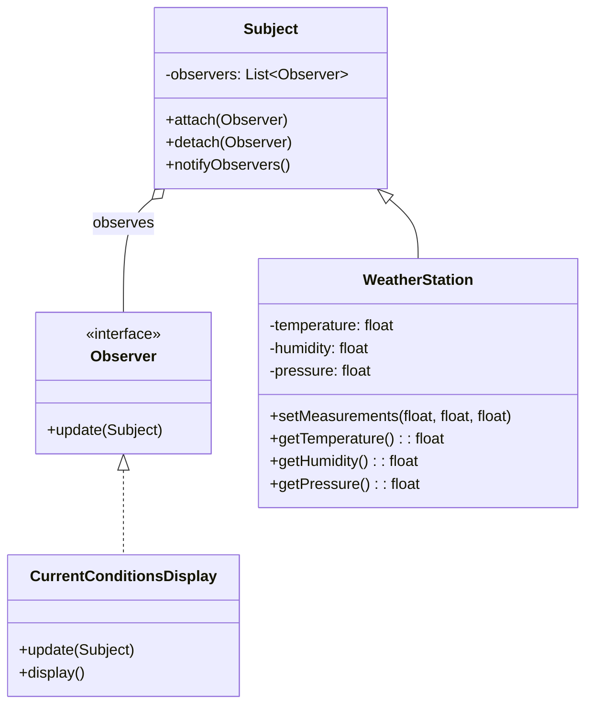
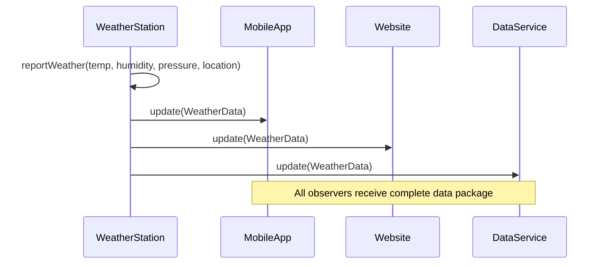
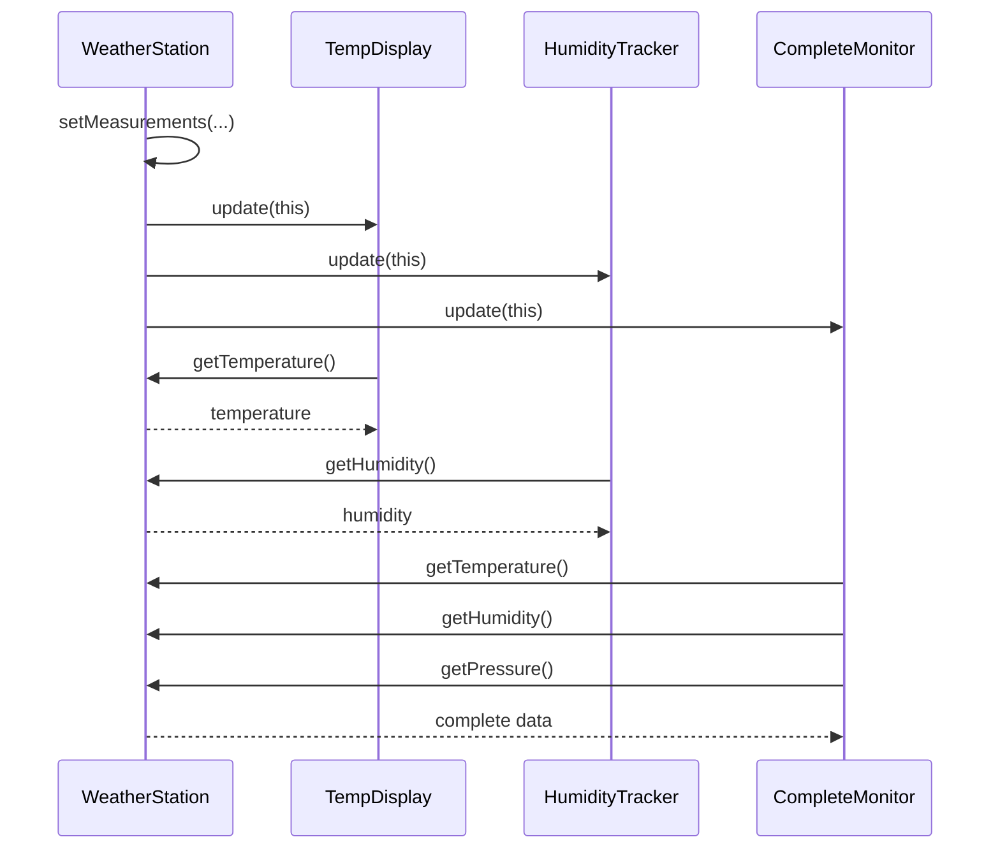
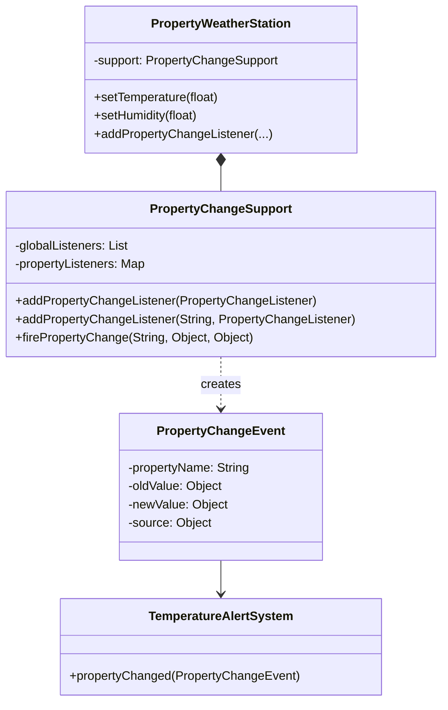
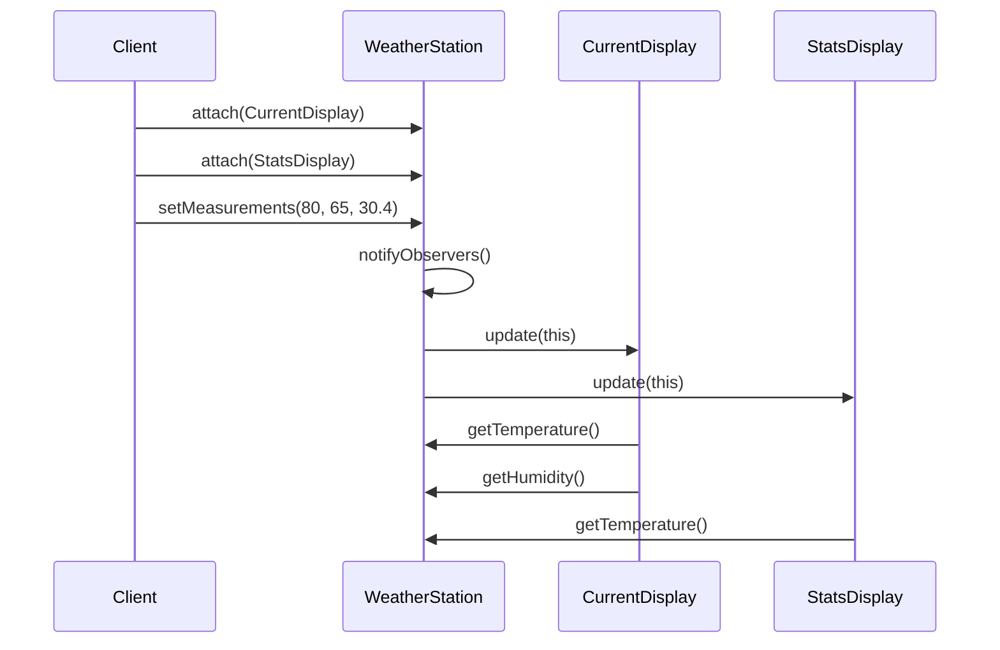
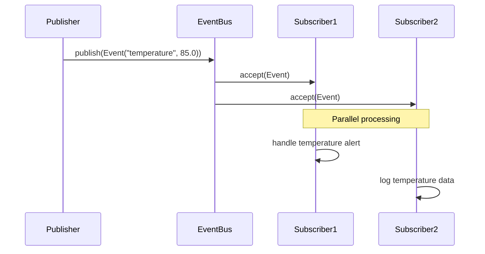

# 👁️ Observer Pattern

The Observer Pattern defines a one-to-many dependency between objects so that when one object changes state, all its dependents are notified and updated automatically. It promotes loose coupling between subjects and observers.

## 🎯 Intent & Problem

**Problem**: You need to maintain consistency between related objects without making classes tightly coupled. When one object changes, multiple other objects need to be updated, but you don't want the changing object to know about all the dependent objects.

**Solution**: The Observer pattern provides a way to subscribe and notify multiple objects about events that happen to the object they're observing.

## 🔧 Implementation Variants

This repository includes **5 comprehensive Observer Pattern implementations**, each demonstrating different approaches and use cases:

### 1. 🏛️ Classic GoF Observer
**Traditional abstract observer with subject-observer coupling**



**Key Features:**
- ✅ Traditional GoF implementation
- ✅ Pull-based data access via subject reference
- ✅ Abstract subject base class
- ⚠️ Tight coupling between observer and subject

### 2. ⬆️ Push Model Observer
**Subject pushes complete data payload to observers**



**Key Features:**
- ✅ Complete data payload in single call
- ✅ No additional method calls needed
- ✅ Efficient for observers needing all data
- ⚠️ Higher memory usage for large payloads
- ⚠️ Subject must know what data observers need

### 3. ⬇️ Pull Model Observer
**Observers pull only the data they need**



**Key Features:**
- ✅ Observers only pull needed data
- ✅ Reduced bandwidth usage
- ✅ Flexible data access patterns
- ⚠️ Multiple method calls per update
- ⚠️ Potential consistency issues

### 4. 🎯 Property/Listener-based Observer
**Subscribe to specific property changes with event objects**



**Key Features:**
- ✅ Granular subscription to specific properties
- ✅ Event objects with old and new values
- ✅ Global and property-specific listeners
- ✅ No unnecessary notifications
- ✅ High flexibility and efficiency

### 5. 📡 Event Bus/Pub-Sub Observer
**Decoupled communication via topics and message bus**

```mermaid
graph TB
    subgraph Publishers
        WS[Weather Station]
        ES[Emergency System]
        MS[Monitoring Service]
    end
    
    subgraph EventBus
        EB[Event Bus<br/>Topic Router]
    end
    
    subgraph Subscribers
        TA[Temp Alert]
        HM[Humidity Monitor]
        EA[Emergency Alert]
        L[Logger]
    end
    
    WS -->|publish("temperature", data)| EB
    ES -->|publish("weather.severe", data)| EB
    MS -->|publish("humidity", data)| EB
    
    EB -->|temperature events| TA
    EB -->|temperature events| L
    EB -->|humidity events| HM
    EB -->|weather.severe events| EA
```

**Key Features:**
- ✅ Complete decoupling via message bus
- ✅ Topic-based message routing
- ✅ Multiple subscribers per topic
- ✅ Dynamic subscription management
- ✅ Error isolation between subscribers

## 📊 Comparison Matrix

| Variant | Coupling | Data Delivery | Memory Usage | Flexibility | Complexity | Use Case |
|---------|----------|---------------|--------------|-------------|------------|----------|
| **Classic GoF** | High | Pull | Low | Medium | Low | Simple notifications |
| **Push Model** | Medium | Push | High | Low | Low | Complete data needed |
| **Pull Model** | Medium | Pull | Low | High | Medium | Selective data access |
| **Property-based** | Low | Push | Medium | High | Medium | Property monitoring |
| **Event Bus** | Very Low | Push | Medium | Very High | High | Distributed systems |

## 🚀 Getting Started

### Compilation
```bash
# Compile all Observer Pattern implementations
javac -d build -sourcepath src/main/java src/main/java/com/example/observer/**/*.java
```

### Running Demos
```bash
# Classic GoF Observer
java -cp build com.example.observer.classic.ClassicObserverDemo

# Push Model Observer  
java -cp build com.example.observer.push.PushObserverDemo

# Pull Model Observer
java -cp build com.example.observer.pull.PullObserverDemo

# Property-based Observer
java -cp build com.example.observer.property.PropertyObserverDemo

# Event Bus Observer
java -cp build com.example.observer.eventbus.EventBusDemo
```

### Running Tests
```bash
# Comprehensive test harness for all variants
java -cp build com.example.observer.AllObserverPatternsTestHarness
```

## 🔄 Sequence Diagrams

### Classic Observer Flow


### Event Bus Flow


## 🏗️ When to Use Each Variant

### Classic GoF Observer
- **Use when**: Simple observer relationships, educational purposes
- **Avoid when**: Need for decoupling, complex data requirements

### Push Model Observer
- **Use when**: Observers need complete data, performance is critical
- **Avoid when**: Large data payloads, observers need different subsets

### Pull Model Observer
- **Use when**: Observers need different data subsets, memory constraints
- **Avoid when**: Consistency is critical, performance is paramount

### Property-based Observer
- **Use when**: Fine-grained change tracking, UI frameworks, JavaBeans
- **Avoid when**: Simple notifications, performance-critical scenarios

### Event Bus Observer
- **Use when**: Microservices, plugin architectures, distributed systems
- **Avoid when**: Simple local notifications, tight performance requirements

## 🔀 Related Patterns

### vs. Mediator Pattern
- **Observer**: One-to-many, subjects notify observers directly
- **Mediator**: Many-to-many, central mediator coordinates communication

### vs. Model-View-Controller (MVC)
- **Observer**: General notification mechanism
- **MVC**: Specific architectural pattern using observer for model-view updates

### vs. Pub-Sub Architecture
- **Observer**: Direct subject-observer coupling
- **Pub-Sub**: Message broker decouples publishers and subscribers

## ⚡ Performance Considerations

### Memory Usage
- **Classic/Pull**: Minimal memory overhead
- **Push**: Higher memory for data copying
- **Property**: Medium overhead for event objects
- **Event Bus**: Memory for topic routing and message queuing

### Notification Speed
- **Classic/Push**: Direct method calls - fastest
- **Pull**: Multiple method calls - slower
- **Property**: Event object creation overhead
- **Event Bus**: Topic resolution overhead

### Scalability
- **Classic/Pull**: Limited by observer list iteration
- **Push**: Limited by data serialization
- **Property**: Good scalability with targeted listeners
- **Event Bus**: Best scalability with topic partitioning

## 🧪 Testing Strategy

Each implementation includes:

- **Unit Tests**: Individual component functionality
- **Integration Tests**: Observer-subject interaction
- **Behavioral Tests**: Notification patterns and data flow  
- **Performance Tests**: Memory usage and notification speed
- **Concurrency Tests**: Thread-safety validation (where applicable)

## 🏃 Exercises for Learning

### Beginner
1. **Add Observer**: Implement a new display type for forecast information
2. **Filter Events**: Add conditional notification based on temperature thresholds
3. **Observer Removal**: Practice safe observer removal during iteration

### Intermediate  
4. **Priority Observers**: Implement ordered notification based on observer priority
5. **Once-Only Observers**: Create observers that auto-unsubscribe after first notification
6. **Composite Observers**: Combine multiple display types into a single observer

### Advanced
7. **Batched Notifications**: Buffer multiple changes and send batch updates
8. **Asynchronous Observers**: Implement non-blocking observer notifications
9. **Distributed Observers**: Extend event bus for network-based notifications
10. **Memory-Safe Observers**: Implement weak reference observers to prevent memory leaks

## 📚 Real-world Applications

- **GUI Frameworks**: Model-View updates (Swing, JavaFX)
- **Event Systems**: User interface event handling
- **Model Binding**: Data binding in web frameworks  
- **Monitoring Systems**: Metrics and alerting platforms
- **Message Queues**: Publish-subscribe messaging systems
- **Reactive Programming**: Stream processing and reactive extensions

## 🎓 Key Takeaways

1. **Choose the Right Variant**: Match the implementation to your coupling and performance needs
2. **Consider Memory vs. Flexibility**: Push models use more memory but offer better performance
3. **Event Buses for Scale**: Use pub-sub patterns for distributed and plugin architectures
4. **Property Observers for UI**: Ideal for fine-grained change tracking in user interfaces
5. **Test Concurrent Access**: Always consider thread safety in multi-threaded environments

---

**Next Patterns**: [Command Pattern](../command-pattern/) • [State Pattern](../state-pattern/) • [Strategy Pattern](../strategy-pattern/)