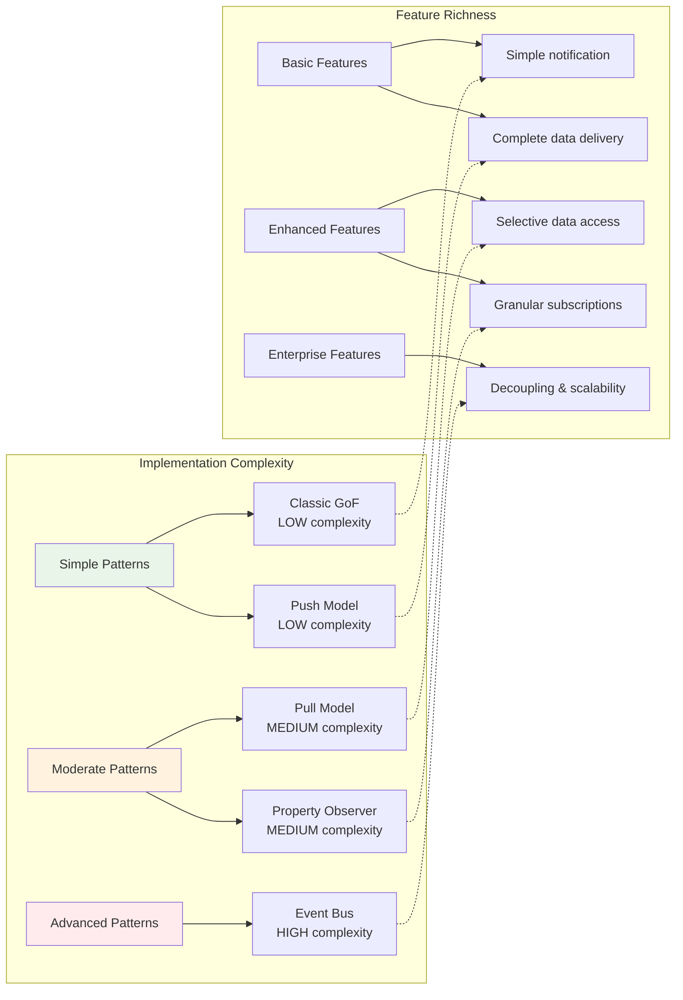
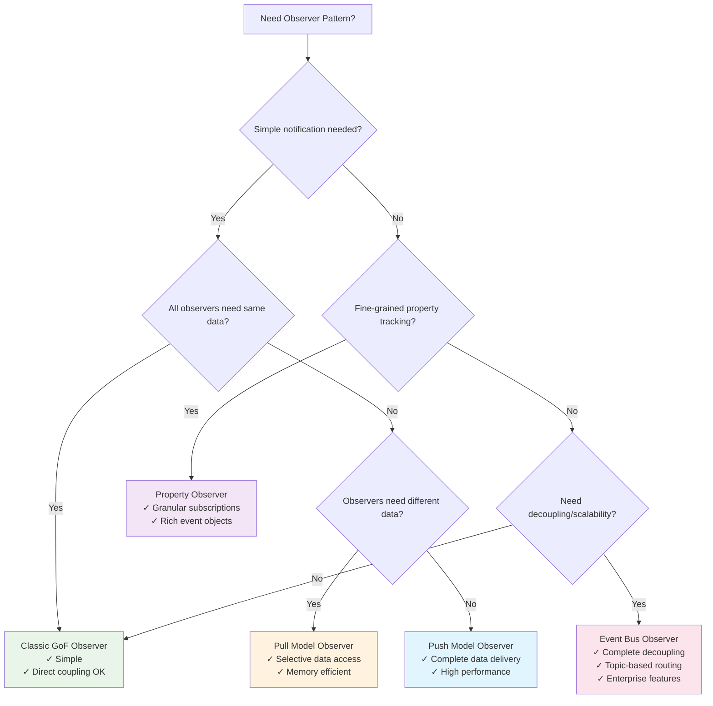

# Observer Pattern - UML Documentation Overview

This directory contains comprehensive UML diagrams and architectural documentation for all Observer Pattern implementations in this repository.

## 📁 Documentation Structure

### 🏗️ [Class Diagrams](observer-pattern-class-diagram.md)
Complete class diagrams for all 5 Observer Pattern variants:
- **Classic GoF Observer** - Traditional subject-observer relationships
- **Push Model Observer** - Generic typed observers with data transfer objects
- **Pull Model Observer** - Selective data access patterns
- **Property-based Observer** - PropertyChangeSupport architecture
- **Event Bus Observer** - Pub-sub decoupled communication

### 🔄 [Sequence Diagrams](observer-pattern-sequence-diagrams.md)
Detailed interaction flows showing:
- Observer registration and notification sequences
- Push model data broadcasting flows
- Pull model selective data access patterns
- Property change targeted notifications
- Event bus decoupled pub-sub messaging

### ⚖️ [Push vs Pull Comparison](push-vs-pull-comparison.md)
Visual analysis comparing push and pull observer models:
- Data flow differences and efficiency
- Memory usage and performance trade-offs
- Use case recommendations and concurrency considerations
- Implementation complexity analysis

### 🚌 [Event Bus Architecture](event-bus-architecture.md)
Enterprise-grade pub-sub observer documentation:
- High-level event bus architecture
- Topic-based routing and namespace organization
- Error handling, resilience, and scalability patterns
- Monitoring, metrics, and enterprise features

### 🎯 [Property Observer Event Flow](property-observer-event-flow.md)
Fine-grained property change documentation:
- Property change event lifecycle and routing
- Multi-property update flows and batch processing
- Advanced features: validation, filtering, transformation
- Performance considerations and optimization strategies

## 📊 Pattern Complexity Overview

## 🎯 Quick Navigation Guide

### For Beginners
Start with these diagrams to understand Observer Pattern fundamentals:
1. [Classic Observer Class Diagram](observer-pattern-class-diagram.md#classic-gof-observer-pattern)
2. [Classic Observer Sequence](observer-pattern-sequence-diagrams.md#classic-gof-observer---registration-and-notification-flow)
3. [Push vs Pull Overview](push-vs-pull-comparison.md#push-model-vs-pull-model-visual-comparison)

### For Intermediate Developers
Dive deeper into pattern variations and trade-offs:
1. [All Class Diagrams](observer-pattern-class-diagram.md) - Compare different approaches
2. [Push vs Pull Analysis](push-vs-pull-comparison.md) - Understand when to use each
3. [Property Observer Flow](property-observer-event-flow.md) - Learn fine-grained notifications

### For Advanced Architects
Explore enterprise patterns and scalability:
1. [Event Bus Architecture](event-bus-architecture.md) - Decoupled pub-sub systems
2. [Event Processing Pipeline](event-bus-architecture.md#event-processing-pipeline)
3. [Scalability Architecture](event-bus-architecture.md#scalability-architecture)

## 🔍 Pattern Selection Guide

## 📈 Learning Path Recommendation

### Phase 1: Foundation (30 minutes)
1. Read [Classic Observer Class Diagram](observer-pattern-class-diagram.md#classic-gof-observer-pattern)
2. Study [Classic Observer Sequence](observer-pattern-sequence-diagrams.md#classic-gof-observer---registration-and-notification-flow)
3. Run the Classic Observer demo code

### Phase 2: Variations (45 minutes)
1. Compare [Push vs Pull Models](push-vs-pull-comparison.md)
2. Examine [Push and Pull Sequence Diagrams](observer-pattern-sequence-diagrams.md)
3. Understand trade-offs and use cases

### Phase 3: Advanced Features (60 minutes)
1. Study [Property Observer Architecture](property-observer-event-flow.md)
2. Explore [Event Bus Pub-Sub Model](event-bus-architecture.md)
3. Review performance and scalability considerations

### Phase 4: Practical Application (90 minutes)
1. Implement a simple observer scenario
2. Choose appropriate pattern variant
3. Consider error handling and edge cases
4. Plan for future scalability needs

## 🏆 Key Takeaways from UML Documentation

### Design Principles Illustrated
- **Loose Coupling**: Event Bus shows complete decoupling
- **Single Responsibility**: Each observer handles specific concerns
- **Open/Closed**: Easy to add new observers without changing subjects
- **Dependency Inversion**: Abstractions don't depend on concretions

### Architectural Patterns Demonstrated
- **Publish-Subscribe**: Event Bus implementation
- **Command Query Separation**: Push (command) vs Pull (query) models
- **Event Sourcing**: Property change events with history
- **Circuit Breaker**: Error handling in Event Bus

### Performance Insights
- **Memory**: Pull model most efficient, Push model highest usage
- **CPU**: Classic fastest, Event Bus most overhead
- **Scalability**: Event Bus best for distributed systems
- **Maintenance**: Property Observer best for complex UIs

---

*These UML diagrams provide a complete visual reference for understanding and implementing the Observer Pattern in various scenarios. Use them as both learning materials and design references for your own implementations.*