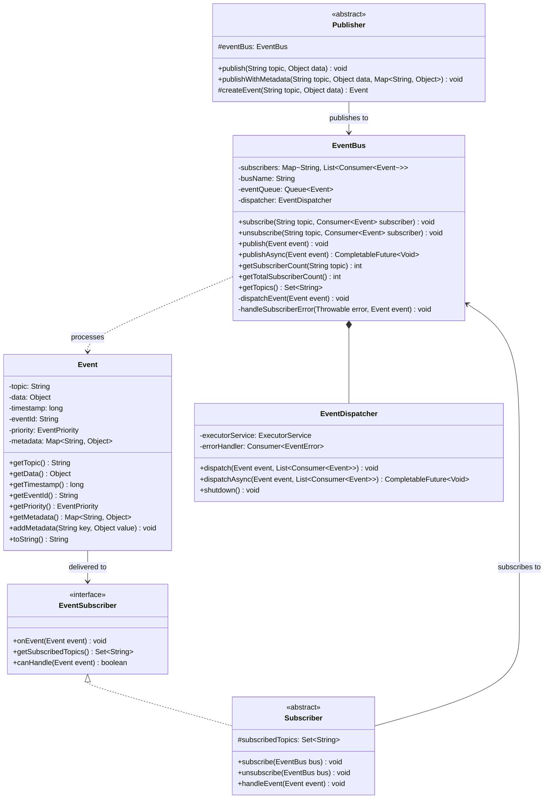
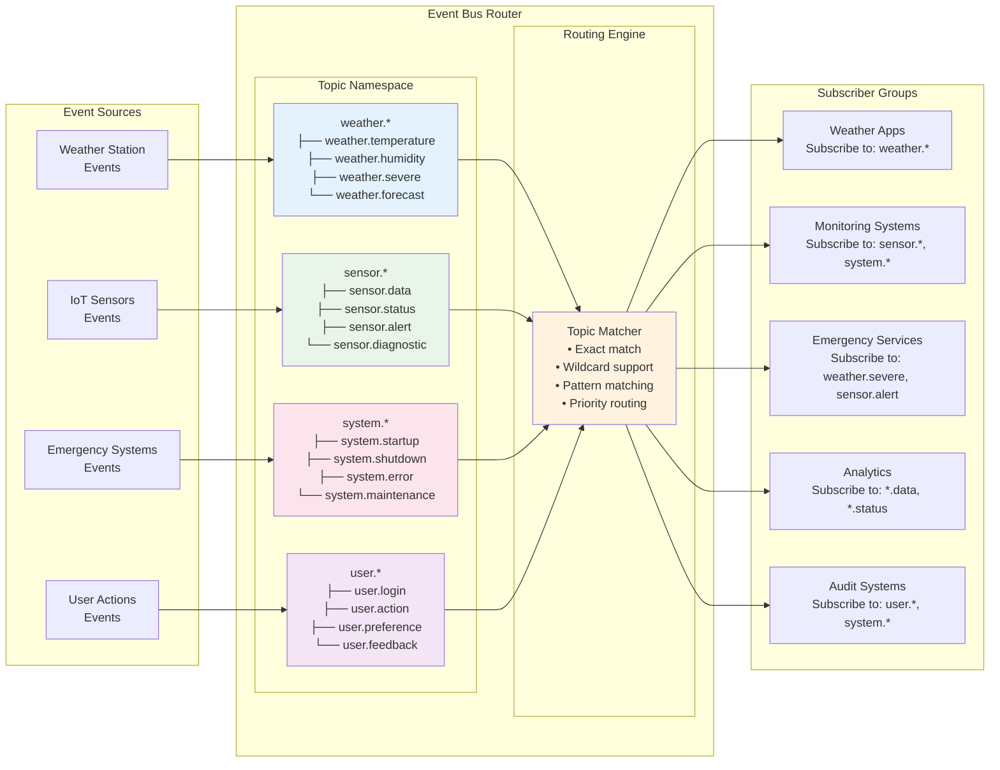
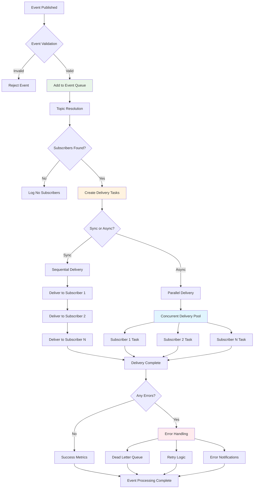
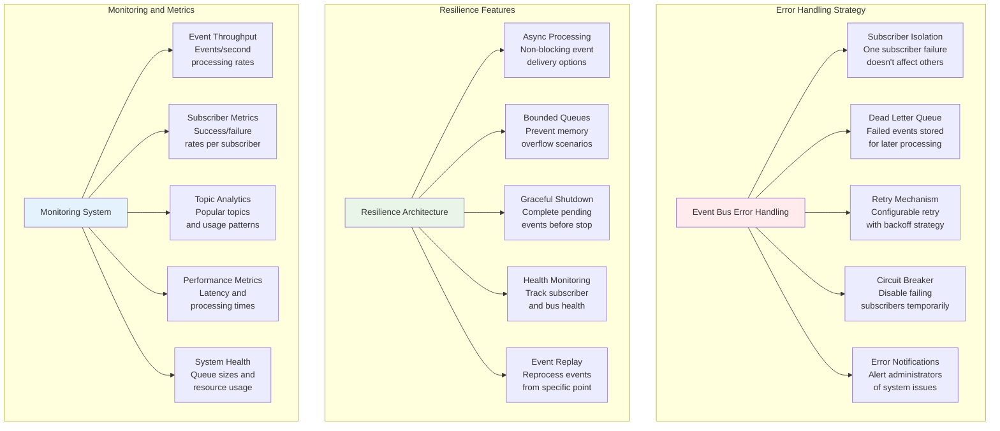
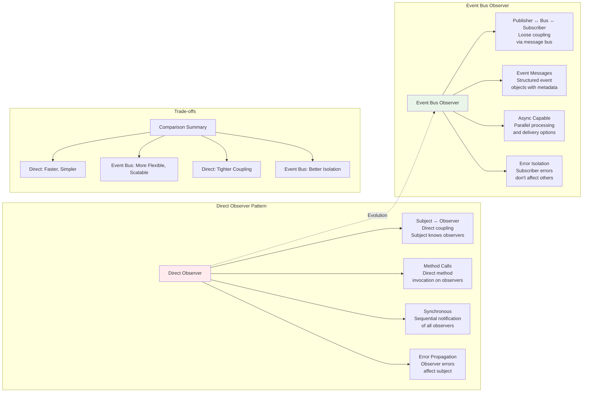

# Event Bus Architecture - Pub-Sub Observer Pattern

## High-Level Event Bus Architecture

```mermaid
graph TB
    subgraph "Publishers Layer"
        WS[Weather Station<br/>Publisher]
        ES[Emergency System<br/>Publisher]
        SS[Sensor System<br/>Publisher]
        MS[Monitoring Service<br/>Publisher]
    end
    
    subgraph "Event Bus Core"
        EB[Event Bus<br/>Message Router]
        subgraph "Topic Registry"
            TR[Topic Registry<br/>temperature: [S1, S4]<br/>humidity: [S2]<br/>weather.severe: [S3]<br/>sensor.data: [S5, S6]]
        end
        subgraph "Event Queue"
            EQ[Event Processing<br/>Queue & Dispatcher]
        end
    end
    
    subgraph "Subscribers Layer"
        S1[Temperature Alert<br/>Subscriber]
        S2[Humidity Monitor<br/>Subscriber]
        S3[Emergency Alert<br/>Subscriber]
        S4[Data Logger<br/>Subscriber]
        S5[Analytics Service<br/>Subscriber]
        S6[Archive Service<br/>Subscriber]
    end
    
    WS -->|publish events| EB
    ES -->|publish events| EB
    SS -->|publish events| EB
    MS -->|publish events| EB
    
    EB --> TR
    EB --> EQ
    
    EB -->|route by topic| S1
    EB -->|route by topic| S2
    EB -->|route by topic| S3
    EB -->|route by topic| S4
    EB -->|route by topic| S5
    EB -->|route by topic| S6
    
    style EB fill:#e1f5fe
    style TR fill:#f3e5f5
    style EQ fill:#e8f5e8
```

## Event Bus Component Detail



## Topic-based Routing Architecture



## Event Processing Pipeline



## Error Handling and Resilience



## Scalability Architecture

```mermaid
graph TB
    subgraph "Single Node Event Bus"
        SN[Single Node Architecture]
        SN --> SN1[In-Memory Topics<br/>Fast but limited<br/>by single machine]
        SN --> SN2[Local Subscribers<br/>All subscribers<br/>in same process]
        SN --> SN3[Synchronous Processing<br/>Direct method calls<br/>for event delivery]
    end
    
    subgraph "Clustered Event Bus"
        CN[Clustered Architecture]
        CN --> CN1[Distributed Topics<br/>Topics replicated<br/>across cluster nodes]
        CN --> CN2[Remote Subscribers<br/>Subscribers can be<br/>on different nodes]
        CN --> CN3[Network Communication<br/>Events sent over<br/>network protocols]
    end
    
    subgraph "Enterprise Event Bus"
        EN[Enterprise Architecture]
        EN --> EN1[Message Broker<br/>External message<br/>broker (Kafka, RabbitMQ)]
        EN --> EN2[Persistent Storage<br/>Events stored<br/>for durability]
        EN --> EN3[Load Balancing<br/>Multiple event bus<br/>instances for scale]
        EN --> EN4[Cross-System Integration<br/>Connect different<br/>systems and services]
    end
    
    SN -.->|Scale Up| CN
    CN -.->|Scale Out| EN
    
    style SN fill:#e8f5e8
    style CN fill:#fff3e0
    style EN fill:#e1f5fe
```

## Comparison with Direct Observer

