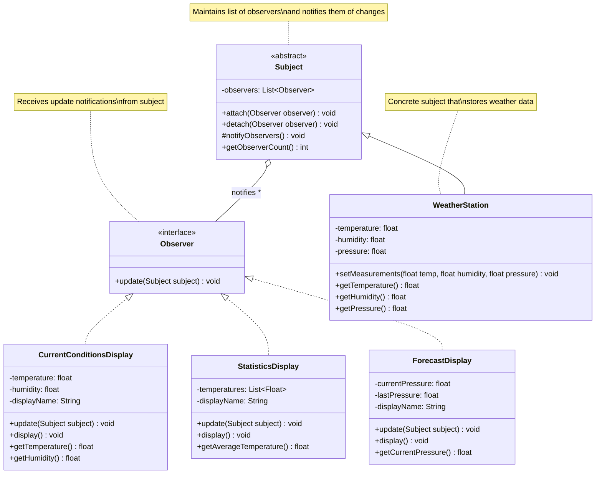
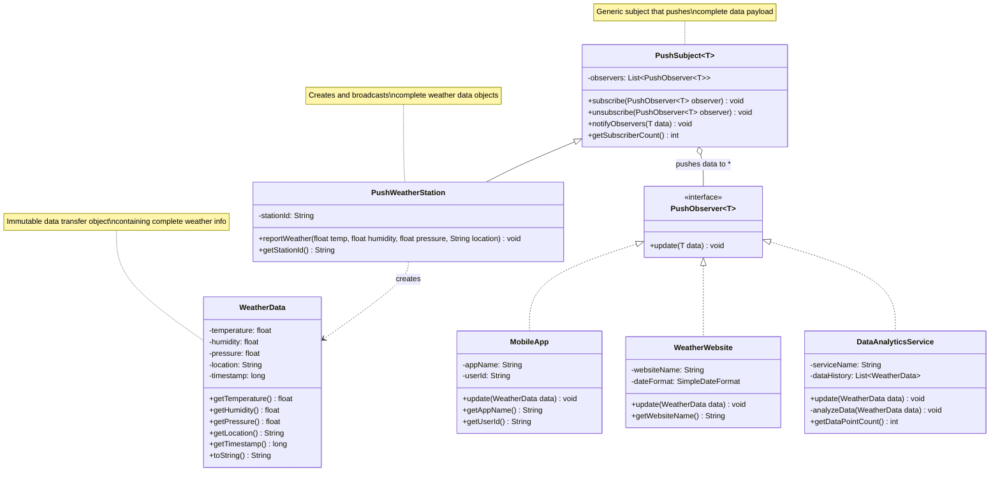
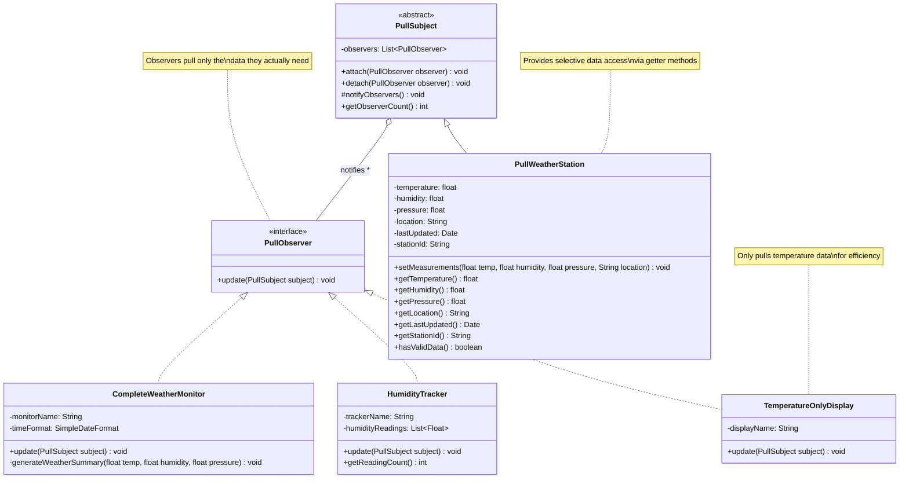
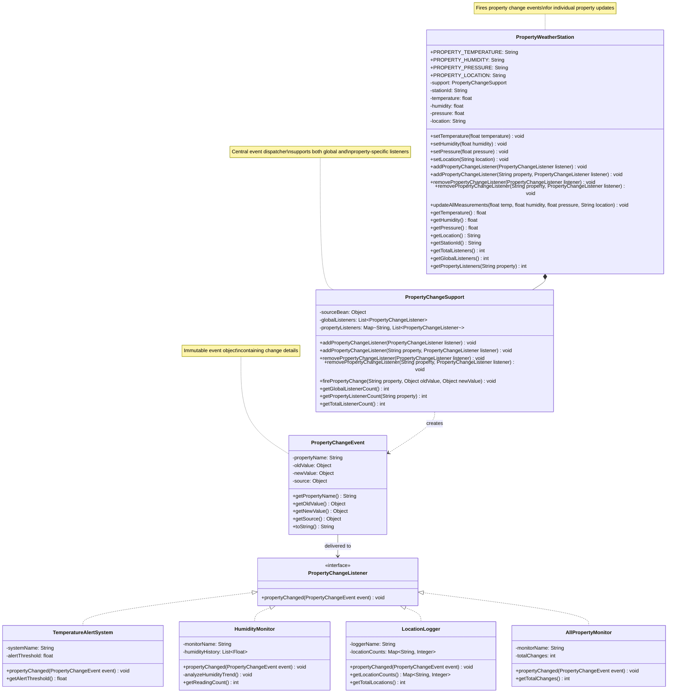
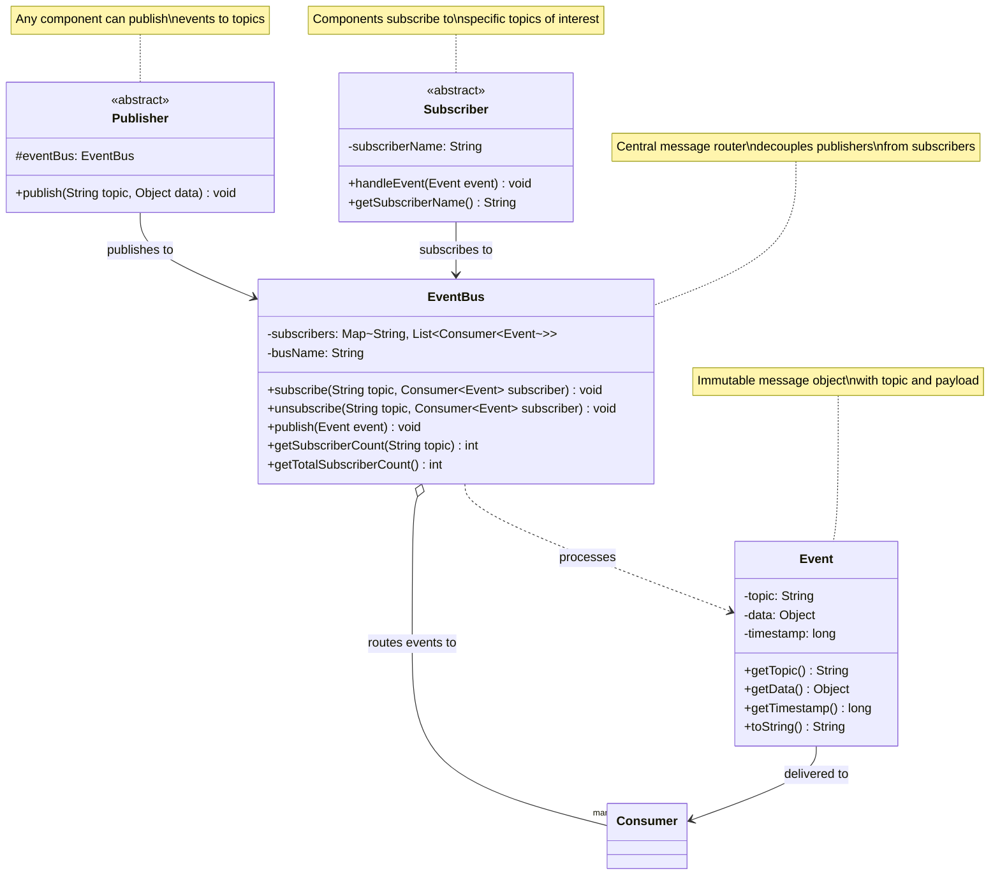

# Observer Pattern - Class Diagrams

## Classic GoF Observer Pattern

## Push Model Observer Pattern

## Pull Model Observer Pattern

## Property-based Observer Pattern

## Event Bus Observer Pattern

