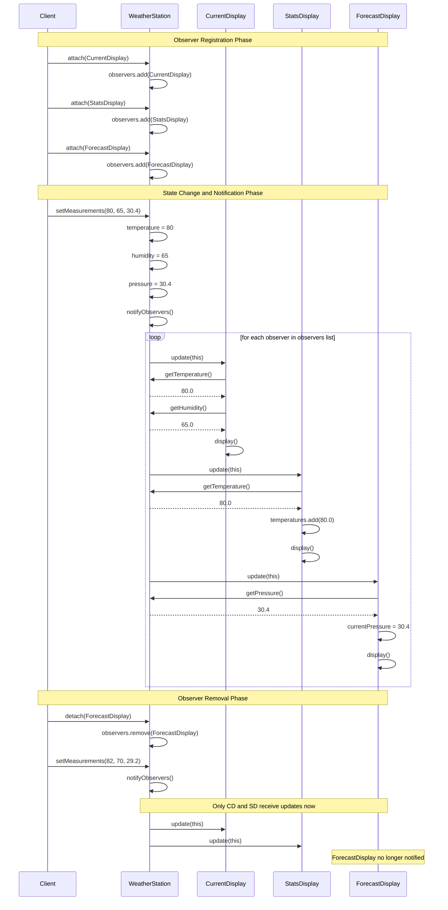
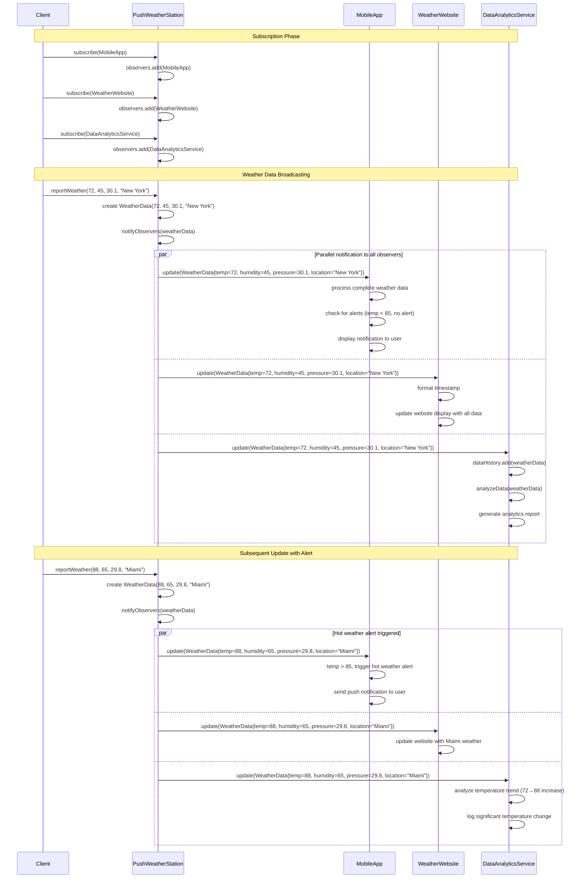
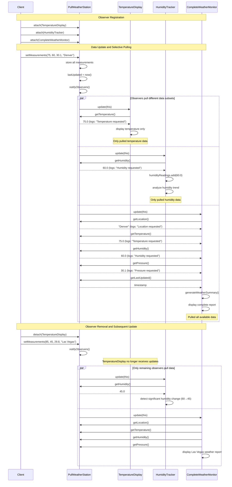
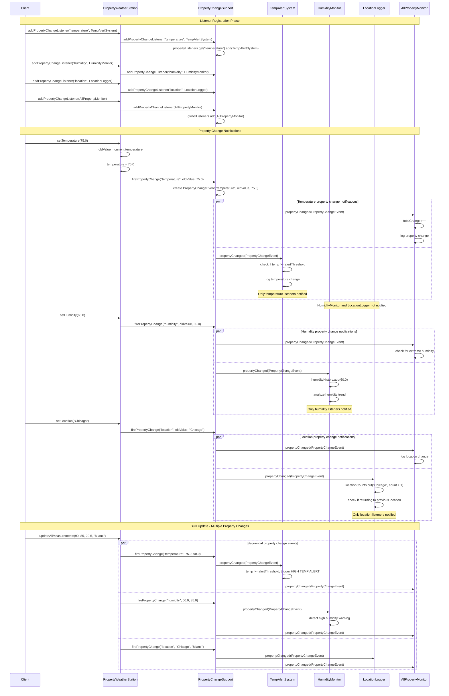
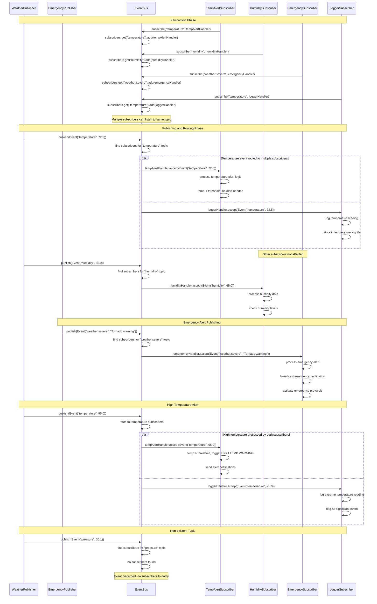

# Observer Pattern - Sequence Diagrams

## Classic GoF Observer - Registration and Notification Flow

## Push Model Observer - Data Broadcasting Flow

## Pull Model Observer - Selective Data Access Flow

## Property-based Observer - Targeted Property Notifications

## Event Bus Observer - Decoupled Pub-Sub Flow

