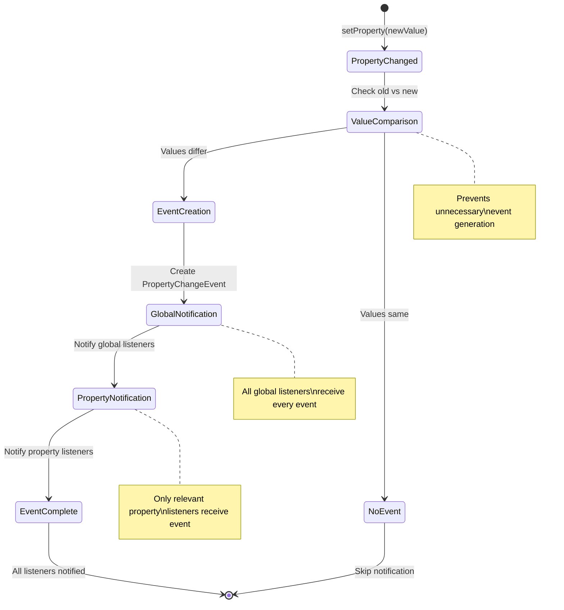
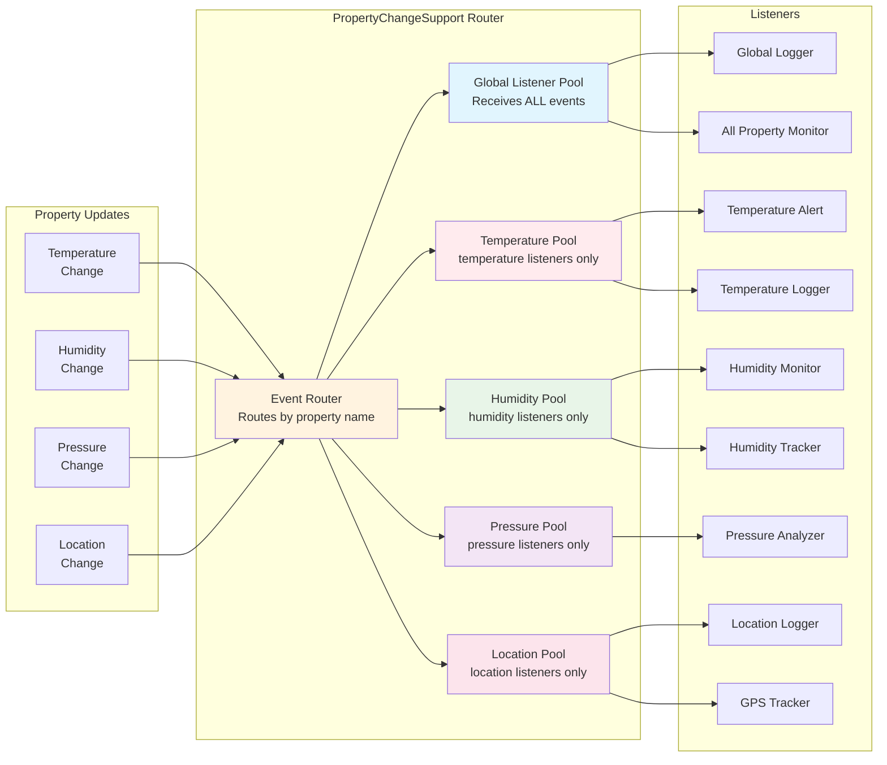
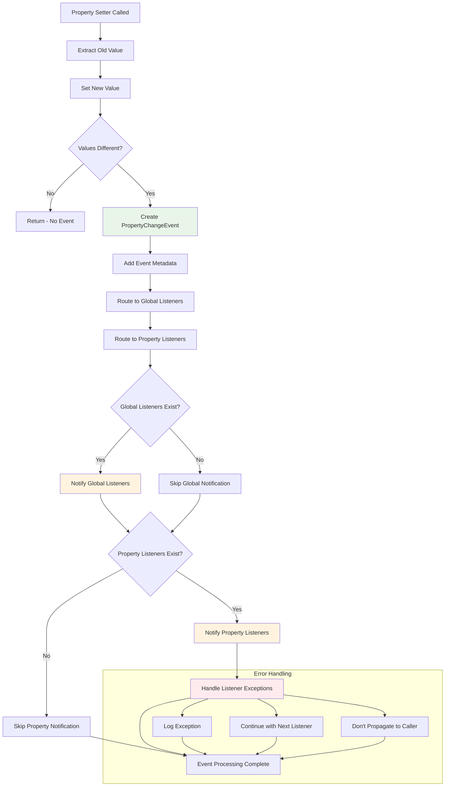
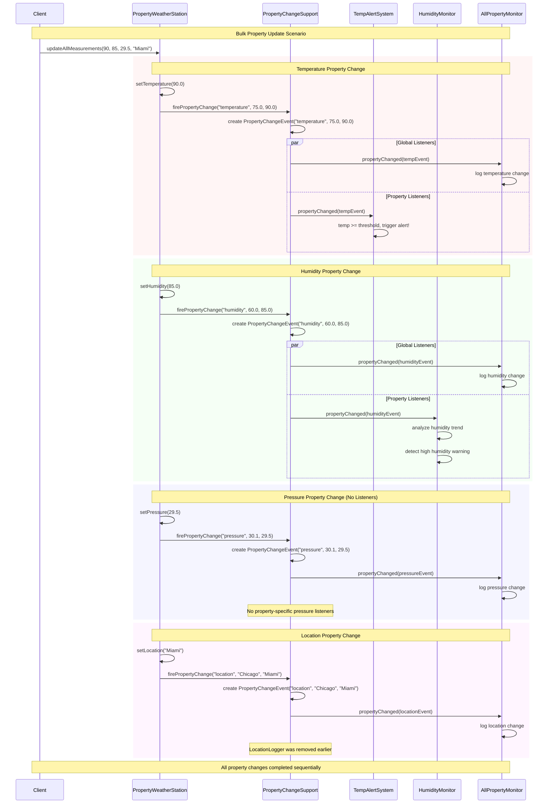
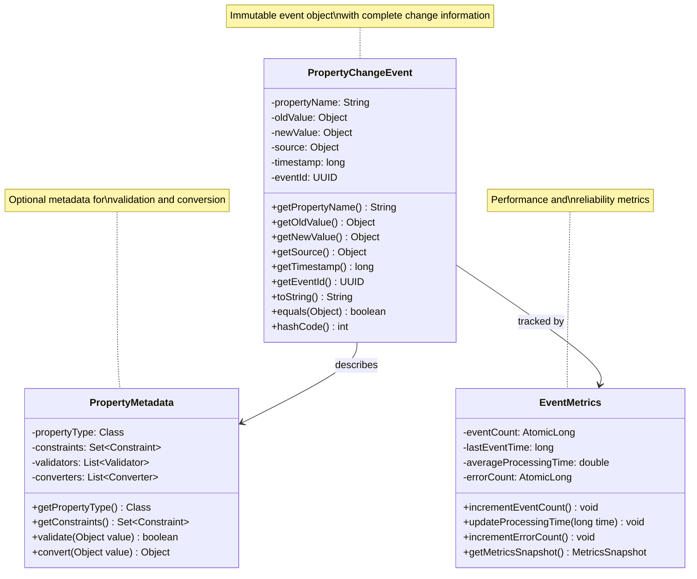
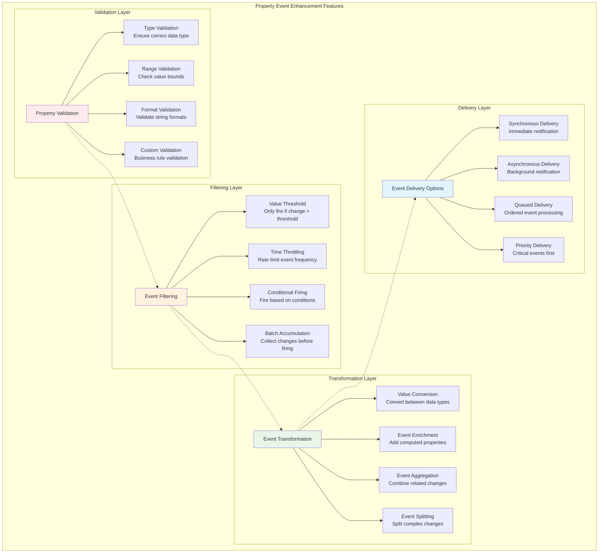
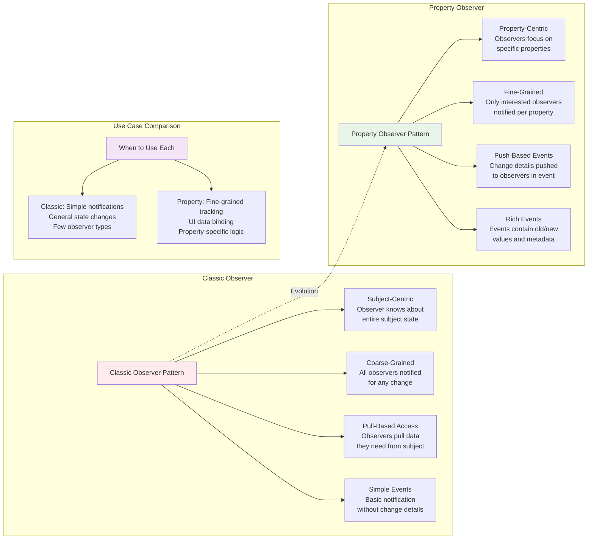
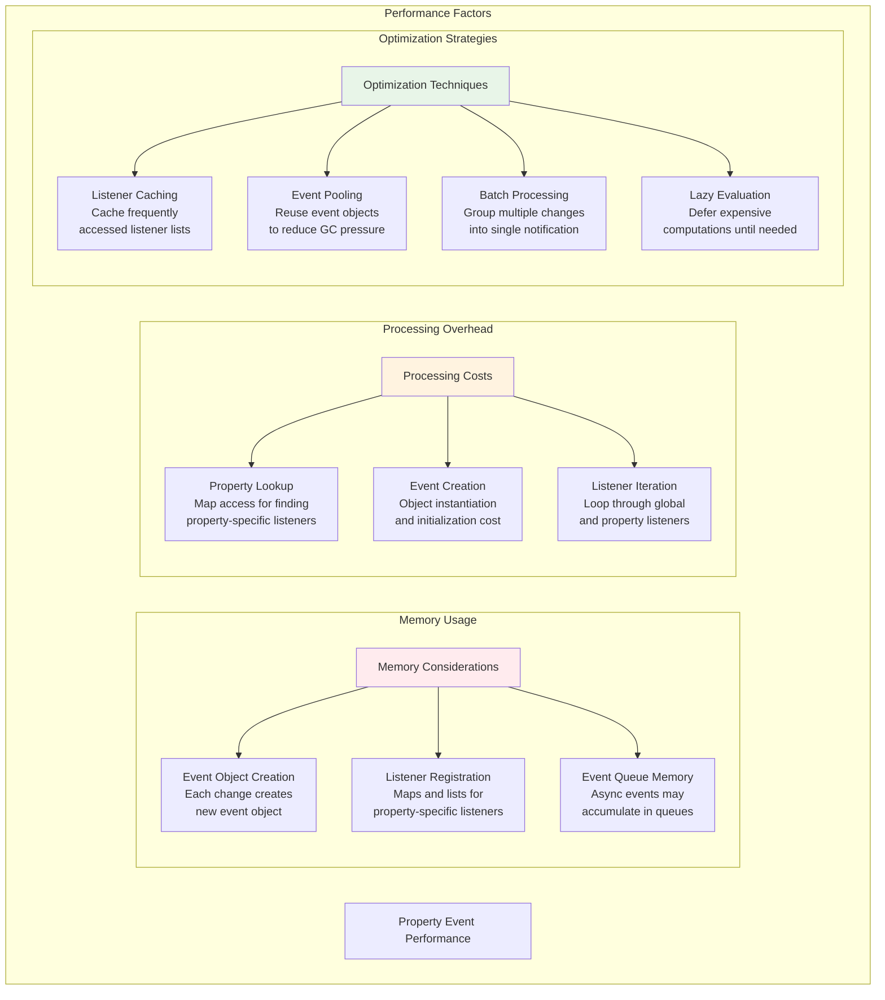

# Property Observer Event Flow Diagrams

## Property Change Event Flow Architecture

```mermaid
graph TB
    subgraph "Property Change Architecture"
        subgraph "Subject Layer"
            PS[Property Subject<br/>PropertyWeatherStation]
            PS --> PS1[setTemperature()]
            PS --> PS2[setHumidity()]
            PS --> PS3[setPressure()]
            PS --> PS4[setLocation()]
        end
        
        subgraph "Event Management Layer"
            PCS[PropertyChangeSupport]
            PCS --> GL[Global Listeners<br/>List~PropertyChangeListener~]
            PCS --> PL[Property-Specific Listeners<br/>Map~String, List~PropertyChangeListener~~]
            PCS --> EF[Event Factory<br/>Creates PropertyChangeEvent objects]
        end
        
        subgraph "Event Objects"
            PCE[PropertyChangeEvent<br/>• propertyName<br/>• oldValue<br/>• newValue<br/>• source<br/>• timestamp]
        end
        
        subgraph "Listener Layer"
            TAS[Temperature Alert System<br/>Listens: temperature]
            HM[Humidity Monitor<br/>Listens: humidity]
            LL[Location Logger<br/>Listens: location]
            APM[All Property Monitor<br/>Listens: ALL properties]
        end
    end
    
    PS --> PCS
    PCS --> GL
    PCS --> PL
    PCS --> EF
    EF --> PCE
    
    PCE -->|temperature events| TAS
    PCE -->|humidity events| HM
    PCE -->|location events| LL
    PCE -->|all events| APM
    
    style PS fill:#e3f2fd
    style PCS fill:#f3e5f5
    style PCE fill:#e8f5e8
```

## Property Change Event Lifecycle



## Property-Specific Event Routing



## Event Processing Pipeline



## Multi-Property Update Flow



## Property Change Event Structure



## Advanced Property Event Features



## Property Observer vs Classic Observer Comparison



## Property Event Performance Considerations

