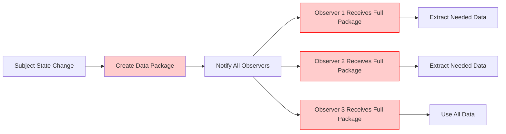
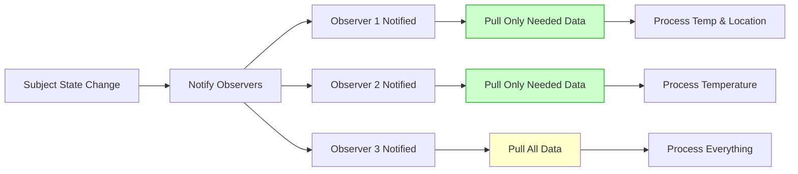
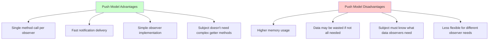
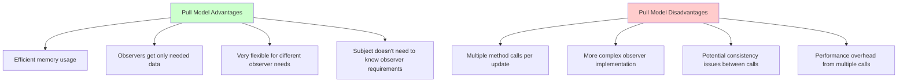
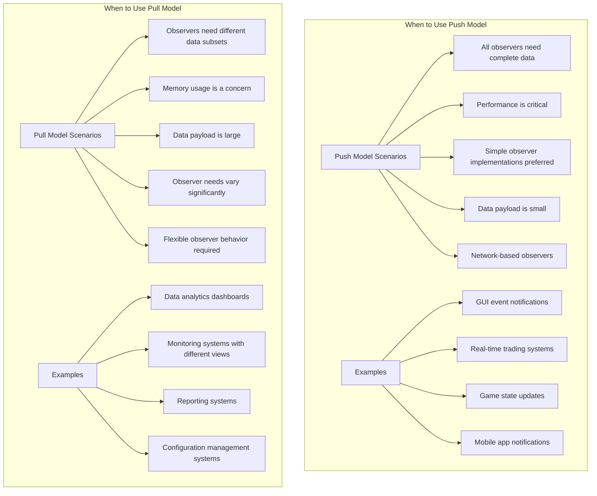
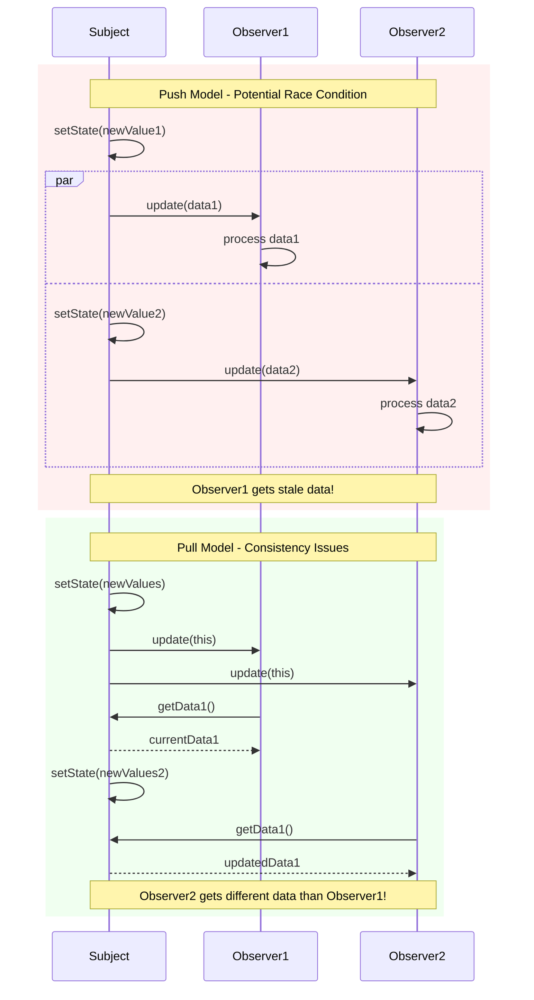

# Observer Pattern - Push vs Pull Model Comparison

## Push Model vs Pull Model Visual Comparison

```mermaid
graph TB
    subgraph "Push Model Observer Pattern"
        subgraph PM_Subject [Subject]
            PM_Data[Complete Data Payload<br/>Temperature: 85°F<br/>Humidity: 70%<br/>Pressure: 29.8<br/>Location: Miami<br/>Timestamp: 1234567890]
        end
        
        subgraph PM_Observers [Observers]
            PM_O1[Mobile App<br/>Receives: ALL data<br/>Uses: Temp, Location<br/>Wastes: Humidity, Pressure]
            PM_O2[Temperature Logger<br/>Receives: ALL data<br/>Uses: Temp only<br/>Wastes: Humidity, Pressure, Location]
            PM_O3[Weather Website<br/>Receives: ALL data<br/>Uses: ALL data<br/>Wastes: Nothing]
        end
        
        PM_Subject ==>|Push Complete Payload| PM_O1
        PM_Subject ==>|Push Complete Payload| PM_O2
        PM_Subject ==>|Push Complete Payload| PM_O3
    end
    
    subgraph "Pull Model Observer Pattern"
        subgraph PL_Subject [Subject]
            PL_Data[Data Repository<br/>getTemperature(): 85°F<br/>getHumidity(): 70%<br/>getPressure(): 29.8<br/>getLocation(): Miami<br/>getTimestamp(): 1234567890]
        end
        
        subgraph PL_Observers [Observers]
            PL_O1[Mobile App<br/>Pulls: getTemperature<br/>Pulls: getLocation<br/>Efficient: 2 calls]
            PL_O2[Temperature Logger<br/>Pulls: getTemperature<br/>Efficient: 1 call]
            PL_O3[Weather Website<br/>Pulls: ALL getters<br/>Complete: 5 calls]
        end
        
        PL_Subject -.->|Notification Only| PL_O1
        PL_Subject -.->|Notification Only| PL_O2
        PL_Subject -.->|Notification Only| PL_O3
        PL_O1 ==>|getTemperature()| PL_Subject
        PL_O1 ==>|getLocation()| PL_Subject
        PL_O2 ==>|getTemperature()| PL_Subject
        PL_O3 ==>|getTemperature()| PL_Subject
        PL_O3 ==>|getHumidity()| PL_Subject
        PL_O3 ==>|getPressure()| PL_Subject
        PL_O3 ==>|getLocation()| PL_Subject
        PL_O3 ==>|getTimestamp()| PL_Subject
    end
```

## Data Flow Comparison

### Push Model Data Flow


### Pull Model Data Flow


## Performance and Memory Comparison

```mermaid
graph LR
    subgraph "Memory Usage Comparison"
        subgraph "Push Model"
            PM_Memory[High Memory Usage<br/>• Full data copied to each observer<br/>• Memory usage = O(data_size × observers)<br/>• Potential waste if observers don't need all data]
        end
        
        subgraph "Pull Model"
            PL_Memory[Low Memory Usage<br/>• Data stored once in subject<br/>• Memory usage = O(data_size)<br/>• No wasted memory transfer]
        end
        
        PM_Memory -.->|vs| PL_Memory
    end
    
    subgraph "Performance Comparison"
        subgraph "Push Model"
            PM_Perf[Single Notification Round<br/>• One method call per observer<br/>• Fast notification<br/>• May transfer unnecessary data]
        end
        
        subgraph "Pull Model"
            PL_Perf[Multiple Method Calls<br/>• Notification + data access calls<br/>• More method call overhead<br/>• Only transfers needed data]
        end
        
        PM_Perf -.->|vs| PL_Perf
    end
```

## Trade-offs Analysis

### Push Model Trade-offs


### Pull Model Trade-offs


## Use Case Recommendations



## Implementation Complexity Comparison

```mermaid
graph LR
    subgraph "Push Model Implementation"
        Push_Impl[Push Implementation Complexity]
        Push_Impl --> Push_Sub[Subject: Simple<br/>• Store data<br/>• Create data object<br/>• Call observer.update(data)]
        Push_Impl --> Push_Obs[Observer: Simple<br/>• Receive complete data<br/>• Extract what's needed<br/>• Process immediately]
    end
    
    subgraph "Pull Model Implementation"
        Pull_Impl[Pull Implementation Complexity]
        Pull_Impl --> Pull_Sub[Subject: Moderate<br/>• Store data<br/>• Provide getter methods<br/>• Handle concurrent access<br/>• Ensure data consistency]
        Pull_Impl --> Pull_Obs[Observer: Moderate<br/>• Receive notification<br/>• Decide what data to pull<br/>• Make multiple method calls<br/>• Handle potential null/stale data]
    end
    
    Push_Sub --> Push_Rating[Complexity: LOW]
    Push_Obs --> Push_Rating
    Pull_Sub --> Pull_Rating[Complexity: MEDIUM]
    Pull_Obs --> Pull_Rating
    
    style Push_Rating fill:#ccffcc
    style Pull_Rating fill:#ffffcc
```

## Concurrency Considerations

