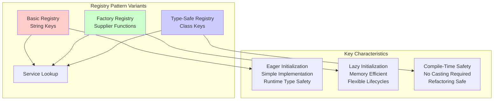

# Registry Design Pattern in Java

The Registry design pattern provides a centralized, global access point for objects in an application. Think of it as a "phone book" 📖 for your application's objects or services. Instead of creating new objects or passing them around everywhere, different parts of your code can ask the registry for a specific object by a well-known identifier.

## 📋 Table of Contents

- [Overview](#overview)
- [Pattern Variants](#pattern-variants)
- [Project Structure](#project-structure)
- [Running the Examples](#running-the-examples)
- [Pattern Comparison](#pattern-comparison)
- [When to Use](#when-to-use)
- [Pros and Cons](#pros-and-cons)
- [Related Patterns](#related-patterns)

## 🎯 Overview

The Registry pattern is a specific implementation of the Service Locator pattern and is often implemented as a Singleton. It has two main operations:

1. **Register**: An object is added to the registry under a specific key
2. **Lookup/Get**: A client requests an object from the registry by providing its key

## 🔧 Pattern Variants

This project demonstrates three different implementations of the Registry pattern:

### 1. Basic Registry Pattern
- **Location**: [`src/main/java/com/example/registry/basic/`](src/main/java/com/example/registry/basic/)
- **Key Type**: String
- **Storage**: Pre-created object instances
- **Initialization**: Eager (objects created before registration)

```java
// Registration
BasicServiceRegistry registry = BasicServiceRegistry.getInstance();
registry.registerService("EMAIL", new EmailService());

// Usage
Service emailService = registry.getService("EMAIL");
emailService.execute();
```

**Characteristics:**
- ✅ Simple to understand and implement
- ❌ No compile-time type safety
- ❌ Requires manual casting for specific types
- ❌ Runtime errors from typos in keys

### 2. Factory Registry Pattern
- **Location**: [`src/main/java/com/example/registry/factory/`](src/main/java/com/example/registry/factory/)
- **Key Type**: String
- **Storage**: Factory functions (Supplier<Service>)
- **Initialization**: Lazy (objects created on first request)

```java
// Registration
FactoryServiceRegistry registry = FactoryServiceRegistry.getInstance();
registry.registerPrototypeFactory("EMAIL", EmailService::new);
registry.registerSingletonFactory("SMS", SMSService::new);

// Usage
Service emailService = registry.getService("EMAIL"); // Creates new instance
Service smsService = registry.getService("SMS");     // Returns cached instance
```

**Characteristics:**
- ✅ Lazy initialization
- ✅ Flexible object lifecycle (prototype vs singleton)
- ✅ Memory efficient for unused services
- ❌ Still no compile-time type safety
- ❌ Slightly more complex than basic registry

### 3. Type-Safe Registry Pattern
- **Location**: [`src/main/java/com/example/registry/typesafe/`](src/main/java/com/example/registry/typesafe/)
- **Key Type**: Class<T>
- **Storage**: Object instances with type safety
- **Initialization**: Eager (objects created before registration)

```java
// Registration
TypeSafeRegistry registry = TypeSafeRegistry.getInstance();
registry.register(EmailService.class, new EmailService());

// Usage - No casting required!
EmailService emailService = registry.get(EmailService.class);
emailService.sendEmail("user@example.com", "Welcome!");
```

**Characteristics:**
- ✅ Compile-time type safety
- ✅ No manual casting required
- ✅ Eliminates ClassCastException risks
- ✅ Refactoring-safe
- ✅ IDE auto-completion support

## 📁 Project Structure

```
registry-pattern/
├── src/main/java/com/example/registry/
│   ├── services/                    # Common service interfaces and implementations
│   │   ├── Service.java            # Base service interface
│   │   ├── EmailService.java       # Email notification service
│   │   ├── SMSService.java         # SMS notification service
│   │   └── PushNotificationService.java # Push notification service
│   ├── basic/                      # Basic Registry Pattern
│   │   ├── BasicServiceRegistry.java
│   │   └── BasicRegistryDemo.java
│   ├── factory/                    # Factory Registry Pattern
│   │   ├── FactoryServiceRegistry.java
│   │   └── FactoryRegistryDemo.java
│   └── typesafe/                   # Type-Safe Registry Pattern
│       ├── TypeSafeRegistry.java
│       └── TypeSafeRegistryDemo.java
├── docs/uml/                       # UML Diagrams
│   ├── README.md                   # UML documentation overview
│   ├── basic-registry-class-diagram.md
│   ├── basic-registry-sequence-diagram.md
│   ├── factory-registry-class-diagram.md
│   ├── factory-registry-sequence-diagram.md
│   ├── typesafe-registry-class-diagram.md
│   └── typesafe-registry-sequence-diagram.md
└── README.md
```

## 📊 UML Diagrams

This project includes comprehensive UML diagrams to help visualize the structure and behavior of each registry pattern implementation. All diagrams are created using Mermaid syntax and render directly in GitHub.

### 🏗️ Class Diagrams
Visualize the static structure, relationships, and key methods:

| Pattern | Class Diagram | Key Features |
|---------|---------------|--------------|
| **Basic Registry** | [📋 View Diagram](docs/uml/basic-registry-class-diagram.md) | String keys, singleton pattern, eager initialization |
| **Factory Registry** | [📋 View Diagram](docs/uml/factory-registry-class-diagram.md) | Factory functions, lazy initialization, dual scopes |
| **Type-Safe Registry** | [📋 View Diagram](docs/uml/typesafe-registry-class-diagram.md) | Class<T> keys, compile-time safety, generics |

### 🔄 Sequence Diagrams
Understand the runtime interactions and method call flows:

| Pattern | Sequence Diagram | Key Interactions |
|---------|------------------|------------------|
| **Basic Registry** | [🔄 View Diagram](docs/uml/basic-registry-sequence-diagram.md) | Registration → Storage → Retrieval → Usage |
| **Factory Registry** | [🔄 View Diagram](docs/uml/factory-registry-sequence-diagram.md) | Factory Registration → Lazy Creation → Caching |
| **Type-Safe Registry** | [🔄 View Diagram](docs/uml/typesafe-registry-sequence-diagram.md) | Type-Safe Registration → Safe Retrieval → Direct Usage |

### 📚 Complete UML Documentation
For detailed explanations, comparison overviews, and viewing instructions, see the [**UML Documentation**](docs/uml/README.md).

**Quick Preview - Pattern Comparison:**



## 🚀 Running the Examples

### Prerequisites
- Java 8 or higher
- Command line terminal or any Java IDE

### Quick Start

1. **Navigate to the project directory:**
   ```bash
   cd registry-pattern
   ```

2. **Compile all Java files:**
   ```bash
   javac -d build -sourcepath src/main/java src/main/java/com/example/registry/**/*.java
   ```

3. **Run the demonstrations:**

   **Basic Registry Demo:**
   ```bash
   java -cp build com.example.registry.basic.BasicRegistryDemo
   ```

   **Factory Registry Demo:**
   ```bash
   java -cp build com.example.registry.factory.FactoryRegistryDemo
   ```

   **Type-Safe Registry Demo:**
   ```bash
   java -cp build com.example.registry.typesafe.TypeSafeRegistryDemo
   ```

### Alternative: One-Command Execution

You can also compile and run each demo in a single command:

```bash
# Basic Registry Demo
javac -d build -sourcepath src/main/java src/main/java/com/example/registry/**/*.java && java -cp build com.example.registry.basic.BasicRegistryDemo

# Factory Registry Demo
javac -d build -sourcepath src/main/java src/main/java/com/example/registry/**/*.java && java -cp build com.example.registry.factory.FactoryRegistryDemo

# Type-Safe Registry Demo
javac -d build -sourcepath src/main/java src/main/java/com/example/registry/**/*.java && java -cp build com.example.registry.typesafe.TypeSafeRegistryDemo
```

### Using an IDE

If you prefer using an IDE:

1. **IntelliJ IDEA / Eclipse / VS Code:**
   - Open the `registry-pattern` folder as a project
   - The IDE should automatically recognize the Java source structure
   - Right-click on any `*Demo.java` file and select "Run"

2. **Manual IDE Setup:**
   - Set `src/main/java` as the source root
   - Ensure the build output directory is configured
   - Run the demo classes directly from the IDE

### Expected Output

Each demo produces detailed output showing:

**Basic Registry Demo:**
- Service registration with string keys
- Service retrieval and execution
- Demonstration of potential issues (typos, casting)
- Registry management operations

**Factory Registry Demo:**
- Factory registration for prototype and singleton scopes
- Lazy initialization demonstration
- Singleton vs prototype instance comparison
- Error handling and cleanup

**Type-Safe Registry Demo:**
- Type-safe registration using Class objects
- Compile-time safety benefits
- Comparison with string-based approach
- Advanced usage patterns and inheritance

### Troubleshooting

**Common Issues:**

1. **"package does not exist" errors:**
   - Ensure you're using the correct classpath: `-cp build`
   - Make sure compilation was successful before running

2. **"class not found" errors:**
   - Verify the build directory exists and contains compiled `.class` files
   - Check that you're running from the correct directory

3. **Permission errors:**
   - Ensure you have write permissions in the project directory
   - The `build` directory will be created automatically during compilation

## ⚖️ Pattern Comparison

| Feature | Basic Registry | Factory Registry | Type-Safe Registry |
|---------|---------------|------------------|-------------------|
| **Key Type** | String | String | Class<T> |
| **Type Safety** | ❌ Runtime only | ❌ Runtime only | ✅ Compile-time |
| **Casting Required** | ✅ Manual casting | ✅ Manual casting | ❌ Automatic |
| **Initialization** | Eager | Lazy | Eager |
| **Object Lifecycle** | Singleton only | Prototype + Singleton | Singleton only |
| **Memory Usage** | Higher (all objects created) | Lower (on-demand) | Higher (all objects created) |
| **Complexity** | Low | Medium | Low |
| **Refactoring Safety** | ❌ String keys brittle | ❌ String keys brittle | ✅ Class-based keys |
| **Performance** | Fast lookup | Slight overhead on creation | Fast lookup |

## 🎯 When to Use

### Use Registry Pattern When:
- You need global access to shared objects
- You want to decouple clients from concrete implementations
- You have a small number of well-known services
- You need a simple service locator mechanism

### Choose Basic Registry When:
- You have simple requirements
- Type safety is not critical
- All services are lightweight and can be created at startup

### Choose Factory Registry When:
- You have expensive-to-create objects
- You need lazy initialization
- You want flexible object lifecycles (prototype vs singleton)
- Some services might not be used in every application run

### Choose Type-Safe Registry When:
- Type safety is important
- You want to eliminate runtime casting errors
- You prefer compile-time error detection
- You use modern IDEs with good auto-completion support

## ✅ Pros and Cons

### Advantages
- **Decoupling**: Clients are decoupled from concrete implementations
- **Centralized Access**: Single point of access for shared objects
- **Flexibility**: Easy to swap implementations without changing client code
- **Global Availability**: Services available from anywhere in the application

### Disadvantages
- **Hidden Dependencies**: Dependencies are not explicit in class constructors
- **Global State**: Introduces global state, making code harder to test
- **Testing Challenges**: Difficult to mock or isolate for unit testing
- **Tight Coupling to Registry**: Classes become dependent on the registry itself

## 🔗 Related Patterns

### Registry vs. Other Patterns

**Registry vs. Dependency Injection:**
- **Registry**: Objects actively request their dependencies (`registry.getService("EMAIL")`)
- **DI**: Dependencies are injected into objects from external sources

**Registry vs. Factory Pattern:**
- **Registry**: Provides access to existing objects
- **Factory**: Creates new objects each time

**Registry vs. Strategy Pattern:**
- **Registry**: Storage and retrieval mechanism
- **Strategy**: Behavioral pattern for interchangeable algorithms

### Modern Alternative: Dependency Injection

In modern applications, Dependency Injection is often preferred over the Registry pattern:

```java
// Registry approach (Service Locator)
public class NotificationManager {
    public void sendNotification() {
        Service emailService = ServiceRegistry.getInstance().getService("EMAIL");
        emailService.execute();
    }
}

// Dependency Injection approach
public class NotificationManager {
    private final Service emailService;
    
    public NotificationManager(Service emailService) {  // Dependencies explicit
        this.emailService = emailService;
    }
    
    public void sendNotification() {
        emailService.execute();
    }
}
```

**Why DI is often preferred:**
- Makes dependencies explicit and visible
- Easier to unit test (just pass mock objects to constructor)
- No global state
- Better separation of concerns

## 📚 Further Reading

- [Martin Fowler - Service Locator](https://martinfowler.com/articles/injection.html#UsingAServiceLocator)
- [Gang of Four Design Patterns](https://en.wikipedia.org/wiki/Design_Patterns)
- [Dependency Injection Principles](https://en.wikipedia.org/wiki/Dependency_injection)

---

**Note**: While the Registry pattern is useful for understanding service location concepts, consider using modern Dependency Injection frameworks (like Spring, Guice, or Dagger) for production applications, as they provide better testability, maintainability, and explicit dependency management.