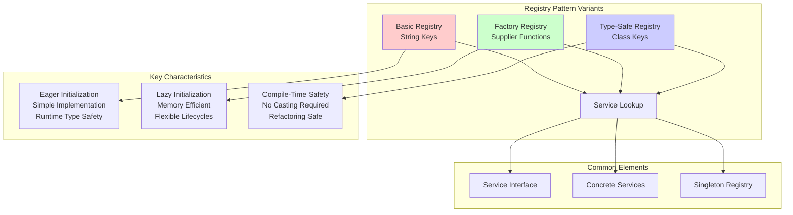

# Registry Pattern UML Diagrams

This directory contains comprehensive UML diagrams for all three Registry pattern implementations using Mermaid syntax. These diagrams illustrate the structural relationships and behavioral interactions of each pattern variant.

## 📊 Available Diagrams

### Class Diagrams
Class diagrams show the static structure, relationships, and key methods of each implementation.

| Pattern | Class Diagram | Key Features |
|---------|---------------|--------------|
| **Basic Registry** | [basic-registry-class-diagram.md](basic-registry-class-diagram.md) | String keys, eager initialization, simple lookup |
| **Factory Registry** | [factory-registry-class-diagram.md](factory-registry-class-diagram.md) | Factory functions, lazy initialization, prototype/singleton scopes |
| **Type-Safe Registry** | [typesafe-registry-class-diagram.md](typesafe-registry-class-diagram.md) | Class<T> keys, compile-time safety, no casting |

### Sequence Diagrams
Sequence diagrams demonstrate the runtime interactions and method call flows for each pattern.

| Pattern | Sequence Diagram | Key Interactions |
|---------|------------------|------------------|
| **Basic Registry** | [basic-registry-sequence-diagram.md](basic-registry-sequence-diagram.md) | Registration → Storage → Retrieval → Usage |
| **Factory Registry** | [factory-registry-sequence-diagram.md](factory-registry-sequence-diagram.md) | Factory Registration → Lazy Creation → Caching |
| **Type-Safe Registry** | [typesafe-registry-sequence-diagram.md](typesafe-registry-sequence-diagram.md) | Type-Safe Registration → Safe Retrieval → Direct Usage |

## 🔍 Pattern Comparison Overview



## 🎯 When to Use Each Pattern

### Basic Registry Pattern
**Use When:**
- Simple requirements with few services
- Type safety is not critical
- All services are lightweight
- Quick prototyping or learning

**Avoid When:**
- Type safety is important
- Large number of services
- Complex service initialization

### Factory Registry Pattern
**Use When:**
- Services are expensive to create
- Not all services are used in every run
- Need flexible object lifecycles
- Memory efficiency is important

**Avoid When:**
- All services are always needed
- Simple, lightweight services
- Startup time is not a concern

### Type-Safe Registry Pattern
**Use When:**
- Type safety is critical
- Using modern IDEs with good tooling
- Refactoring happens frequently
- Compile-time error detection preferred

**Avoid When:**
- Working with legacy systems
- Dynamic service registration needed
- Runtime type flexibility required

## 📚 How to Read the Diagrams

### Class Diagram Symbols
- **Interface**: `<<interface>>` stereotype
- **Static Methods**: `$` suffix (e.g., `getInstance()$`)
- **Generic Types**: `~Type~` notation (e.g., `Map~String, Service~`)
- **Relationships**: 
  - `<|..` implements
  - `-->` uses/depends on
  - `..>` creates/references

### Sequence Diagram Elements
- **Participants**: Classes/objects involved in interactions
- **Messages**: Method calls between participants
- **Activation Boxes**: Time when object is active
- **Notes**: Important explanations and comments
- **Alt/Opt Blocks**: Conditional or optional flows

## 🔧 Viewing the Diagrams

### GitHub Integration
All Mermaid diagrams render automatically in GitHub when viewing the `.md` files. Simply click on any diagram file to see the rendered UML.

### Local Viewing Options

1. **VS Code**: Install the "Mermaid Preview" extension
2. **IntelliJ IDEA**: Built-in Mermaid support in markdown files
3. **Online**: Copy diagram code to [Mermaid Live Editor](https://mermaid.live/)
4. **CLI Tools**: Use `mermaid-cli` for PNG/SVG generation

### Generating Images
To generate static images from the Mermaid diagrams:

```bash
# Install mermaid-cli
npm install -g @mermaid-js/mermaid-cli

# Generate PNG images
mmdc -i basic-registry-class-diagram.md -o basic-registry-class-diagram.png
mmdc -i factory-registry-class-diagram.md -o factory-registry-class-diagram.png
mmdc -i typesafe-registry-class-diagram.md -o typesafe-registry-class-diagram.png
```

## 🎓 Educational Value

These UML diagrams serve multiple educational purposes:

1. **Visual Learning**: Understand pattern structure at a glance
2. **Comparison**: Easy side-by-side pattern comparison
3. **Implementation Guide**: Clear roadmap for implementing each pattern
4. **Documentation**: Comprehensive pattern documentation
5. **Teaching Aid**: Perfect for presentations and tutorials

## 🔗 Related Resources

- [Main README](../../README.md) - Complete pattern documentation
- [Source Code](../../src/main/java/com/example/registry/) - Implementation examples
- [Demo Classes](../../src/main/java/com/example/registry/*/Demo.java) - Working examples

---

**Note**: All diagrams use Mermaid syntax for maximum compatibility with GitHub, GitLab, and modern documentation platforms.