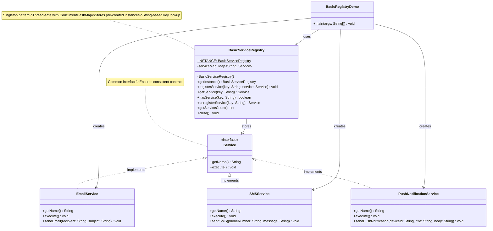

# Basic Registry Pattern - Class Diagram

## Key Features

- **Singleton Pattern**: `BasicServiceRegistry` ensures only one instance exists
- **String Keys**: Services are identified by string keys like "EMAIL", "SMS"
- **Eager Initialization**: Services must be created before registration
- **Thread Safety**: Uses `ConcurrentHashMap` for thread-safe operations
- **Simple Lookup**: Direct key-to-service mapping