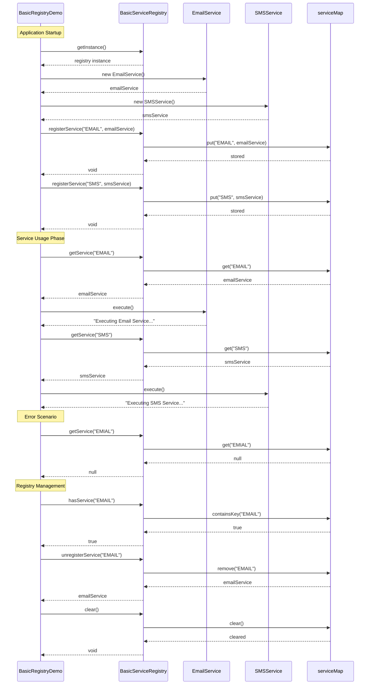

# Basic Registry Pattern - Sequence Diagram

## Service Registration and Usage Flow

## Key Interaction Points

1. **Singleton Access**: Registry instance obtained via `getInstance()`
2. **Eager Creation**: Services created before registration
3. **String-Based Lookup**: Services retrieved using string keys
4. **Shared Instances**: Same service instance returned on multiple calls
5. **Error Handling**: Null returned for non-existent keys
6. **Management Operations**: Support for checking, removing, and clearing services

## Potential Issues Demonstrated

- **Typo Errors**: `getService("EMIAL")` returns null instead of email service
- **Runtime Casting**: Manual casting required for service-specific methods
- **No Compile-Time Safety**: Errors only discovered at runtime