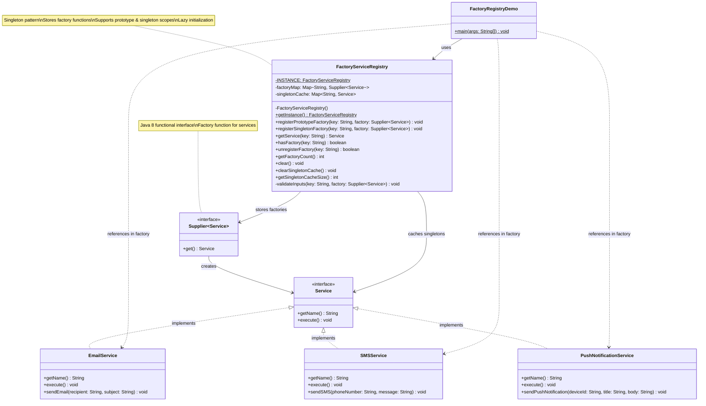

# Factory Registry Pattern - Class Diagram

## Key Features

- **Factory Storage**: Stores `Supplier<Service>` functions instead of instances
- **Lazy Initialization**: Services created only when first requested
- **Dual Scopes**: 
  - **Prototype**: New instance each time (`registerPrototypeFactory`)
  - **Singleton**: Cached instance (`registerSingletonFactory`)
- **Memory Efficient**: Unused services are never created
- **Flexible Lifecycle**: Different object creation strategies per service
- **Caching**: Singleton instances cached for reuse