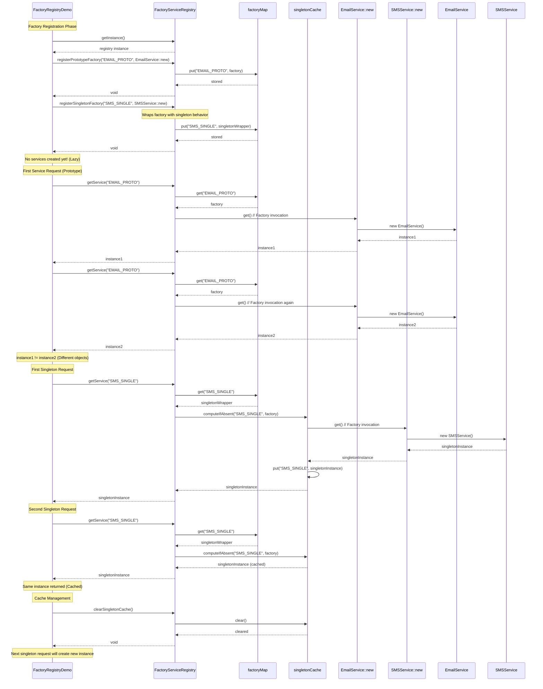

# Factory Registry Pattern - Sequence Diagram

## Factory Registration and Lazy Initialization Flow



## Factory Pattern Benefits Demonstrated

### 1. Lazy Initialization
- **No Upfront Cost**: Services created only when first requested
- **Memory Efficient**: Unused services never consume memory
- **Startup Performance**: Faster application startup

### 2. Flexible Object Lifecycles

#### Prototype Scope
```java
registry.registerPrototypeFactory("EMAIL", EmailService::new);
// Each call creates a new instance
```

#### Singleton Scope
```java
registry.registerSingletonFactory("SMS", SMSService::new);
// First call creates and caches, subsequent calls return cached instance
```

### 3. Factory Function Storage
- Stores `Supplier<Service>` functions, not instances
- Factory invoked on-demand
- Supports complex initialization logic

## Key Interaction Points

1. **Factory Registration**: Stores factory functions, not instances
2. **Lazy Creation**: Objects created on first `getService()` call
3. **Prototype vs Singleton**: Different caching strategies
4. **Cache Management**: Singleton instances cached and reused
5. **Memory Efficiency**: Unused factories never execute