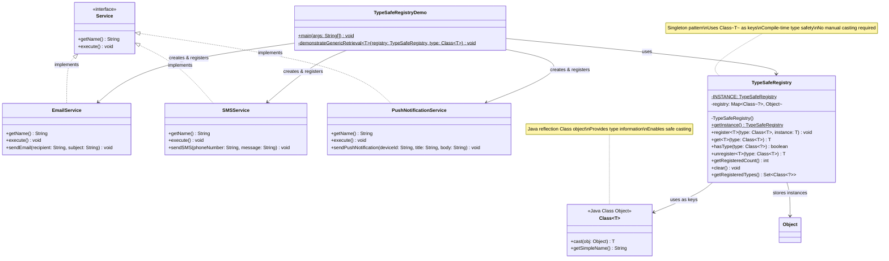

# Type-Safe Registry Pattern - Class Diagram



## Key Features

- **Type Safety**: Uses `Class<T>` objects as keys instead of strings
- **Compile-Time Checking**: Prevents type mismatches at compile time
- **No Casting**: Return types automatically inferred from `Class<T>` parameter
- **Generics**: Leverages Java generics for type safety
- **Refactoring Safe**: Class renames automatically update keys
- **IDE Support**: Full auto-completion and type hints
- **Safe Casting**: Internal casting guaranteed safe by registration contract

## Type Safety Benefits

```java
// ✅ Type-safe - no casting needed
EmailService emailService = registry.get(EmailService.class);

// ❌ Compile error - prevents wrong assignments
SMSService wrongType = registry.get(EmailService.class); // Won't compile!