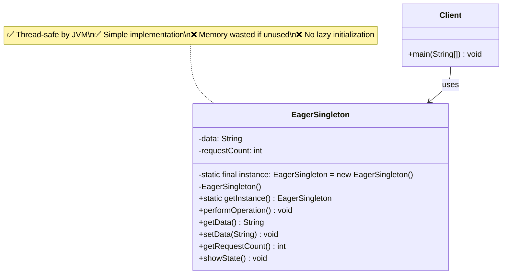
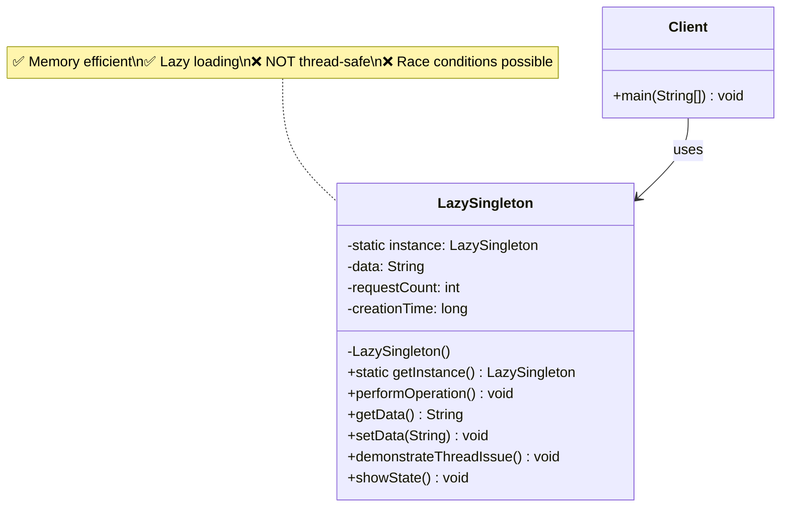
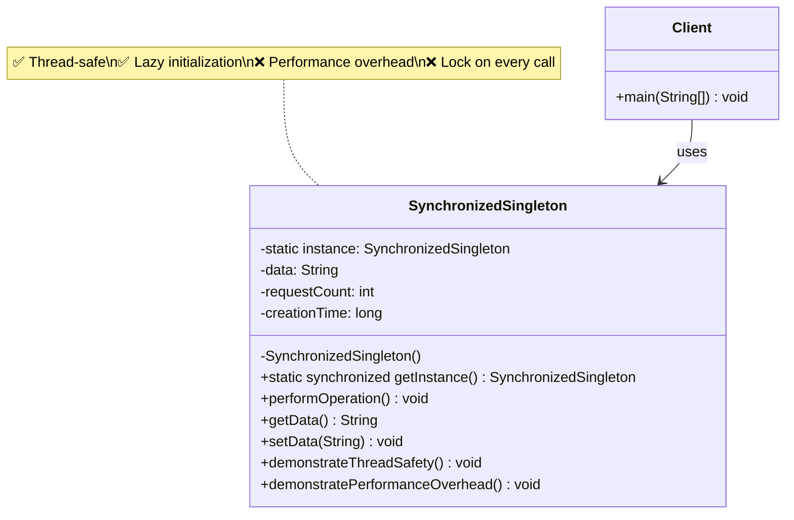
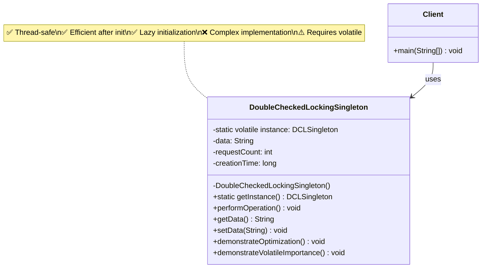
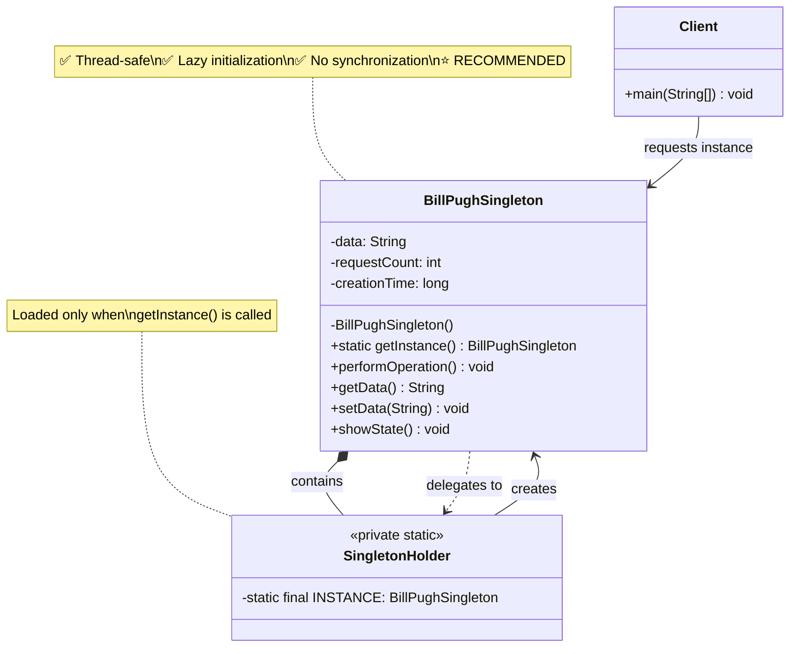
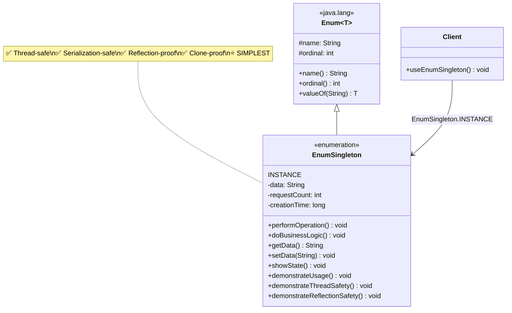
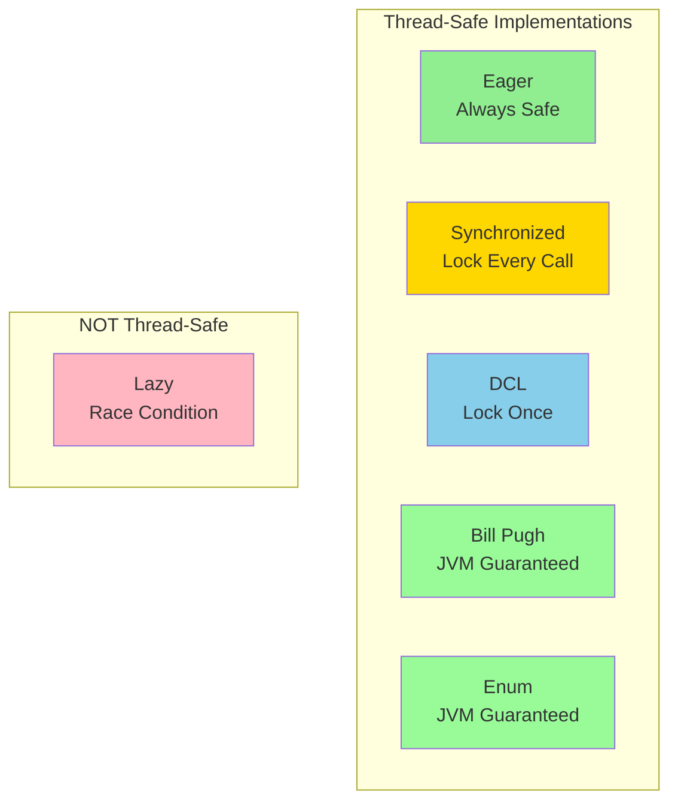
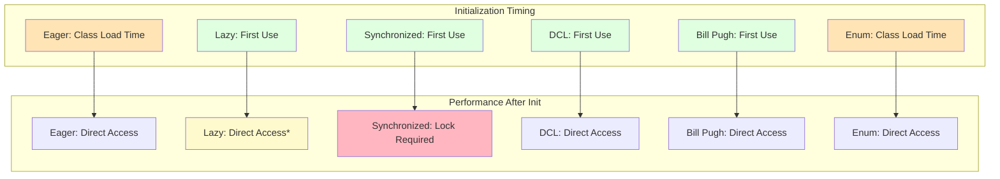
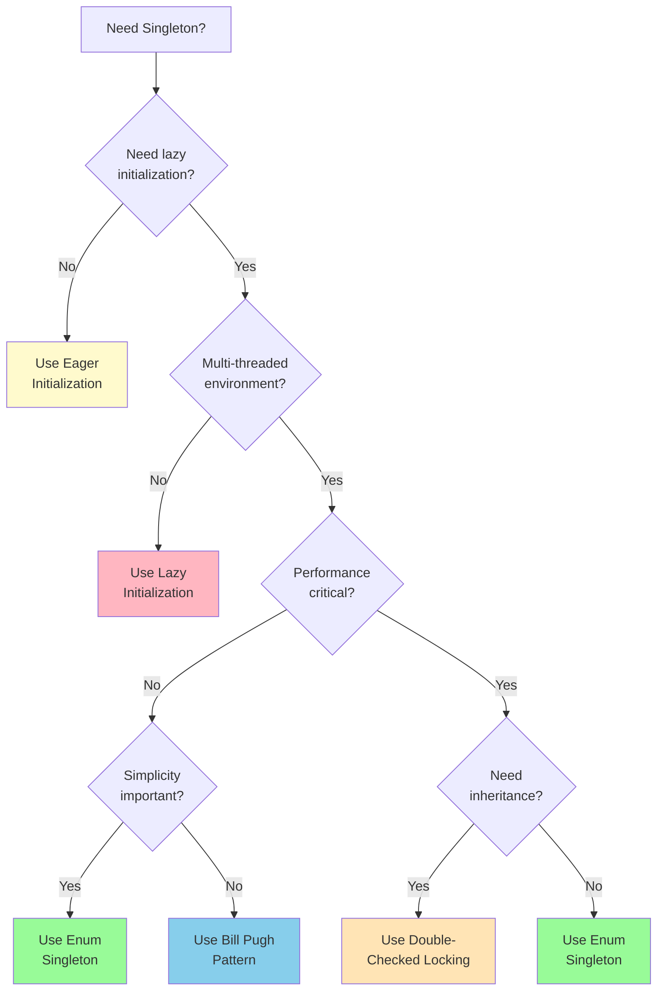

# Singleton Pattern - Class Diagrams

## Overview Class Diagram - All Variations

```mermaid
classDiagram
    class SingletonPattern {
        <<interface>>
        +getInstance() Object
    }
    
    class EagerSingleton {
        -static instance: EagerSingleton
        -data: String
        -requestCount: int
        -EagerSingleton()
        +static getInstance() EagerSingleton
        +performOperation() void
        +getData() String
        +setData(String) void
    }
    
    class LazySingleton {
        -static instance: LazySingleton
        -data: String
        -requestCount: int
        -creationTime: long
        -LazySingleton()
        +static getInstance() LazySingleton
        +performOperation() void
        +demonstrateThreadIssue() void
    }
    
    class SynchronizedSingleton {
        -static instance: SynchronizedSingleton
        -data: String
        -requestCount: int
        -SynchronizedSingleton()
        +static synchronized getInstance() SynchronizedSingleton
        +performOperation() void
        +demonstrateThreadSafety() void
    }
    
    class DoubleCheckedLockingSingleton {
        -static volatile instance: DCLSingleton
        -data: String
        -requestCount: int
        -DoubleCheckedLockingSingleton()
        +static getInstance() DCLSingleton
        +performOperation() void
        +demonstrateOptimization() void
    }
    
    class BillPughSingleton {
        -data: String
        -requestCount: int
        -BillPughSingleton()
        +static getInstance() BillPughSingleton
        +performOperation() void
    }
    
    class SingletonHolder {
        <<static>>
        -static final INSTANCE: BillPughSingleton
    }
    
    class EnumSingleton {
        <<enumeration>>
        INSTANCE
        -data: String
        -requestCount: int
        +performOperation() void
        +doBusinessLogic() void
    }
    
    SingletonPattern <|.. EagerSingleton
    SingletonPattern <|.. LazySingleton
    SingletonPattern <|.. SynchronizedSingleton
    SingletonPattern <|.. DoubleCheckedLockingSingleton
    SingletonPattern <|.. BillPughSingleton
    SingletonPattern <|.. EnumSingleton
    
    BillPughSingleton ..> SingletonHolder : uses
    
    note for EagerSingleton "Instance created at\nclass loading time"
    note for LazySingleton "NOT thread-safe\nMultiple instances possible"
    note for SynchronizedSingleton "Thread-safe but\nsynchronization overhead"
    note for DoubleCheckedLockingSingleton "Requires volatile\nOptimized locking"
    note for BillPughSingleton "RECOMMENDED\nBest practice"
    note for EnumSingleton "SIMPLEST & SAFEST\nReflection-proof"
```

## Detailed Implementation Diagrams

### 1. Eager Initialization

### 2. Lazy Initialization (Non-Thread-Safe)

### 3. Synchronized Method

### 4. Double-Checked Locking

### 5. Bill Pugh (Inner Static Helper)

### 6. Enum Singleton

## Thread Safety Comparison

## Memory & Performance Characteristics

## Implementation Decision Tree

