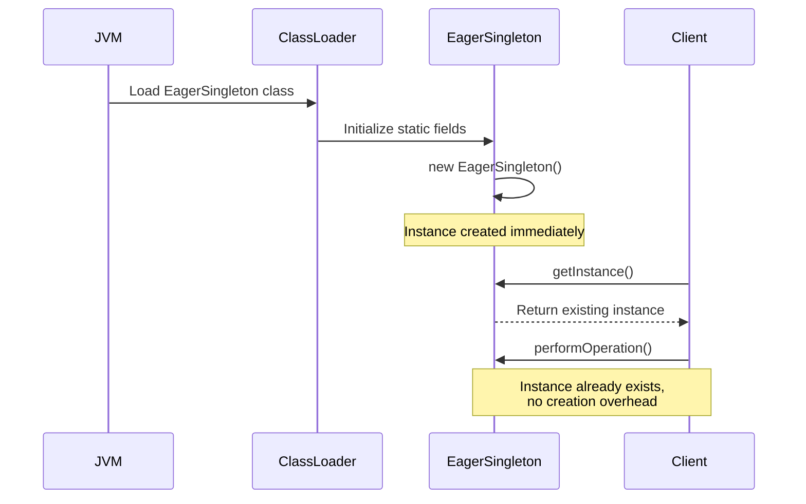
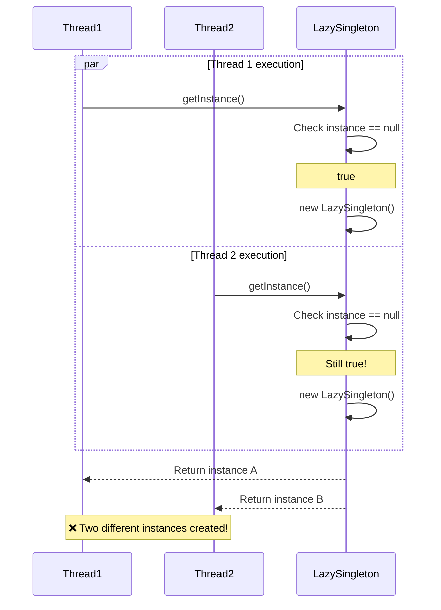
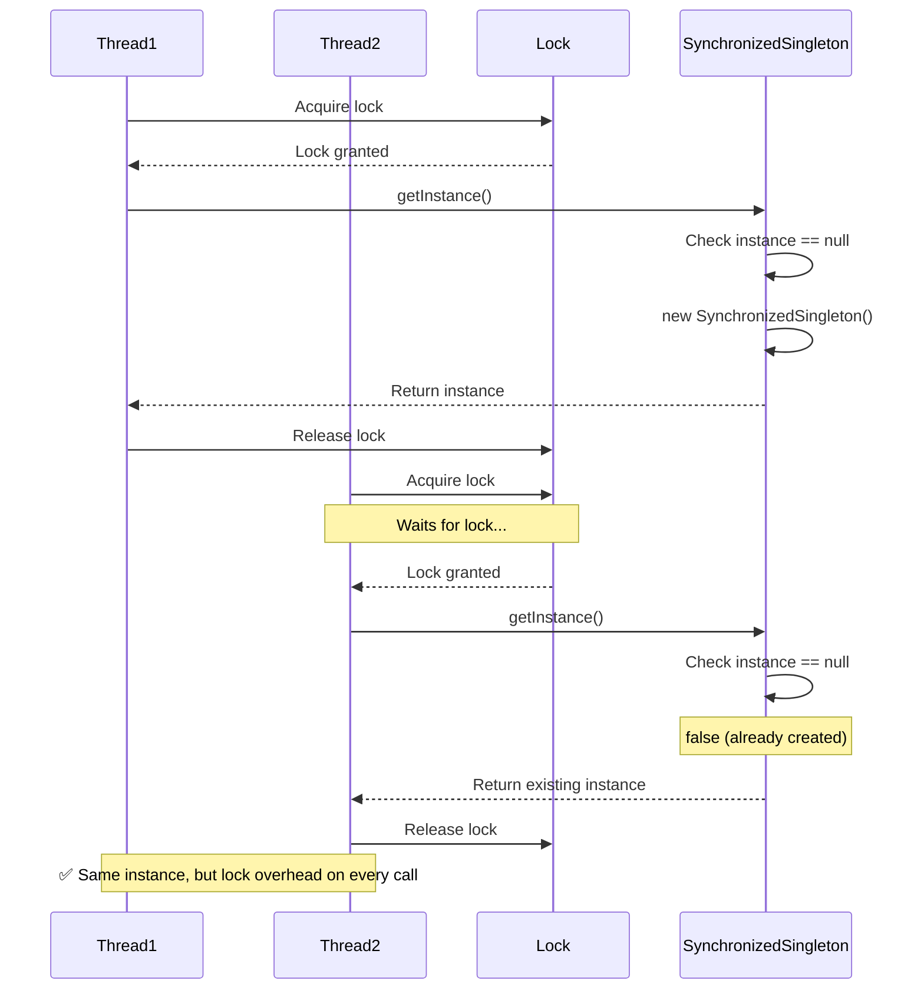
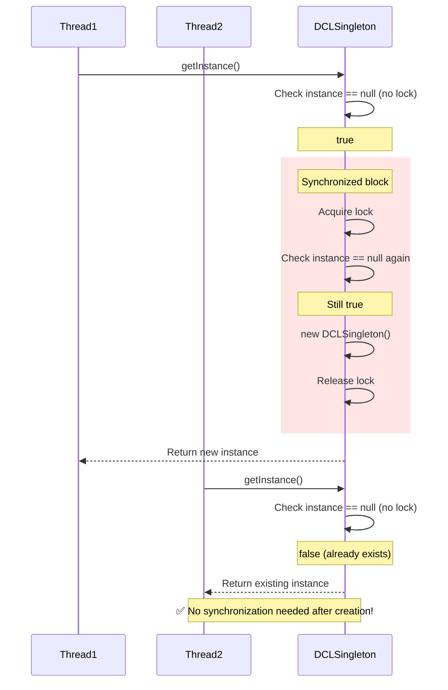
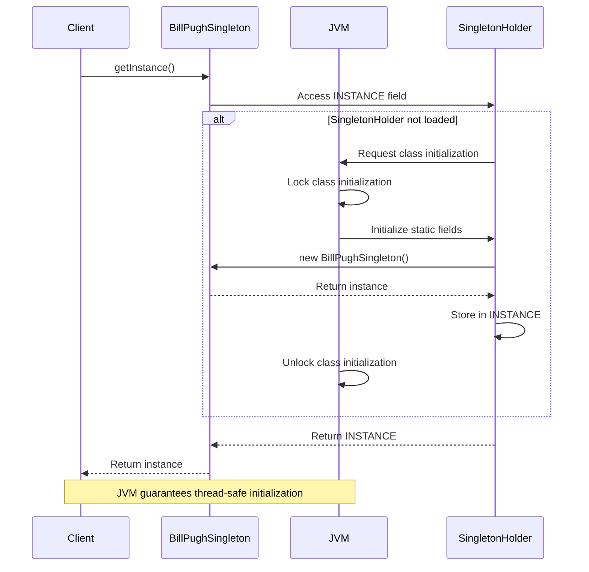
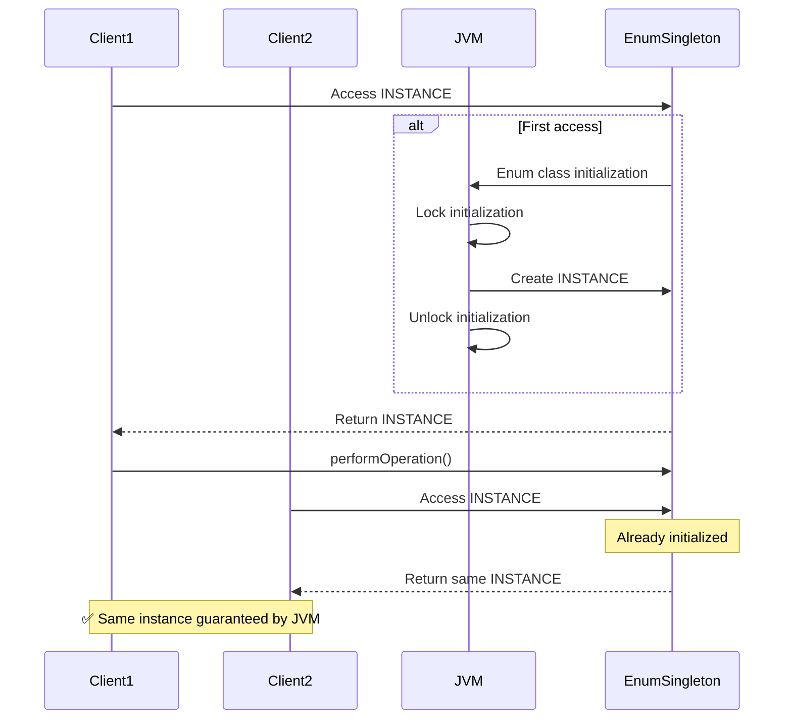
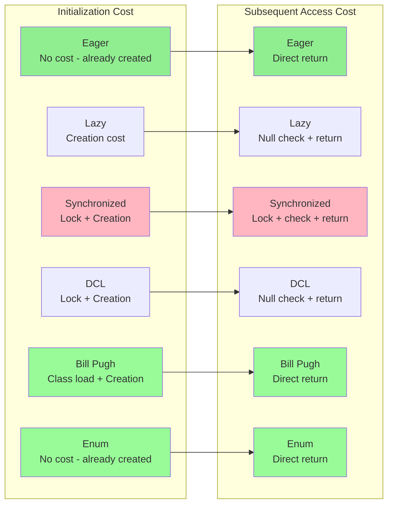
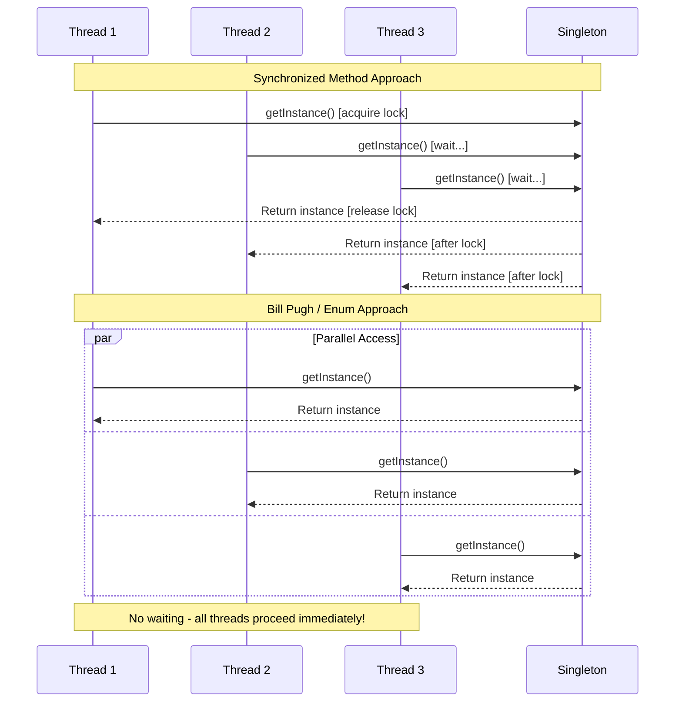

# Singleton Pattern - Sequence Diagrams

## 1. Eager Initialization Sequence

## 2. Lazy Initialization Sequence (Thread Safety Issue)

## 3. Synchronized Method Sequence

## 4. Double-Checked Locking Sequence

## 5. Bill Pugh (Inner Static Helper) Sequence

## 6. Enum Singleton Sequence

## Comparison: First Access Performance

## Thread Contention Scenario

