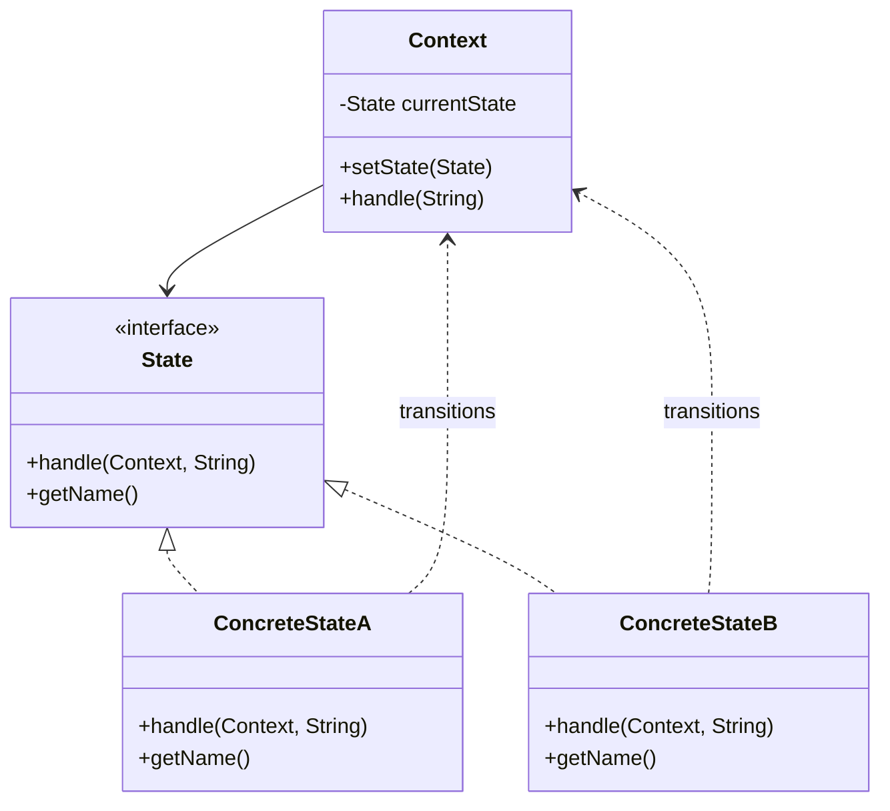
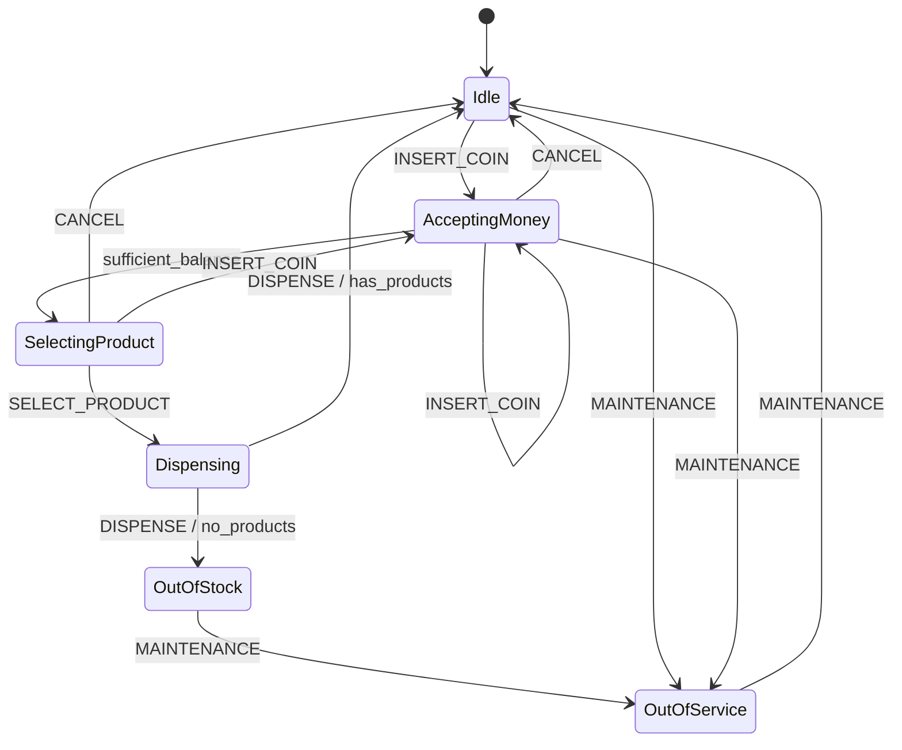
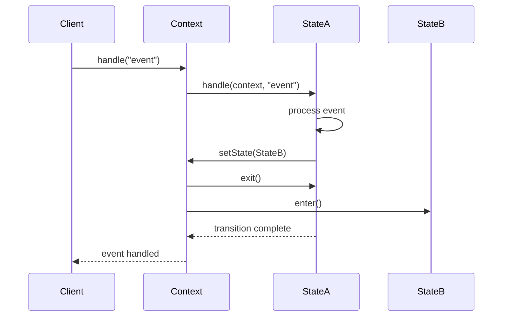

# State Pattern

The State Pattern allows an object to alter its behavior when its internal state changes. The object appears to change its class by delegating behavior to different state objects that represent different states of the context.

## Intent & Problem

### Problem
Traditional approaches to state-dependent behavior often lead to:
- Large switch statements scattered throughout the code
- Violation of the Open/Closed Principle
- Tight coupling between states and the context
- Difficulty in adding new states or transitions
- Complex conditional logic that's hard to maintain

### Solution
The State Pattern encapsulates state-specific behavior in separate state objects and delegates requests to the current state object. This eliminates conditionals and makes the code more maintainable and extensible.

## When to Use

**Use the State Pattern when:**
- An object's behavior depends on its state and must change at runtime
- Operations have large, multipart conditional statements that depend on object state
- State-specific behavior is scattered across multiple operations
- You need to avoid duplicate code across similar states

**Don't use when:**
- There are only a few states and they rarely change
- State transitions are simple and don't require complex logic
- Performance is critical and object creation overhead is unacceptable

## Comparison with Other Patterns

| Pattern | Intent | Key Difference |
|---------|--------|----------------|
| **State** | Change behavior based on internal state | State determines behavior |
| **Strategy** | Choose algorithm at runtime | External choice of algorithm |
| **Command** | Encapsulate requests as objects | Encapsulates operations, not state |
| **Template Method** | Define algorithm skeleton | Fixed algorithm with variable steps |

## Implementation Variants

### 1. Classic GoF State (Object-Oriented)
**Intent:** Traditional GoF implementation with state interface and concrete state classes.

**Key Features:**
- State interface defines common behavior
- Context holds reference to current state
- Each state encapsulates its own behavior and transitions

**Use Case:** Complex state machines with rich state-specific behavior.

**Files:**
- `src/main/java/com/example/state/classic/`

### 2. Table-Driven State Machine
**Intent:** Define transitions and actions as data rather than code.

**Key Features:**
- Transition table maps (state, event) → (newState, action)
- Easy to configure and modify transitions
- Clear separation of logic and configuration

**Use Case:** Systems requiring runtime configuration or external control.

**Files:**
- `src/main/java/com/example/state/table/`

### 3. Enum-Based State
**Intent:** Use Java enums to encapsulate state behavior compactly.

**Key Features:**
- Each enum constant implements behavior methods
- Type-safe and compile-time checked
- Compact representation

**Use Case:** State machines with moderate complexity and good performance requirements.

**Files:**
- `src/main/java/com/example/state/enumbased/`

### 4. Switch-Based Minimal State
**Intent:** Simple conditional dispatch for small state machines.

**Key Features:**
- Direct switch statements for state handling
- Minimal overhead and simple to understand
- All logic centralized in one place

**Use Case:** Simple state machines with few states and performance constraints.

**Files:**
- `src/main/java/com/example/state/switchbased/`

### 5. Dynamic Registry-Backed State
**Intent:** Support runtime registration and replacement of state objects.

**Key Features:**
- State registry for dynamic state management
- Plugin-style architecture support
- Runtime state replacement and aliasing

**Use Case:** Extensible systems requiring plugin states or configuration-driven behavior.

**Files:**
- `src/main/java/com/example/state/dynamic/`

### 6. Functional State
**Intent:** Use lambdas and functional programming for state behavior.

**Key Features:**
- States represented as functions
- Fluent builder API for construction
- Composition of behaviors through lambdas

**Use Case:** Java 8+ projects preferring functional style and concise code.

**Files:**
- `src/main/java/com/example/state/functional/`

### 7. Hierarchical States
**Intent:** Support nested states with inheritance of behavior.

**Key Features:**
- Parent-child state relationships
- Event bubbling from child to parent
- Shared behavior in parent states

**Use Case:** Complex UI navigation, nested contexts, or layered state machines.

**Files:**
- `src/main/java/com/example/state/hierarchical/`

### 8. Reactive Event-Driven State
**Intent:** Integrate with asynchronous event streams and message systems.

**Key Features:**
- Event bus integration
- Asynchronous state transitions
- Support for external event sources

**Use Case:** Event-driven systems, IoT devices, reactive architectures.

**Files:**
- `src/main/java/com/example/state/reactive/`

### 9. Distributed Persistent State
**Intent:** Support long-running workflows with crash recovery and persistence.

**Key Features:**
- State snapshots and versioning
- Crash recovery and rollback
- Distributed system support

**Use Case:** Workflow engines, long-running business processes, distributed transactions.

**Files:**
- `src/main/java/com/example/state/persistent/`

## Decision Matrix

| Aspect | Classic | Table | Enum | Switch | Dynamic | Functional | Hierarchical | Reactive | Persistent |
|--------|---------|-------|------|--------|---------|------------|--------------|----------|------------|
| **Extensibility** | ⭐⭐⭐⭐⭐ | ⭐⭐⭐⭐⭐ | ⭐⭐ | ⭐ | ⭐⭐⭐⭐⭐ | ⭐⭐⭐⭐ | ⭐⭐⭐⭐ | ⭐⭐⭐⭐ | ⭐⭐⭐ |
| **Performance** | ⭐⭐⭐ | ⭐⭐⭐⭐ | ⭐⭐⭐⭐⭐ | ⭐⭐⭐⭐⭐ | ⭐⭐ | ⭐⭐⭐ | ⭐⭐ | ⭐⭐ | ⭐ |
| **Complexity** | ⭐⭐⭐ | ⭐⭐ | ⭐⭐⭐⭐ | ⭐⭐⭐⭐⭐ | ⭐⭐ | ⭐⭐⭐ | ⭐⭐ | ⭐⭐ | ⭐ |
| **Testability** | ⭐⭐⭐⭐⭐ | ⭐⭐⭐⭐ | ⭐⭐⭐⭐ | ⭐⭐ | ⭐⭐⭐⭐ | ⭐⭐⭐ | ⭐⭐⭐ | ⭐⭐⭐ | ⭐⭐⭐ |
| **Memory Usage** | ⭐⭐ | ⭐⭐⭐ | ⭐⭐⭐⭐ | ⭐⭐⭐⭐⭐ | ⭐⭐ | ⭐⭐⭐ | ⭐⭐ | ⭐⭐ | ⭐ |
| **Runtime Flexibility** | ⭐⭐ | ⭐⭐⭐⭐⭐ | ⭐ | ⭐ | ⭐⭐⭐⭐⭐ | ⭐⭐⭐ | ⭐⭐⭐ | ⭐⭐⭐⭐⭐ | ⭐⭐⭐⭐⭐ |

## Trade-offs Analysis

### Class Explosion vs Switch Complexity
- **OO Approaches (Classic, Dynamic):** More classes but better separation of concerns
- **Procedural Approaches (Switch, Table):** Fewer classes but potential for large, complex methods

### Runtime Flexibility vs Performance
- **High Flexibility (Dynamic, Reactive, Persistent):** Support runtime changes but with overhead
- **High Performance (Enum, Switch):** Fast execution but limited runtime adaptability

### Extensibility vs Simplicity
- **Extensible (Classic, Functional, Hierarchical):** Easy to add new states but more complex architecture
- **Simple (Switch, Enum):** Straightforward implementation but harder to extend

## UML Diagrams

### Class Diagram - Classic State Pattern


### State Transition Diagram - Vending Machine


### Sequence Diagram - State Transition


## Running the Examples

### Compile All Variants
```bash
cd state-pattern
javac -d build -sourcepath src/main/java src/main/java/com/example/state/**/*.java
```

### Run Individual Demos
```bash
# Classic GoF Pattern
java -cp build com.example.state.classic.ClassicStateDemo

# Table-Driven State Machine
java -cp build com.example.state.table.TableDrivenDemo

# Enum-Based State
java -cp build com.example.state.enumbased.EnumStateDemo

# Switch-Based State
java -cp build com.example.state.switchbased.SwitchBasedDemo

# Dynamic Registry State
java -cp build com.example.state.dynamic.DynamicStateDemo

# Functional State
java -cp build com.example.state.functional.FunctionalStateDemo

# Hierarchical State
java -cp build com.example.state.hierarchical.HierarchicalStateDemo

# Reactive Event-Driven State
java -cp build com.example.state.reactive.ReactiveStateDemo

# Persistent State
java -cp build com.example.state.persistent.PersistentStateDemo
```

## Real-World Use Cases

### 1. User Interface Navigation
- **Pattern:** Hierarchical States
- **Example:** Mobile app with screens, modals, and tabs
- **Benefits:** Natural nesting, shared navigation behavior

### 2. Network Protocol Implementation
- **Pattern:** Classic GoF or Enum-Based
- **Example:** TCP connection states (CLOSED, LISTEN, SYN_SENT, ESTABLISHED)
- **Benefits:** Clear state transitions, protocol compliance

### 3. Workflow Engines
- **Pattern:** Persistent State
- **Example:** Order processing, approval workflows
- **Benefits:** Fault tolerance, audit trails, long-running processes

### 4. Game Development
- **Pattern:** Dynamic Registry or Functional
- **Example:** Game modes, character states, AI behaviors
- **Benefits:** Modding support, rapid iteration, data-driven behavior

### 5. IoT Device Management
- **Pattern:** Reactive Event-Driven
- **Example:** Sensor states, connectivity management
- **Benefits:** Event-driven architecture, distributed systems integration

## Reader Exercises

### Exercise 1: Add New State (Classic)
Extend the vending machine with a "MAINTENANCE" state that:
- Accepts only technician commands
- Allows refilling products
- Transitions back to IDLE when complete

### Exercise 2: Convert Switch to Table
Take the ATM switch-based implementation and convert it to use a transition table approach.

### Exercise 3: Implement Hierarchical Validation
Create a hierarchical state machine for form validation with:
- Parent state: VALIDATING
- Child states: FIELD_VALIDATION, BUSINESS_RULES, FINAL_CHECK

### Exercise 4: Add Persistence
Extend any state machine to save/restore state to/from a file, handling:
- Serialization of context data
- Version compatibility
- Recovery from corrupted state

### Exercise 5: Event Aggregation
Create a reactive state machine that responds to multiple event types and aggregates them before making transitions.

## Best Practices

### 1. State Design
- Keep states focused on single responsibilities
- Minimize shared state between state objects
- Use immutable state data where possible
- Consider state initialization and cleanup

### 2. Transition Logic
- Validate transitions before executing them
- Provide clear error messages for invalid transitions
- Consider using guard conditions for complex logic
- Document allowed transitions clearly

### 3. Performance Considerations
- Pool state objects if creation is expensive
- Use flyweight pattern for stateless states
- Consider enum-based states for performance-critical code
- Profile transition overhead in tight loops

### 4. Testing Strategy
- Test each state in isolation
- Test all valid transitions
- Test invalid transition handling
- Use state machine visualization for complex cases

### 5. Error Handling
- Define error recovery states
- Implement fallback mechanisms
- Log state transitions for debugging
- Validate state consistency regularly

## Related Patterns

- **Strategy Pattern:** Choose algorithms at runtime
- **Command Pattern:** Encapsulate operations as objects
- **Observer Pattern:** Notify about state changes
- **Memento Pattern:** Save and restore state snapshots
- **Visitor Pattern:** Operations on state machine structures

## Conclusion

The State Pattern provides a clean, maintainable solution for managing state-dependent behavior. The choice of implementation variant depends on your specific requirements:

- **Simple cases:** Use Switch-Based or Enum-Based variants
- **Complex logic:** Use Classic GoF or Functional variants  
- **Dynamic requirements:** Use Dynamic Registry or Reactive variants
- **Long-running processes:** Use Persistent State variant
- **Nested contexts:** Use Hierarchical State variant

Each variant demonstrates different trade-offs between simplicity, performance, and flexibility. Understanding these trade-offs helps you choose the right approach for your specific use case.