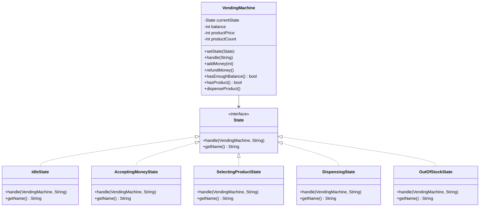
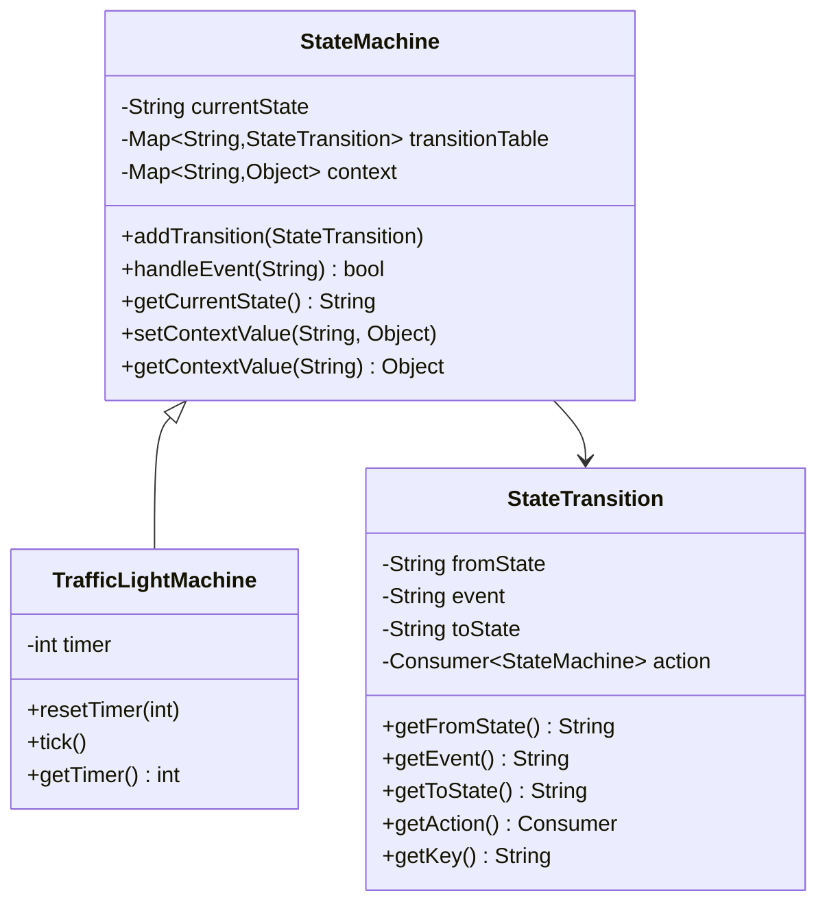
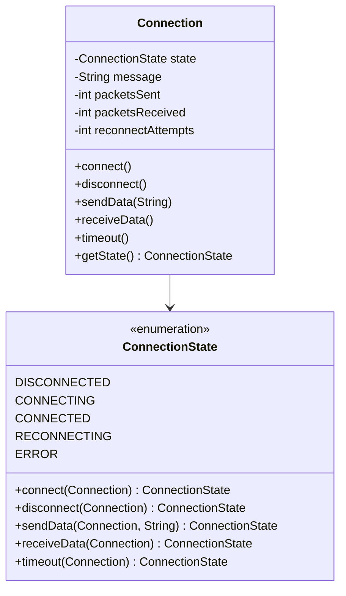
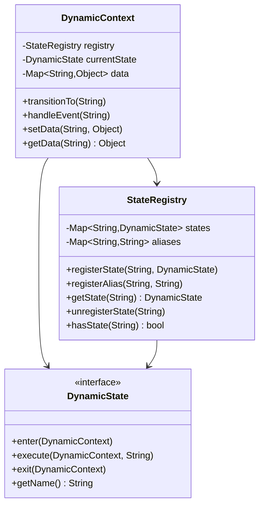
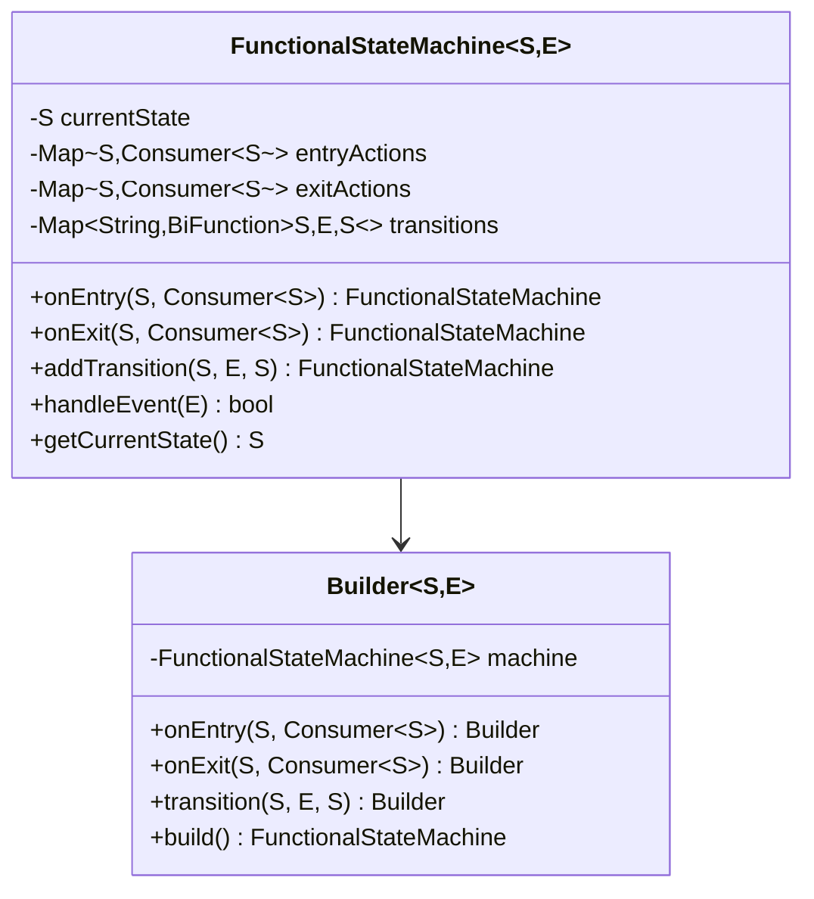
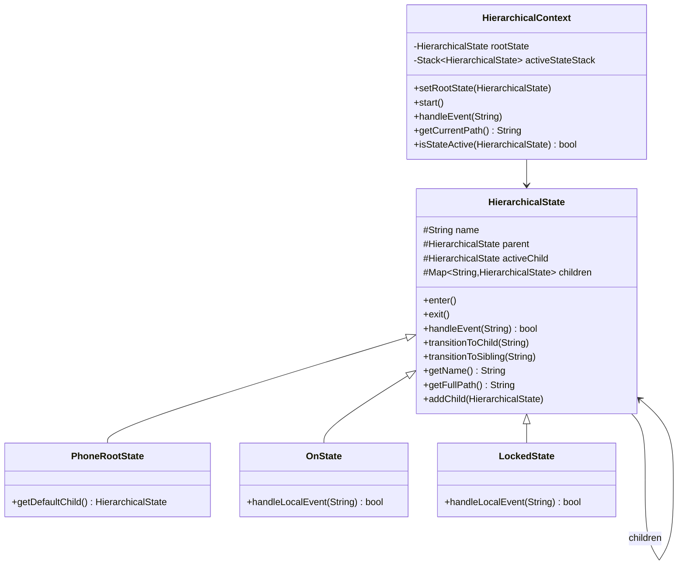
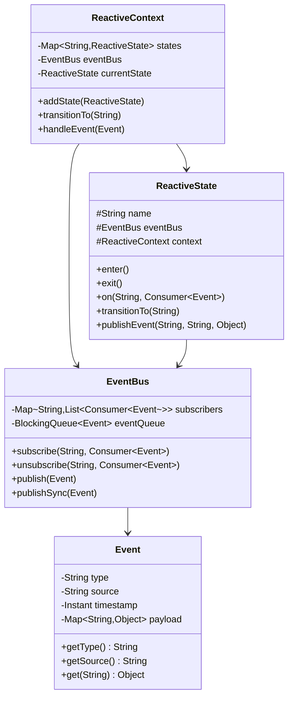
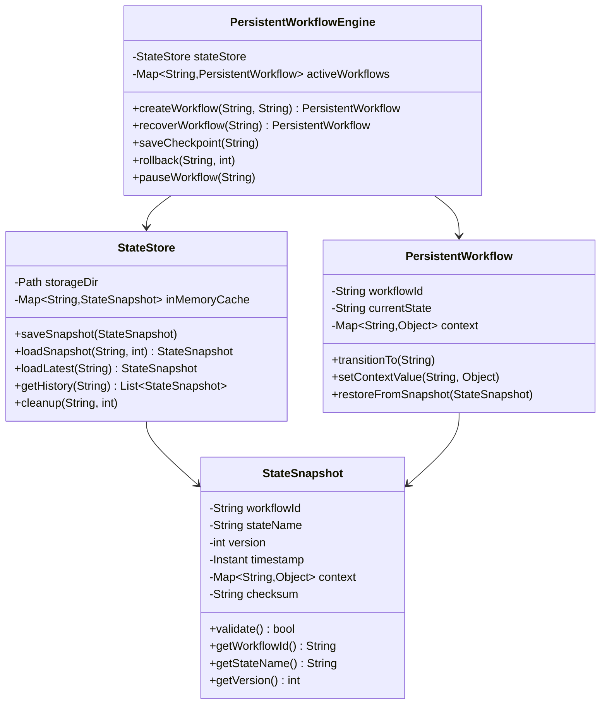

# State Pattern - Class Diagrams

## Classic GoF State Pattern

## Table-Driven State Machine

## Enum-Based State Pattern

## Dynamic Registry State Pattern

## Functional State Pattern

## Hierarchical State Pattern

## Reactive Event-Driven State Pattern

## Persistent State Pattern

