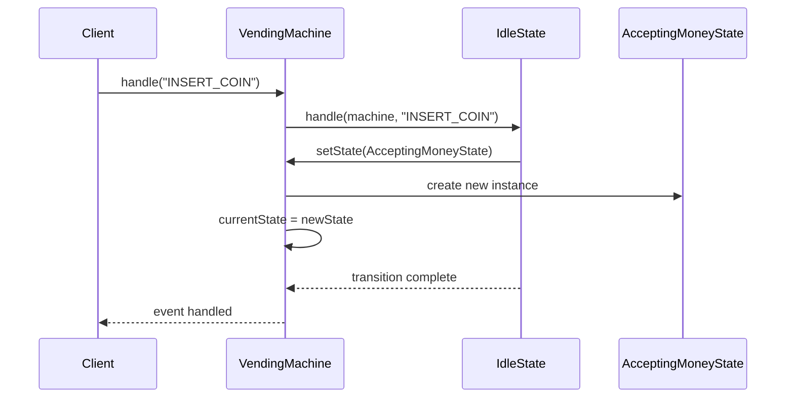
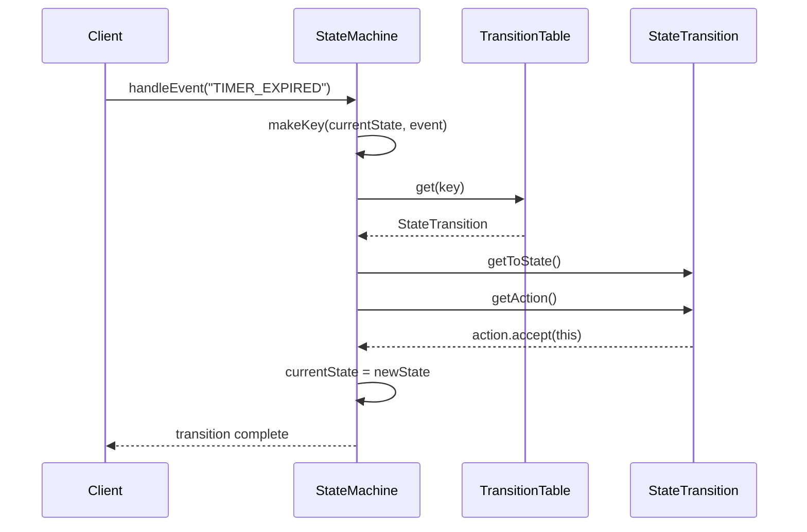
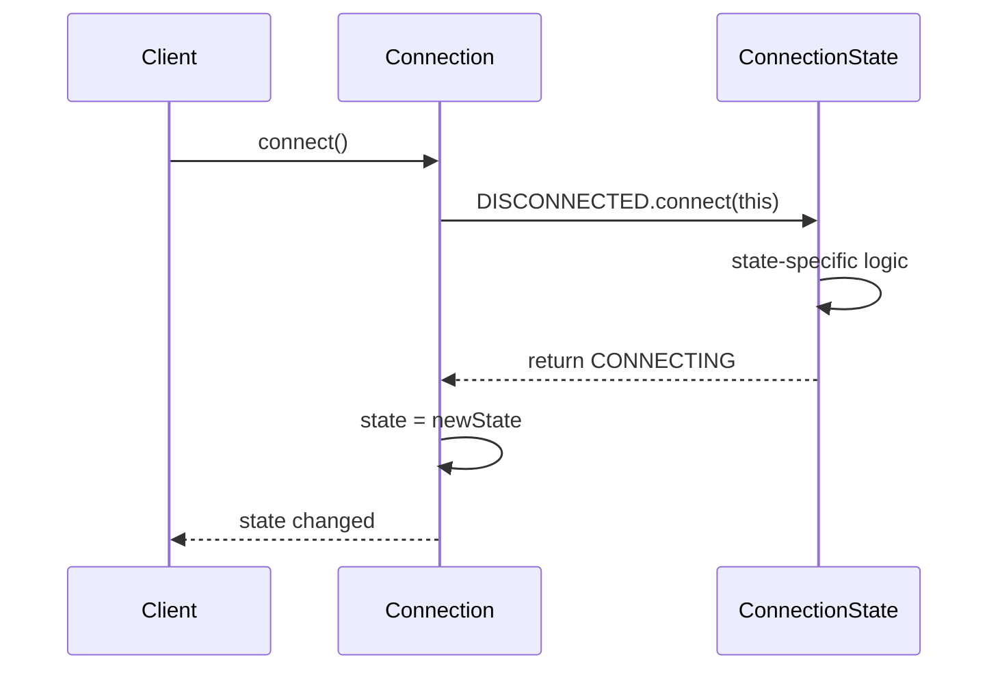
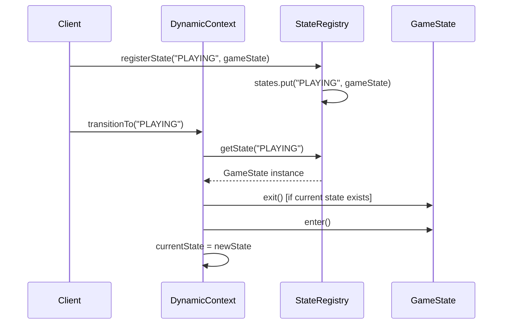
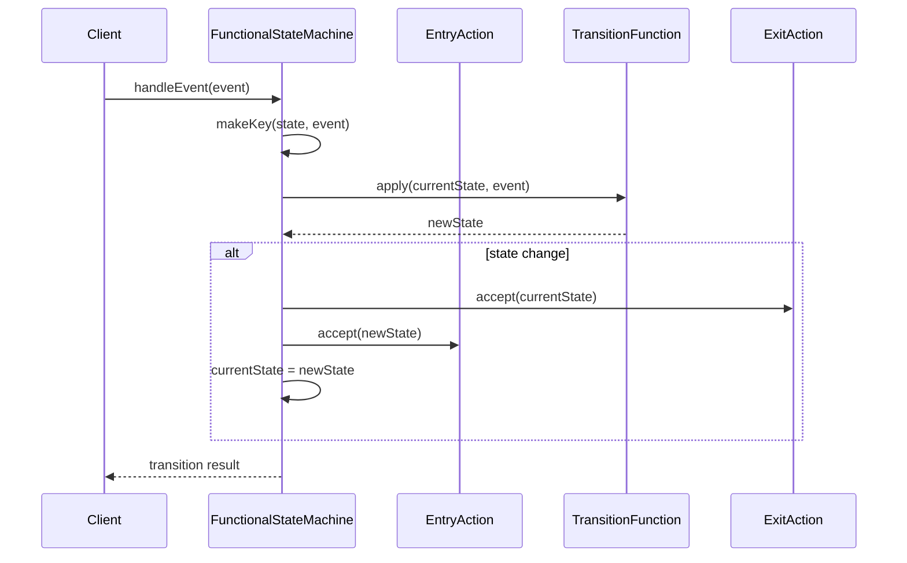
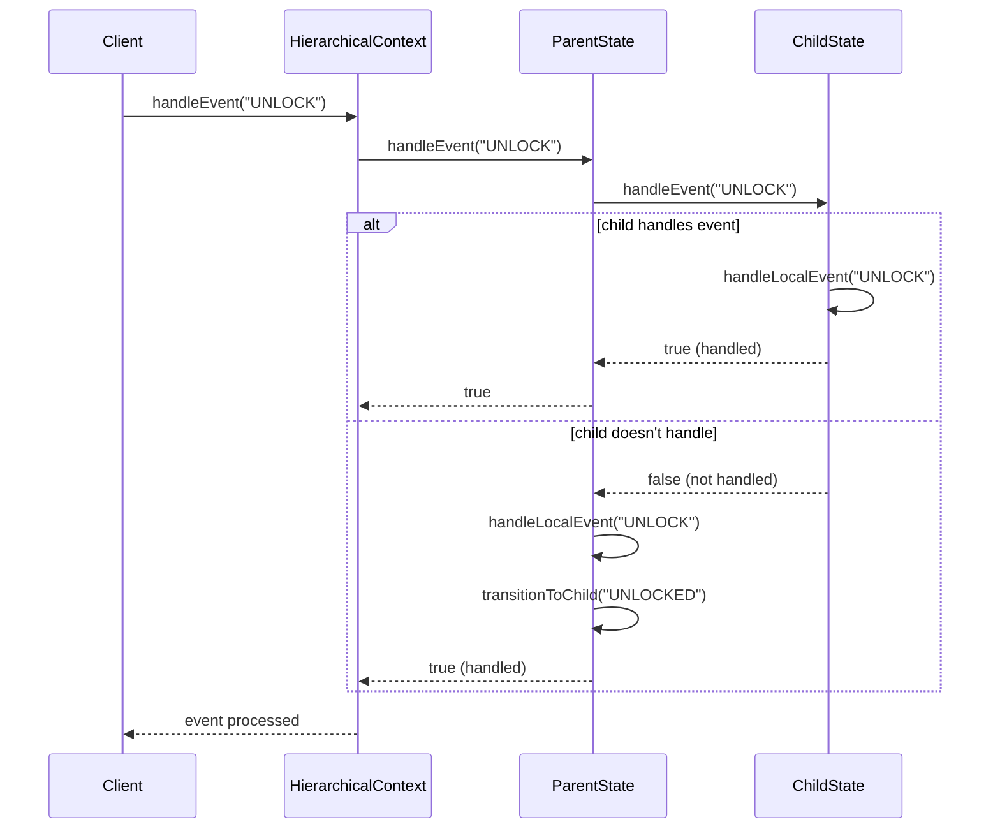
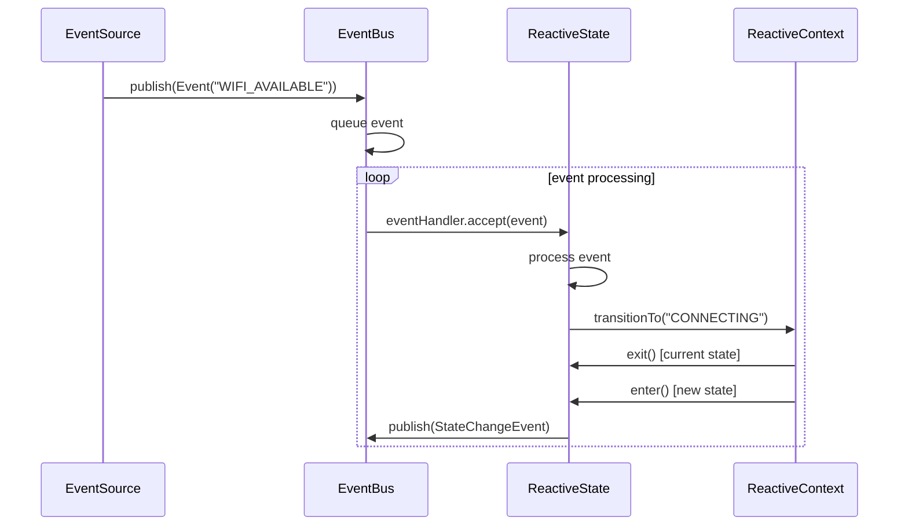
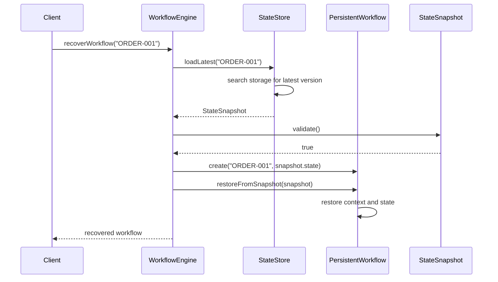
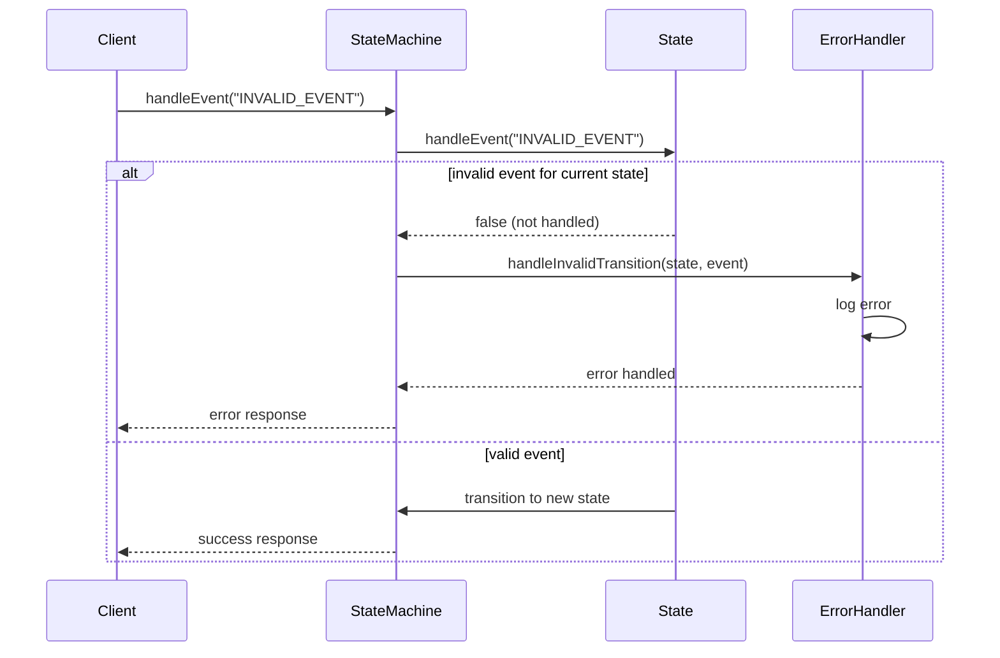
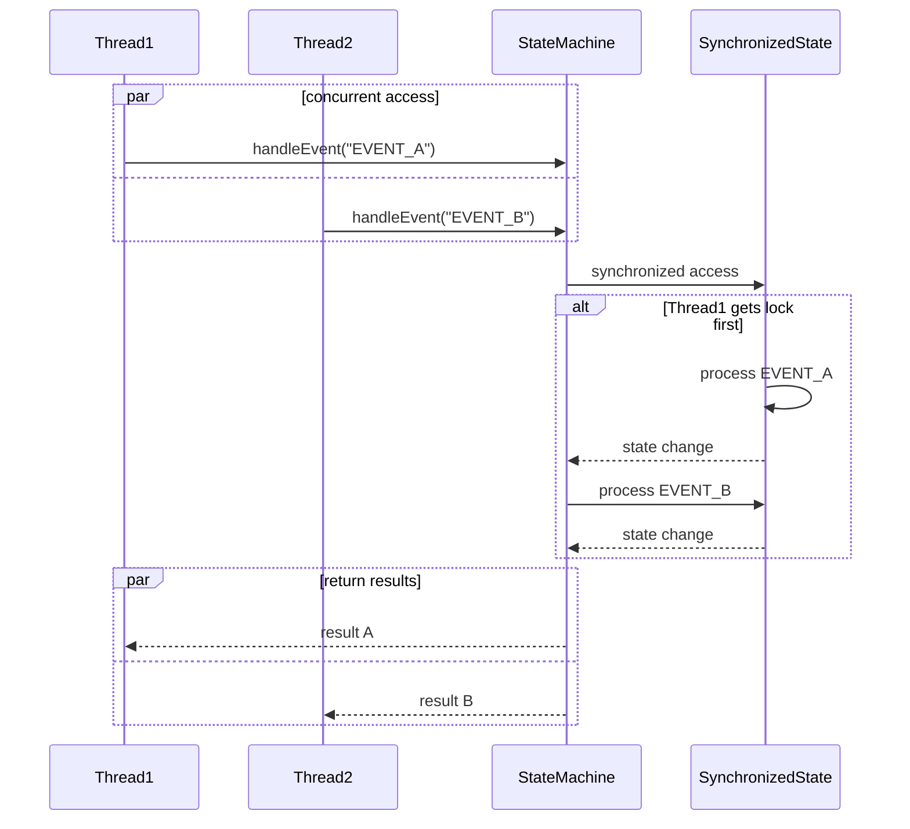

# State Pattern - Sequence Diagrams

## Classic State Transition

## Table-Driven State Processing

## Enum State Transition

## Dynamic State Registration and Transition

## Functional State Machine Execution

## Hierarchical State Event Handling

## Reactive Event-Driven State Flow

## Persistent State Recovery

## State Machine Error Handling

## Concurrent State Access

