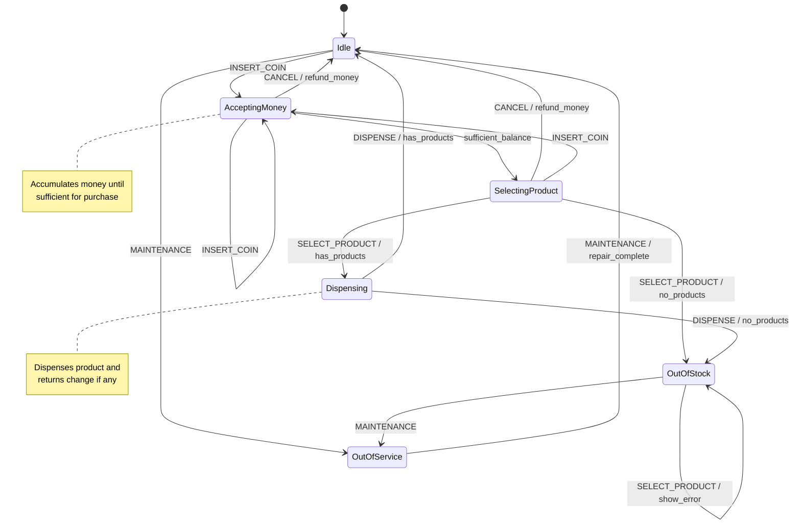
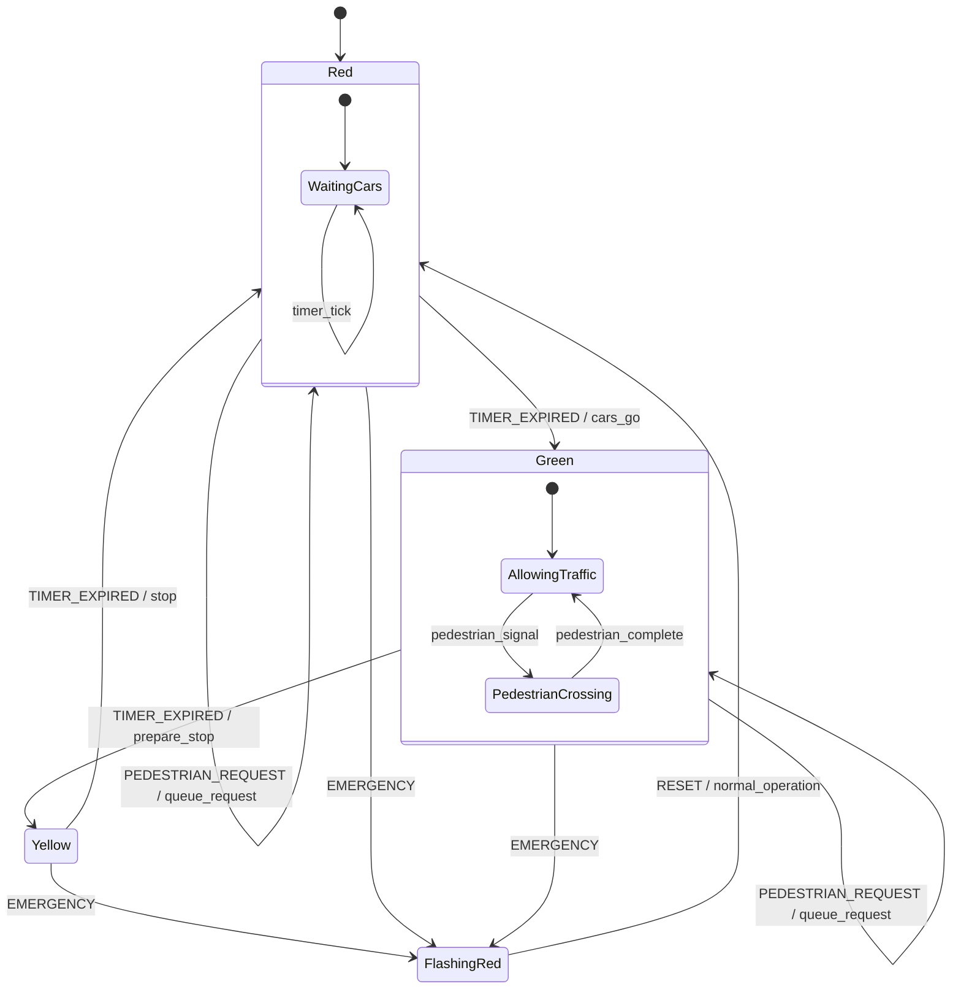
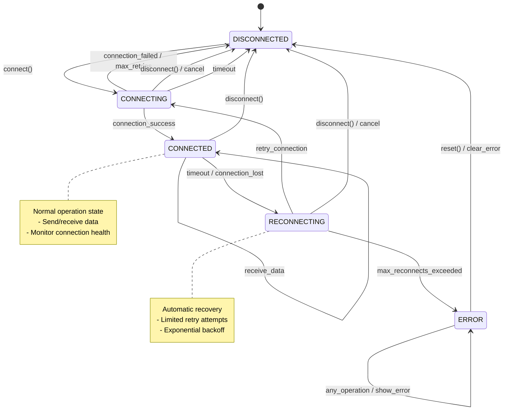
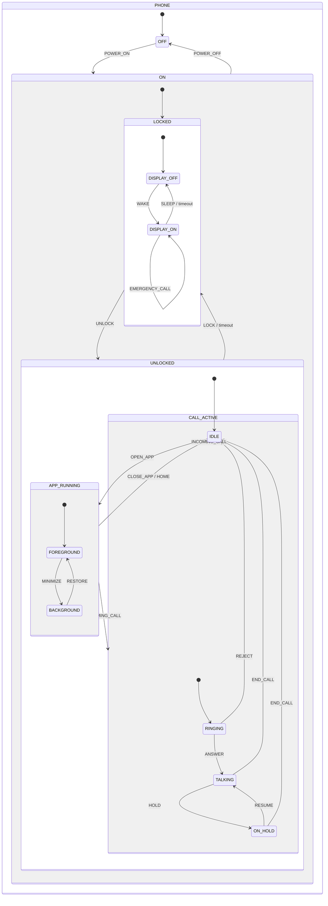
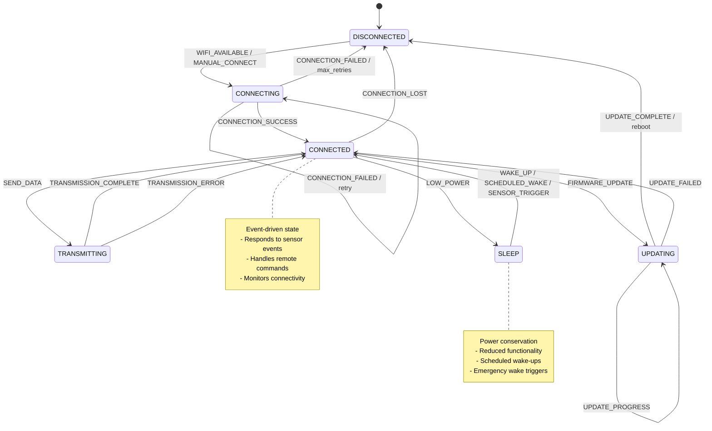
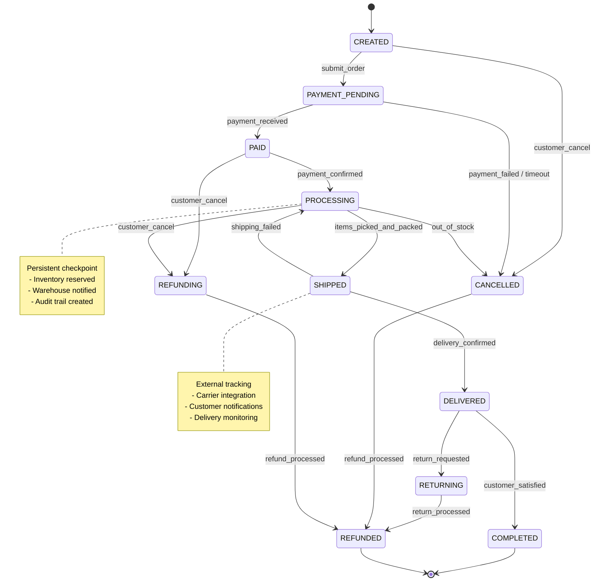
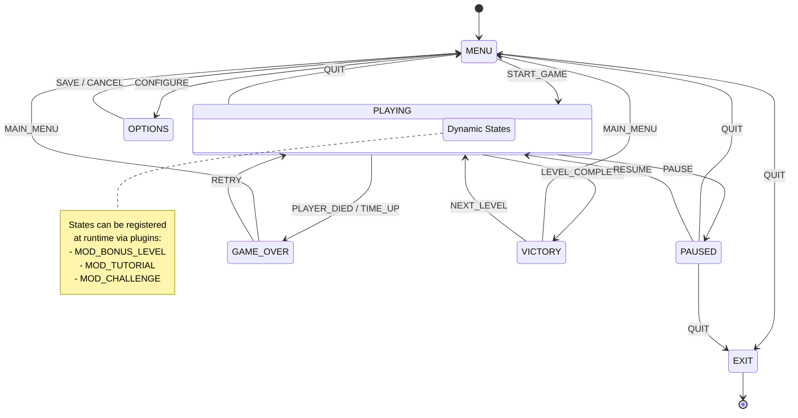
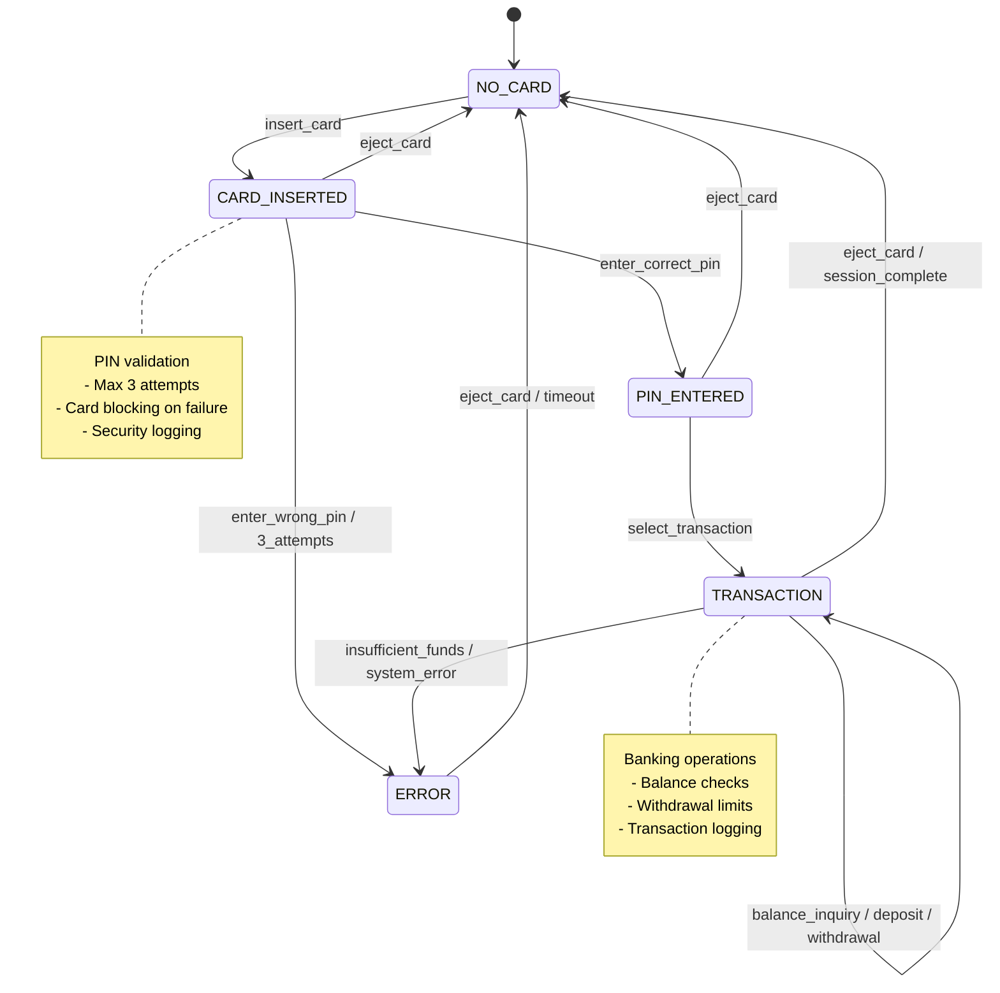
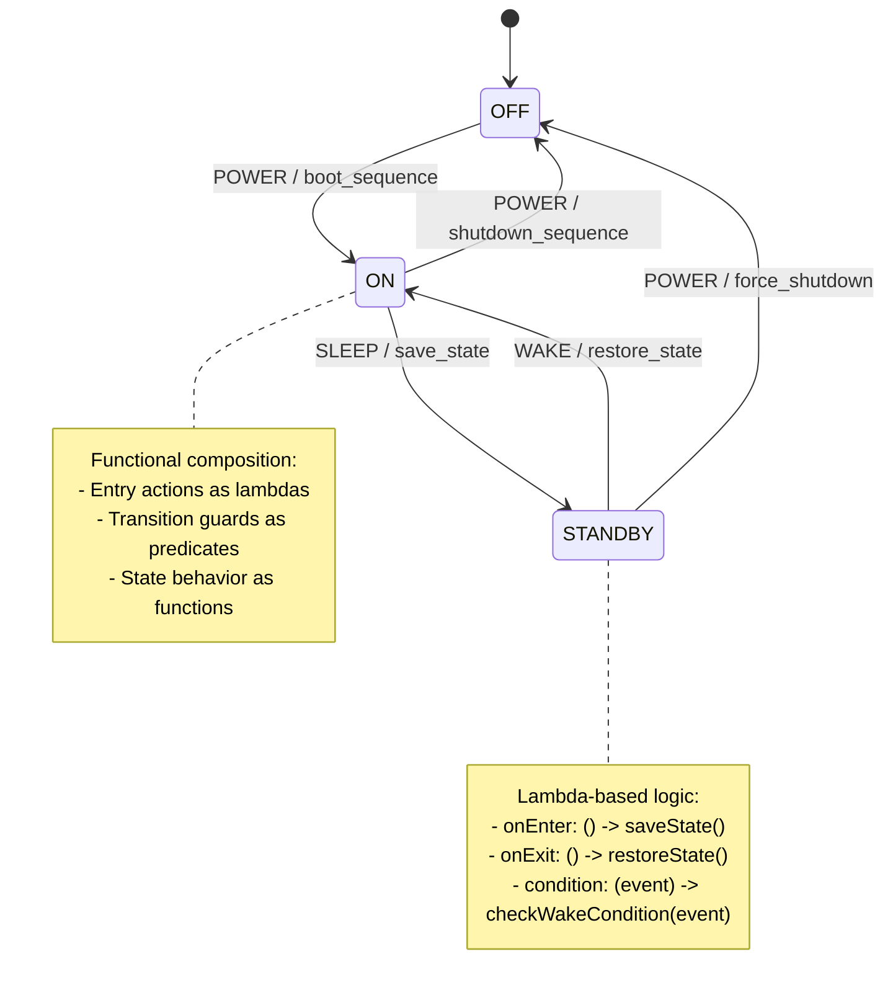

# State Pattern - State Diagrams

## Vending Machine States (Classic Pattern)

## Traffic Light State Machine (Table-Driven)

## Connection States (Enum-Based)

## Phone State Hierarchy

## IoT Device States (Reactive)

## Order Workflow States (Persistent)

## Game State Machine (Dynamic)

## ATM State Machine (Switch-Based)

## Functional State Machine Example

