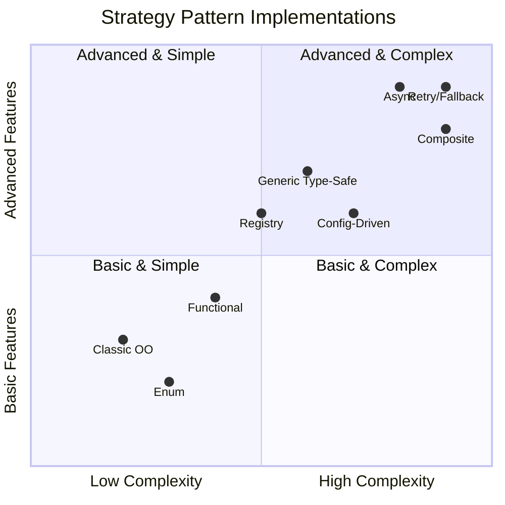
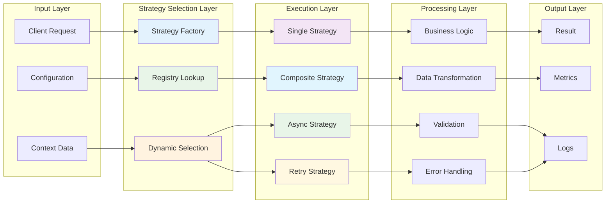
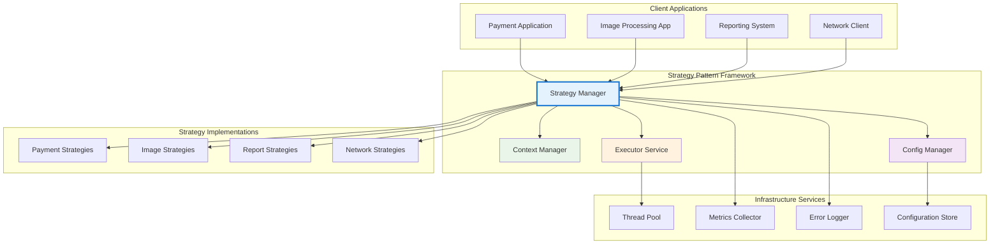
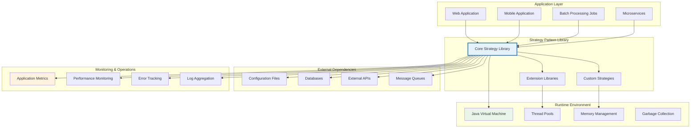
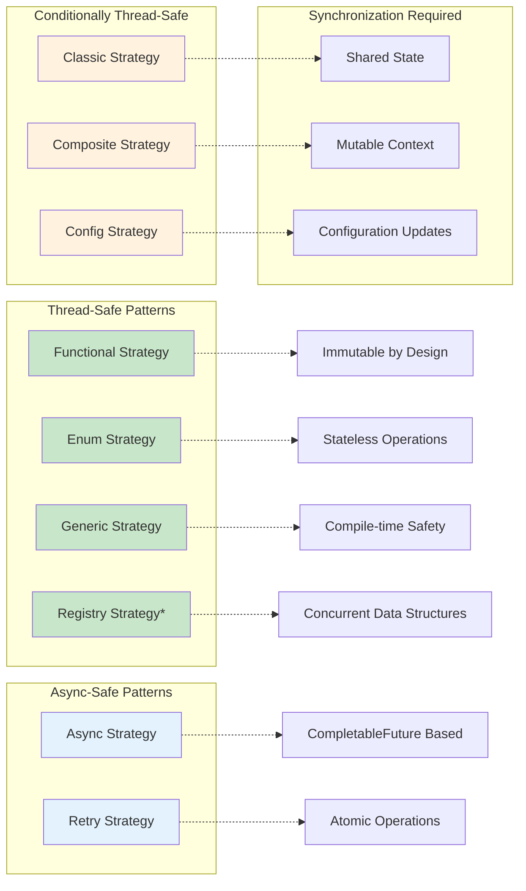

# Strategy Pattern - Architecture Overview

## Complete System Architecture

```mermaid
graph TB
    subgraph "Strategy Pattern Ecosystem"
        subgraph "Core Patterns"
            Classic[Classic OO Strategy]
            Functional[Functional Strategy]
            Registry[Registry Strategy]
            Enum[Enum Strategy]
        end
        
        subgraph "Advanced Patterns"
            Generic[Generic Type-Safe]
            Async[Async Strategy]
            Composite[Composite Strategy]
            Config[Config-Driven]
            Retry[Retry/Fallback]
        end
        
        subgraph "Support Components"
            Context[Execution Context]
            Validators[Validation Framework]
            Processors[Data Processors]
            Executors[Thread Executors]
        end
    end
    
    subgraph "Application Domains"
        Payments[Payment Processing]
        DataProc[Data Processing]
        ImageProc[Image Processing]
        Network[Network Operations]
        Validation[Data Validation]
        Reporting[Report Generation]
    end
    
    subgraph "Infrastructure"
        ThreadPool[Thread Pool Management]
        ConfigMgmt[Configuration Management]
        Monitoring[Monitoring & Metrics]
        ErrorHandling[Error Handling]
    end
    
    Classic --> Payments
    Functional --> DataProc
    Registry --> DataProc
    Enum --> DataProc
    Generic --> Validation
    Async --> ImageProc
    Composite --> DataProc
    Config --> Reporting
    Retry --> Network
    
    Async --> ThreadPool
    Config --> ConfigMgmt
    Retry --> Monitoring
    Composite --> Context
    Generic --> Validators
    
    ThreadPool --> Infrastructure
    ConfigMgmt --> Infrastructure
    Monitoring --> Infrastructure
    ErrorHandling --> Infrastructure
```

## Pattern Complexity and Feature Matrix

## Data Flow Architecture

## Component Interaction Diagram

## Deployment Architecture

## Performance Characteristics

| Pattern Variant | Startup Time | Memory Usage | Throughput | Scalability | Complexity |
|-----------------|---------------|--------------|------------|-------------|------------|
| Classic OO | Fast | Low | High | Medium | Low |
| Functional | Fast | Low | Very High | High | Medium |
| Registry | Medium | Medium | High | Very High | Medium |
| Enum | Very Fast | Very Low | Very High | Medium | Low |
| Generic Type-safe | Fast | Medium | High | High | High |
| Async | Medium | Medium | Very High | Very High | Very High |
| Composite | Slow | High | Medium | High | Very High |
| Config-driven | Slow | Medium | Medium | Very High | High |
| Retry/Fallback | Medium | Medium | Variable | Very High | Very High |

## Thread Safety Analysis

