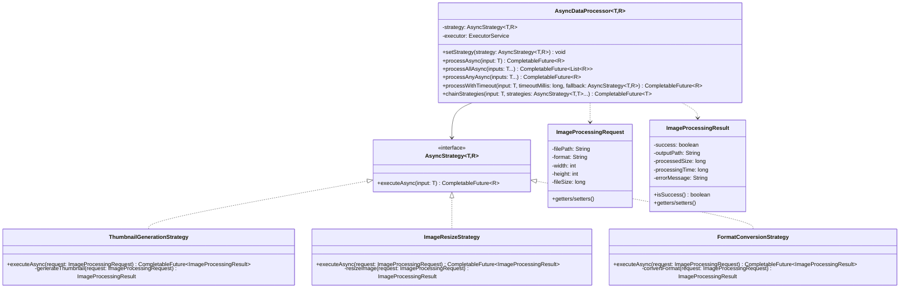
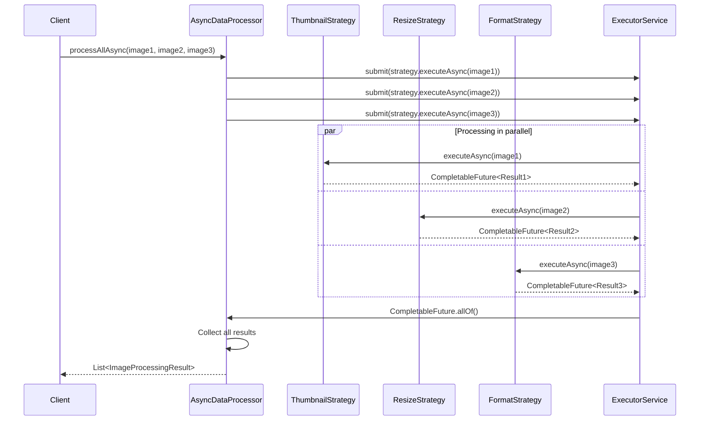
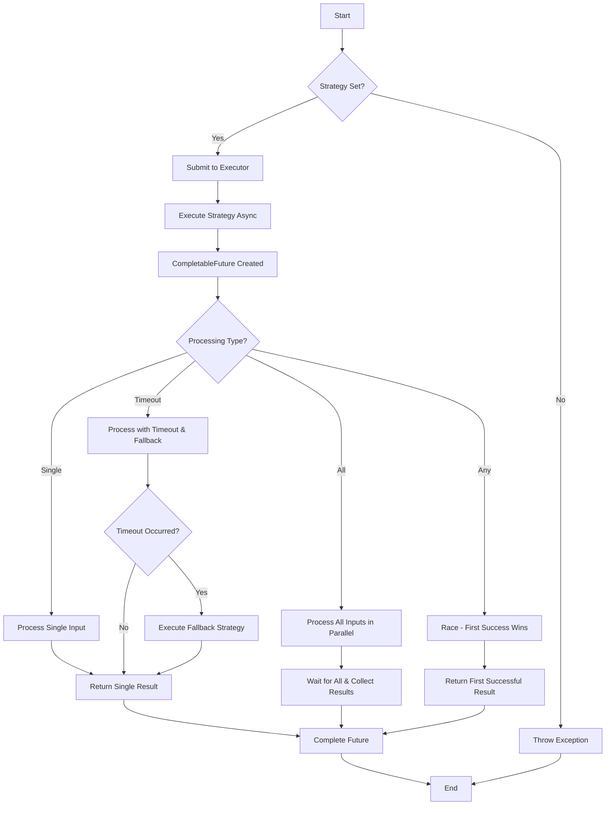

# Async Strategy Pattern - UML Diagrams

## Class Diagram

```mermaid
classDiagram
    class AsyncStrategy~T,R~ {
        <<interface>>
        +executeAsync(input: T) CompletableFuture~R~
    }
    
    class AsyncDataProcessor~T,R~ {
        -strategy: AsyncStrategy~T,R~
        -executor: ExecutorService
        +setStrategy(strategy: AsyncStrategy~T,R~) void
        +processAsync(input: T) CompletableFuture~R~
        +processAllAsync(inputs: T...) CompletableFuture~List~R~~
        +processAnyAsync(inputs: T...) CompletableFuture~R~
        +processWithTimeout(input: T, timeoutMillis: long, fallback: AsyncStrategy~T,R~) CompletableFuture~R~
        +chainStrategies(input: T, strategies: AsyncStrategy~T,T~...) CompletableFuture~T~
    }
    
    class ThumbnailGenerationStrategy {
        +executeAsync(request: ImageProcessingRequest) CompletableFuture~ImageProcessingResult~
        -generateThumbnail(request: ImageProcessingRequest) ImageProcessingResult
    }
    
    class ImageResizeStrategy {
        +executeAsync(request: ImageProcessingRequest) CompletableFuture~ImageProcessingResult~
        -resizeImage(request: ImageProcessingRequest) ImageProcessingResult
    }
    
    class FormatConversionStrategy {
        +executeAsync(request: ImageProcessingRequest) CompletableFuture~ImageProcessingResult~
        -convertFormat(request: ImageProcessingRequest) ImageProcessingResult
    }
    
    class ImageProcessingRequest {
        -filePath: String
        -format: String
        -width: int
        -height: int
        -fileSize: long
        +getters/setters()
    }
    
    class ImageProcessingResult {
        -success: boolean
        -outputPath: String
        -processedSize: long
        -processingTime: long
        -errorMessage: String
        +isSuccess() boolean
        +getters/setters()
    }
    
    AsyncStrategy <|.. ThumbnailGenerationStrategy
    AsyncStrategy <|.. ImageResizeStrategy
    AsyncStrategy <|.. FormatConversionStrategy
    AsyncDataProcessor --> AsyncStrategy
    AsyncDataProcessor ..> ImageProcessingRequest
    AsyncDataProcessor ..> ImageProcessingResult
```

## Sequence Diagram - Parallel Processing

```mermaid
sequenceDiagram
    participant Client
    participant AsyncDataProcessor
    participant Strategy1 as ThumbnailStrategy
    participant Strategy2 as ResizeStrategy  
    participant Strategy3 as FormatStrategy
    participant ExecutorService
    
    Client->>AsyncDataProcessor: processAllAsync(image1, image2, image3)
    
    AsyncDataProcessor->>ExecutorService: submit(strategy.executeAsync(image1))
    AsyncDataProcessor->>ExecutorService: submit(strategy.executeAsync(image2))
    AsyncDataProcessor->>ExecutorService: submit(strategy.executeAsync(image3))
    
    par Processing in parallel
        ExecutorService->>Strategy1: executeAsync(image1)
        Strategy1-->>ExecutorService: CompletableFuture<Result1>
    and
        ExecutorService->>Strategy2: executeAsync(image2)
        Strategy2-->>ExecutorService: CompletableFuture<Result2>
    and
        ExecutorService->>Strategy3: executeAsync(image3)
        Strategy3-->>ExecutorService: CompletableFuture<Result3>
    end
    
    ExecutorService->>AsyncDataProcessor: CompletableFuture.allOf()
    AsyncDataProcessor->>AsyncDataProcessor: Collect all results
    AsyncDataProcessor-->>Client: List<ImageProcessingResult>
```

## Activity Diagram - Async Processing Flow

```mermaid
graph TD
    A[Start] --> B{Strategy Set?}
    B -->|No| C[Throw Exception]
    B -->|Yes| D[Submit to Executor]
    
    D --> E[Execute Strategy Async]
    E --> F[CompletableFuture Created]
    
    F --> G{Processing Type?}
    G -->|Single| H[Process Single Input]
    G -->|All| I[Process All Inputs in Parallel]
    G -->|Any| J[Race - First Success Wins]
    G -->|Timeout| K[Process with Timeout & Fallback]
    
    H --> L[Return Single Result]
    I --> M[Wait for All & Collect Results]
    J --> N[Return First Successful Result]
    K --> O{Timeout Occurred?}
    O -->|No| L
    O -->|Yes| P[Execute Fallback Strategy]
    P --> L
    
    L --> Q[Complete Future]
    M --> Q
    N --> Q
    Q --> R[End]
    
    C --> R
```