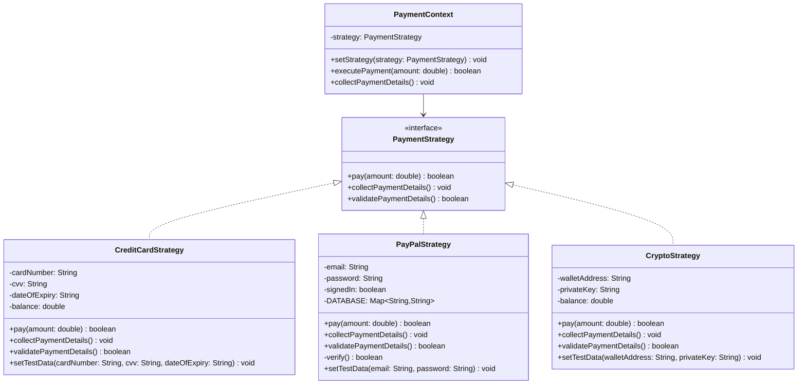
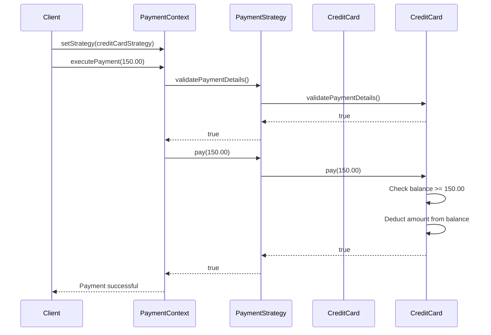
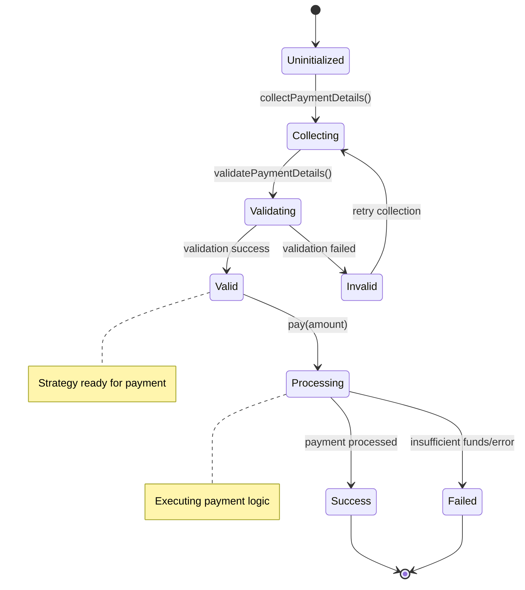

# Classic Strategy Pattern - UML Diagrams

## Class Diagram

```mermaid
classDiagram
    class PaymentStrategy {
        <<interface>>
        +pay(amount: double) boolean
        +collectPaymentDetails() void
        +validatePaymentDetails() boolean
    }
    
    class PaymentContext {
        -strategy: PaymentStrategy
        +setStrategy(strategy: PaymentStrategy) void
        +executePayment(amount: double) boolean
        +collectPaymentDetails() void
    }
    
    class CreditCardStrategy {
        -cardNumber: String
        -cvv: String
        -dateOfExpiry: String
        -balance: double
        +pay(amount: double) boolean
        +collectPaymentDetails() void
        +validatePaymentDetails() boolean
        +setTestData(cardNumber: String, cvv: String, dateOfExpiry: String) void
    }
    
    class PayPalStrategy {
        -email: String
        -password: String
        -signedIn: boolean
        -DATABASE: Map~String,String~
        +pay(amount: double) boolean
        +collectPaymentDetails() void
        +validatePaymentDetails() boolean
        -verify() boolean
        +setTestData(email: String, password: String) void
    }
    
    class CryptoStrategy {
        -walletAddress: String
        -privateKey: String
        -balance: double
        +pay(amount: double) boolean
        +collectPaymentDetails() void
        +validatePaymentDetails() boolean
        +setTestData(walletAddress: String, privateKey: String) void
    }
    
    PaymentStrategy <|.. CreditCardStrategy
    PaymentStrategy <|.. PayPalStrategy
    PaymentStrategy <|.. CryptoStrategy
    PaymentContext --> PaymentStrategy
```

## Sequence Diagram - Payment Processing

```mermaid
sequenceDiagram
    participant Client
    participant PaymentContext
    participant PaymentStrategy
    participant CreditCardStrategy as CreditCard
    
    Client->>PaymentContext: setStrategy(creditCardStrategy)
    Client->>PaymentContext: executePayment(150.00)
    
    PaymentContext->>PaymentStrategy: validatePaymentDetails()
    PaymentStrategy->>CreditCard: validatePaymentDetails()
    CreditCard-->>PaymentStrategy: true
    PaymentStrategy-->>PaymentContext: true
    
    PaymentContext->>PaymentStrategy: pay(150.00)
    PaymentStrategy->>CreditCard: pay(150.00)
    CreditCard->>CreditCard: Check balance >= 150.00
    CreditCard->>CreditCard: Deduct amount from balance
    CreditCard-->>PaymentStrategy: true
    PaymentStrategy-->>PaymentContext: true
    PaymentContext-->>Client: Payment successful
```

## State Diagram - Payment Strategy Lifecycle

```mermaid
stateDiagram-v2
    [*] --> Uninitialized
    
    Uninitialized --> Collecting: collectPaymentDetails()
    Collecting --> Validating: validatePaymentDetails()
    Validating --> Valid: validation success
    Validating --> Invalid: validation failed
    Invalid --> Collecting: retry collection
    
    Valid --> Processing: pay(amount)
    Processing --> Success: payment processed
    Processing --> Failed: insufficient funds/error
    
    Success --> [*]
    Failed --> [*]
    
    note right of Valid : Strategy ready for payment
    note right of Processing : Executing payment logic
```