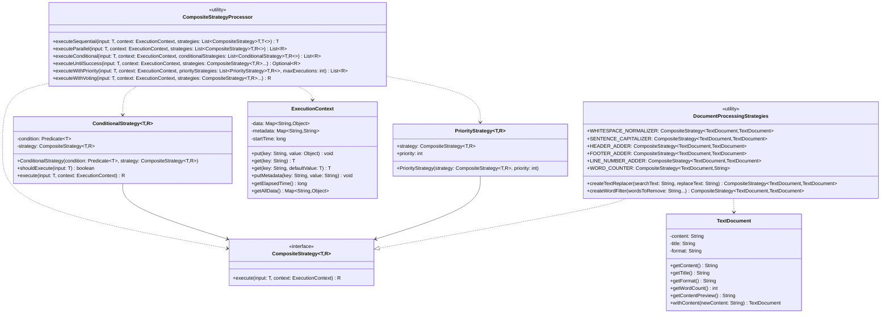
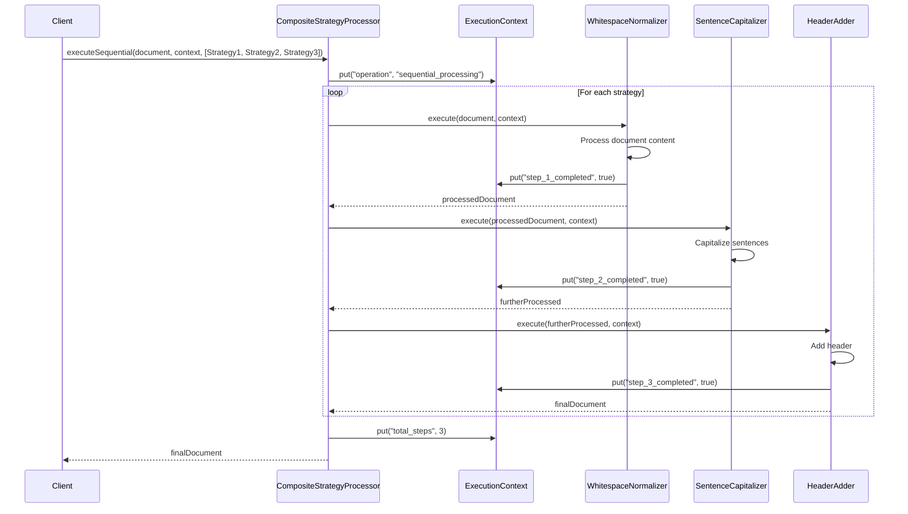
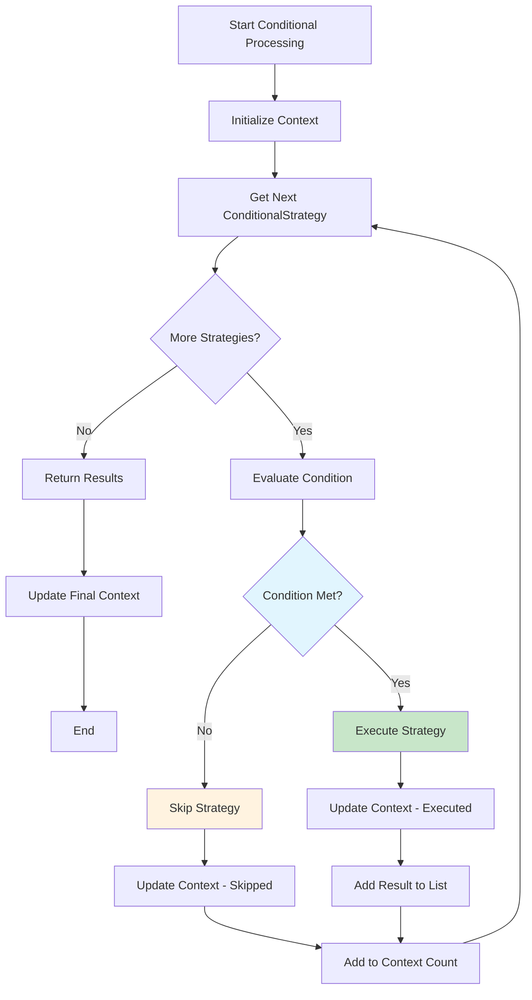
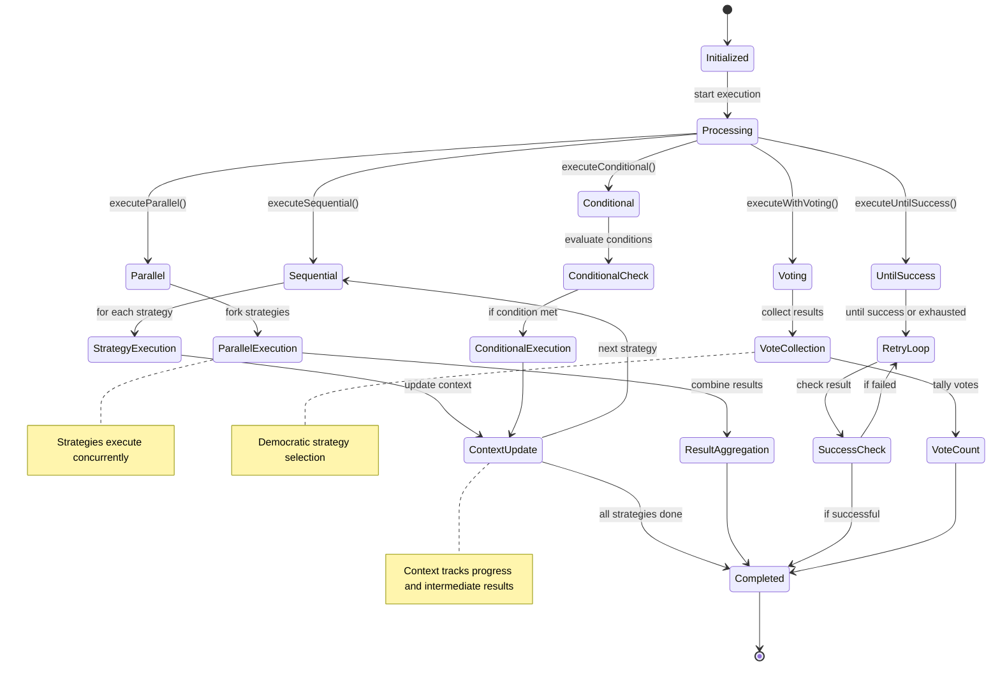

# Composite Strategy Pattern - UML Diagrams

## Class Diagram

## Sequence Diagram - Sequential Processing

## Activity Diagram - Conditional Execution

## State Diagram - Execution Context Lifecycle

