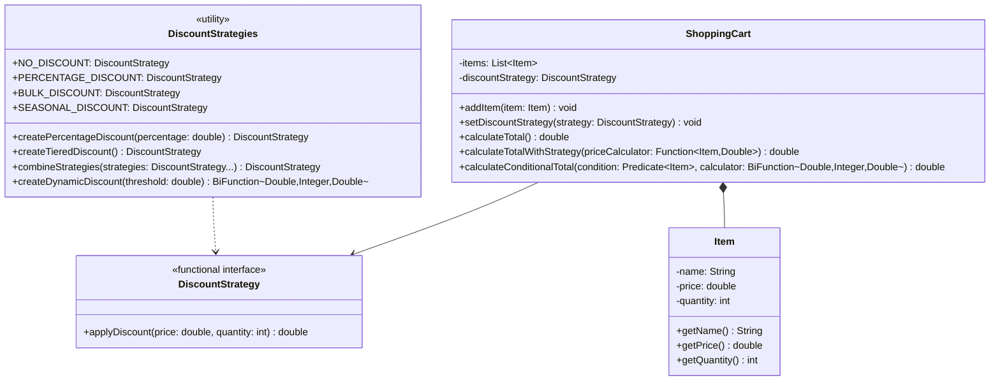
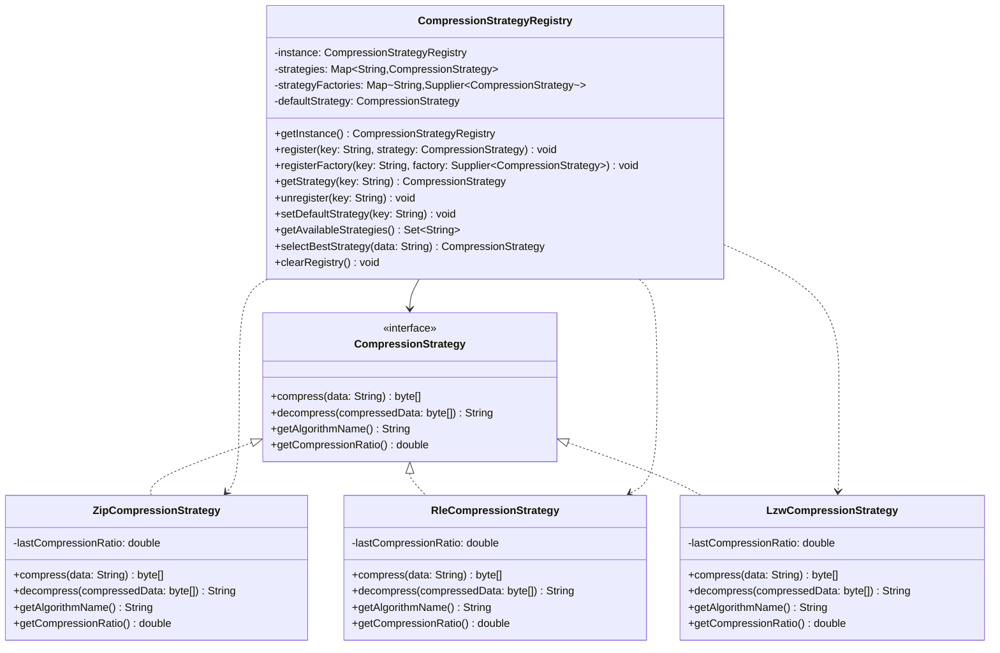
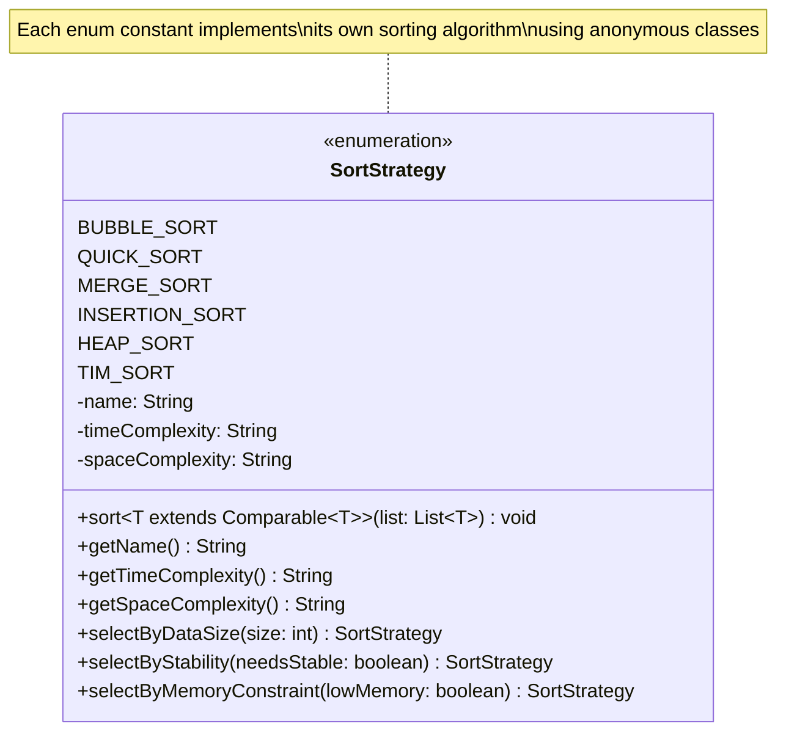
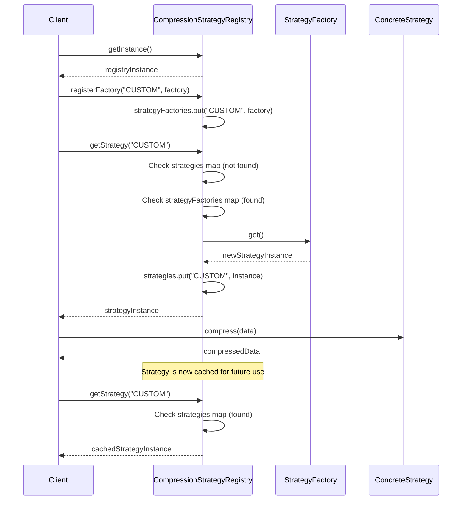

# Functional, Registry & Enum Strategy Patterns - UML Diagrams

## Functional Strategy Pattern - Class Diagram



## Registry Strategy Pattern - Class Diagram



## Enum Strategy Pattern - Class Diagram



## Sequence Diagram - Registry Pattern Dynamic Loading



## Activity Diagram - Functional Strategy Composition

```mermaid
graph TD
    A[Start Strategy Composition] --> B[Define Base Strategies]
    B --> C[Create Lambda Expressions]
    
    C --> D{Composition Type?}
    D -->|Method Reference| E[Use Static Methods]
    D -->|Lambda Chain| F[Chain Multiple Lambdas]
    D -->|Higher-Order Function| G[Create Strategy Factory]
    D -->|Stream Operations| H[Use Stream API]
    
    E --> I[DiscountStrategies.NO_DISCOUNT]
    F --> J[strategy1.andThen(strategy2)]
    G --> K[createPercentageDiscount(10)]
    H --> L[items.stream().map(strategy)]
    
    I --> M[Apply to Shopping Cart]
    J --> M
    K --> M
    L --> M
    
    M --> N[Calculate Final Total]
    N --> O[Return Result]
    O --> P[End]
    
    style D fill:#e1f5fe
    style M fill:#c8e6c9
```