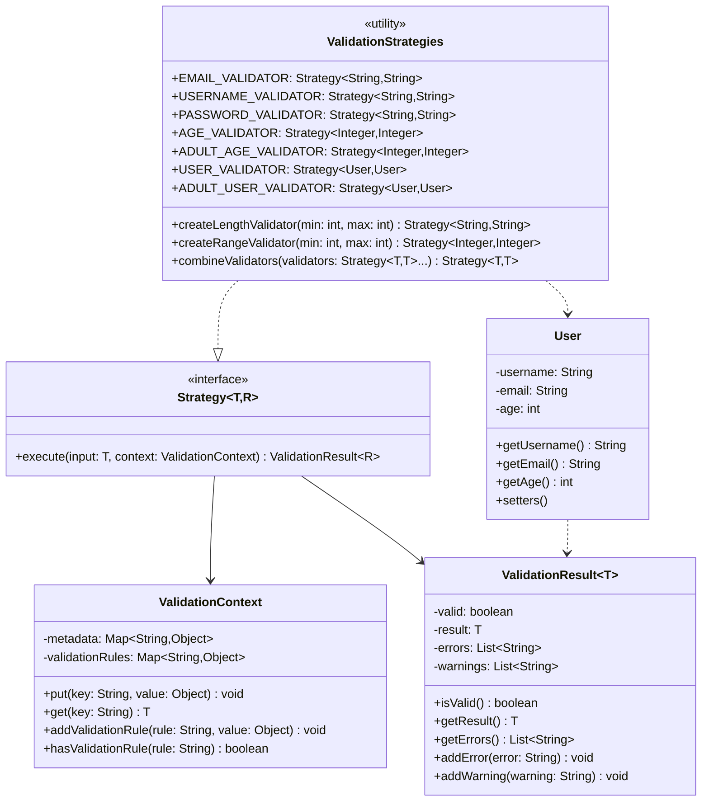
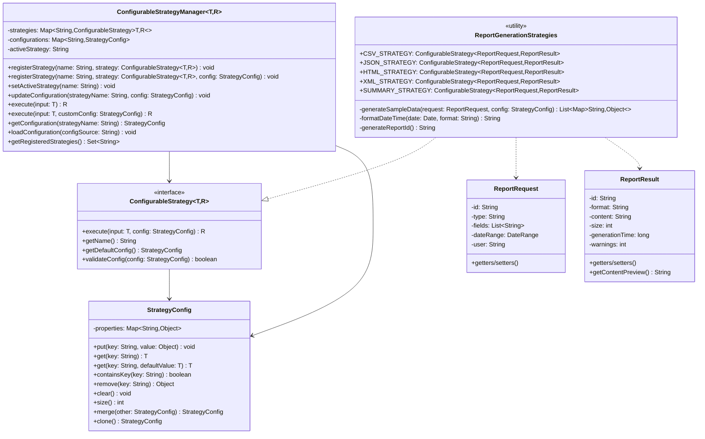
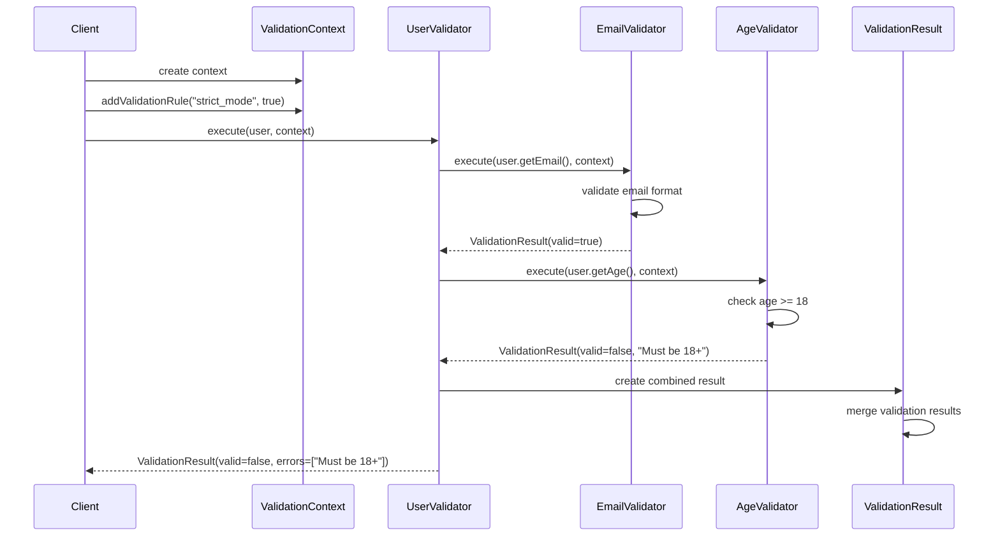
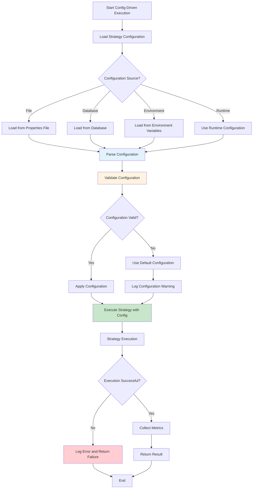
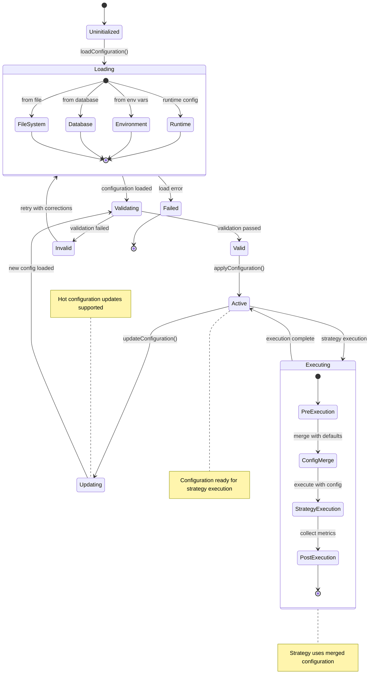

# Generic Type-Safe & Config-Driven Strategy Patterns - UML Diagrams

## Generic Type-Safe Strategy Pattern - Class Diagram

## Config-Driven Strategy Pattern - Class Diagram

## Sequence Diagram - Generic Validation Pipeline

## Activity Diagram - Config-Driven Strategy Execution

## State Diagram - Configuration Lifecycle

