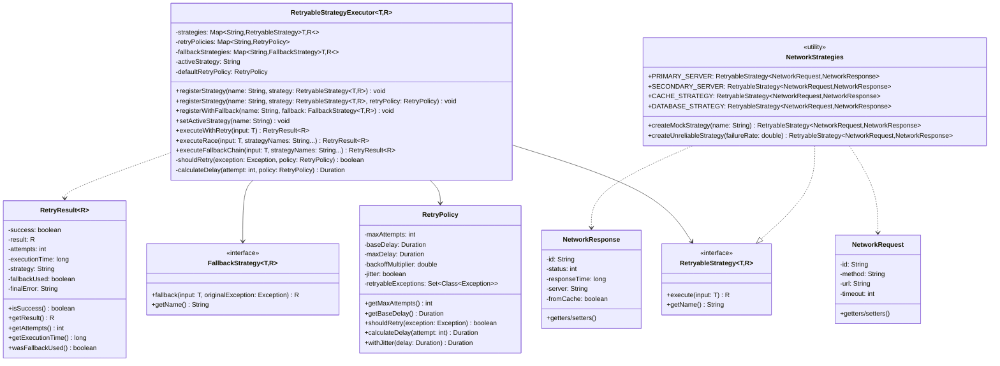
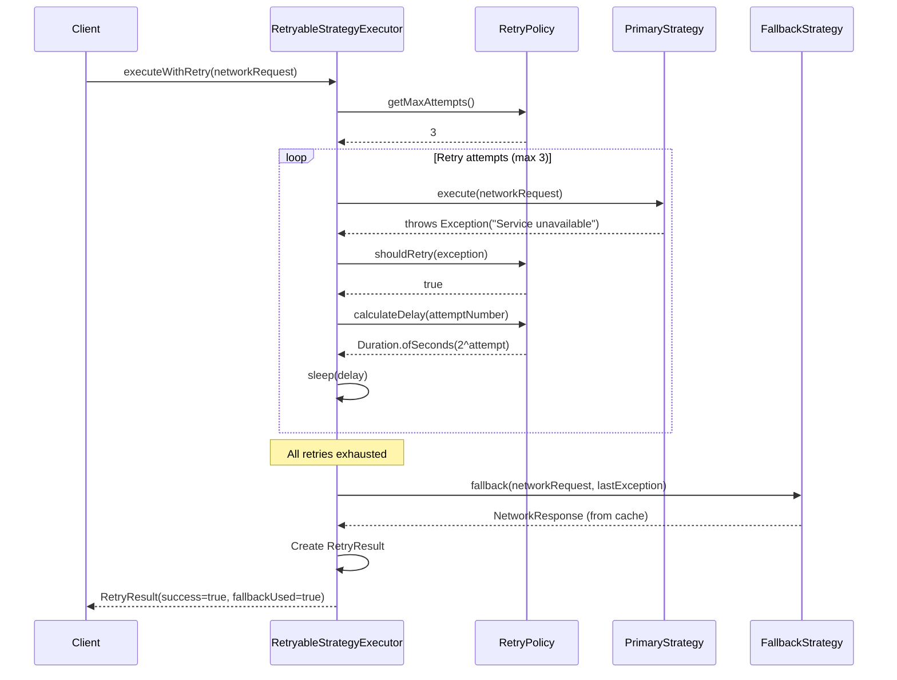
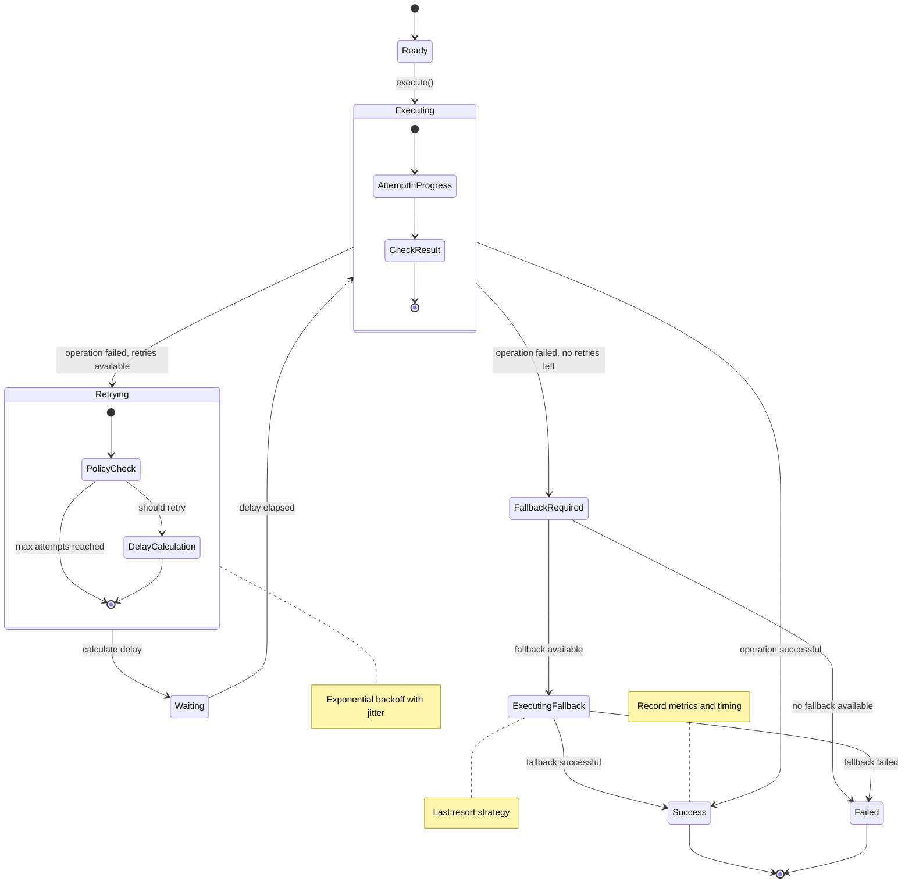
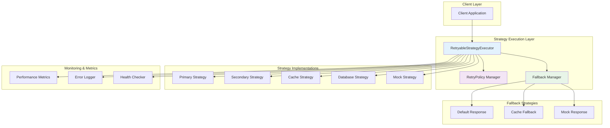

# Retry/Fallback Strategy Pattern - UML Diagrams

## Class Diagram



## Sequence Diagram - Retry with Fallback



## Activity Diagram - Race Execution

```mermaid
graph TD
    A[Start Race Execution] --> B[Create CompletableFutures for all strategies]
    B --> C[Submit all strategies to executor]
    
    C --> D[CompletableFuture.anyOf()]
    D --> E{First strategy completes}
    
    E -->|Success| F[Cancel remaining futures]
    E -->|Failure| G{All strategies failed?}
    
    G -->|No| H[Wait for next completion]
    G -->|Yes| I[All strategies failed]
    
    H --> E
    
    F --> J[Create successful RetryResult]
    I --> K[Create failed RetryResult with all errors]
    
    J --> L[Return result]
    K --> L
    L --> M[End]
    
    style F fill:#c8e6c9
    style I fill:#ffcdd2
    style J fill:#c8e6c9
    style K fill:#ffcdd2
```

## State Diagram - Strategy Execution States



## Component Diagram - Retry Strategy Architecture

