# Strategy Pattern - UML Documentation

This document contains comprehensive UML diagrams for all Strategy Pattern implementations in this module.

## Overview Class Diagram

```mermaid
classDiagram
    class StrategyPattern {
        <<interface>>
    }
    
    class ClassicStrategy {
        +PaymentStrategy
        +PaymentContext
    }
    
    class FunctionalStrategy {
        +DiscountStrategy
        +ShoppingCart
    }
    
    class RegistryStrategy {
        +CompressionStrategy
        +CompressionStrategyRegistry
    }
    
    class EnumStrategy {
        +SortStrategy~enum~
    }
    
    class GenericStrategy {
        +Strategy~T,R~
        +ValidationContext
    }
    
    class AsyncStrategy {
        +AsyncStrategy~T,R~
        +AsyncDataProcessor
    }
    
    class CompositeStrategy {
        +CompositeStrategy~T,R~
        +CompositeStrategyProcessor
    }
    
    class ConfigStrategy {
        +ConfigurableStrategy
        +ConfigurableStrategyManager
    }
    
    class RetryStrategy {
        +RetryableStrategy
        +RetryableStrategyExecutor
    }
    
    StrategyPattern <|.. ClassicStrategy
    StrategyPattern <|.. FunctionalStrategy
    StrategyPattern <|.. RegistryStrategy
    StrategyPattern <|.. EnumStrategy
    StrategyPattern <|.. GenericStrategy
    StrategyPattern <|.. AsyncStrategy
    StrategyPattern <|.. CompositeStrategy
    StrategyPattern <|.. ConfigStrategy
    StrategyPattern <|.. RetryStrategy
```

## Implementation Complexity Matrix

| Pattern Variant | Complexity | Features | Use Case |
|-----------------|------------|----------|----------|
| Classic OO | ⭐⭐ | Traditional, Simple | Basic algorithm selection |
| Functional | ⭐⭐⭐ | Modern Java, Lambdas | Functional programming |
| Registry | ⭐⭐⭐ | Dynamic, Hot-swappable | Runtime strategy changes |
| Enum-based | ⭐⭐ | Type-safe, Built-in | Predefined algorithms |
| Generic Type-safe | ⭐⭐⭐⭐ | Compile-time safety | Complex validations |
| Async | ⭐⭐⭐⭐⭐ | Non-blocking, Concurrent | I/O operations |
| Composite | ⭐⭐⭐⭐⭐ | Complex combinations | Multi-step processing |
| Config-driven | ⭐⭐⭐⭐ | External configuration | Flexible deployments |
| Retry/Fallback | ⭐⭐⭐⭐⭐ | Fault-tolerant | Distributed systems |